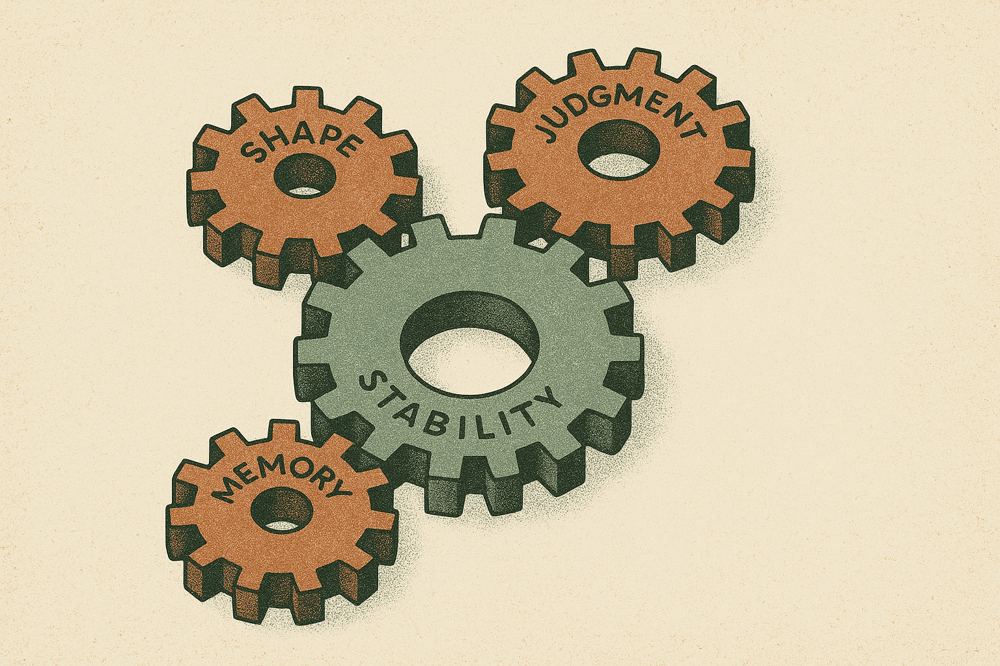

TL;DR: The bottleneck for autonomous research agents in late 2026 is not generation, it is judgment and infrastructure, and the most useful recent work builds the rubric, the structured data store, and the maintenance discipline *before* it lets the model run.

For a year now the pitch on autonomous research agents has been the same: point a capable model at an open-ended scientific question, let it read papers, write code, run experiments, and hand you a report. The demos look great. The reality, as anyone who has actually shipped one knows, is that the agent will happily produce a confident, well-formatted report that skips the analysis that mattered, uses the wrong statistical test, or draws a conclusion the data does not support. It codes fine. It just can't tell whether the work is any good.

Three papers posted to arXiv this cycle attack that gap from three different angles, and read together they point at the same conclusion. The interesting frontier is no longer "can the agent do the task." It is "can the agent know what a good answer looks like before it starts, structure what it learns so it doesn't pay for it twice, and land improvements without breaking everything else." This is the plumbing phase. Let me map where it actually stands.

## What is actually broken in autonomous research agents?

Start with the clearest statement of the problem. In *Learning to Evaluate Before Improving: Automatic Rubric Induction for Automatic Research Agents*, the authors (releasing code as AutoSciRub at github.com/zjunlp/AutoSciRub) name the failure mode directly: open-ended research tasks "often do not clearly specify the analyses, methods, and success criteria required to complete the task." The instruction says "analyze this dataset and report findings." It does not say which analyses, which controls, which evidence would make a conclusion defensible.

So the agent guesses. And because these models are fluent, the guess arrives wrapped in a report that reads like competence. This is the same crack I wrote about in [AI research agents can code, but they still can't judge the work](/blog/2026-07-30-ai-research-agents-can-code-but-they-still-cant-judge-the-work/). The generation is solved enough. The evaluation is not. An agent that can write a thousand lines of clean analysis code but cannot tell you whether the analysis was the right one to run is a fast way to produce plausible garbage.

The deeper issue is that "success" is underspecified by design in real research. You do not get a rubric handed to you. Working scientists carry an implicit one: they know a claim about group differences needs a significance test, that a model comparison needs a baseline, that a causal claim needs more than a correlation. The agent has read enough to know these things exist. It just doesn't reliably apply them unless something forces the check. That "something" is what the current wave of work is trying to build.

## How does making the rubric explicit change results?

AutoSciRub's move is to invert the usual order. Instead of generate-then-maybe-evaluate, it induces a task-specific, executable rubric *before* execution, then uses that rubric to guide the work, verify it criterion by criterion, and drive revision. The pipeline decomposes a vague instruction into what the authors call atomic scientific goals, grounds those goals in relevant literature and the actual visible data, and synthesizes criteria that are specific, actionable, and verifiable. The point is to make the implicit experimental and evidential requirements explicit, so the agent knows up front what "done well" means.

The numbers are worth reading carefully because they show both promise and the honest ceiling. On ResearchClawBench, AutoSciRub reports an average gain of 2.08 points across three backbone LLMs under a fixed Codex harness, and 2.95 points across three agent harnesses using a fixed DeepSeek-V4-Flash backbone. Those are real but modest. The bigger result is on a randomly sampled 20-task subset of AstaBench E2E Discovery, where the authors report an average improvement of 16.8 points across three agent harnesses, while maintaining or increasing the number of successfully completed tasks.

The gap between a 2-point gain and a 16.8-point gain tells you something. On tightly scoped benchmark tasks where the success criteria are already fairly baked in, an explicit rubric adds a little. On genuinely open-ended discovery tasks, where the agent would otherwise be flying blind, front-loading the evaluation is where the leverage lives. That matches the intuition: the more underspecified the task, the more a rubric earns its keep.

This is the same throughline I traced in [Google's Paper Assistant Wants to Catch Your Math Errors Before a Reviewer Does](/blog/2026-06-29-googles-paper-assistant-wants-to-catch-your-math-errors-before-a-reviewer-does/) and in the argument from [Auto-research agents need fuzzer-style feedback](/blog/2026-08-11-auto-research-agents-need-fuzzer-style-feedback/). The pattern repeats: agents get dramatically better when you give them a concrete, checkable signal instead of asking them to self-assess in the abstract. A rubric is a feedback surface. Generation without one is a coin flip with good handwriting.

## Why does structuring data first cut agent cost so much?

The second paper attacks a different tax: the compute cost of reasoning over unstructured mess. *Token-Efficient Data Reasoning Agents via Adaptive Structuring of Unstructured Data* starts from a number that should stop any operator running agents over documents. On the FanOutQA benchmark, reasoning over an ideal pre-structured store is 28X cheaper than having the agent re-open large documents each time, and the authors report that gap growing to orders of magnitude as questions fan out over more source documents.

The reason is mechanical. Every question that needs scattered evidence forces the agent to reopen big PDFs, filings, earnings calls, contracts, and burn tokens rediscovering the same facts. The authors put the per-question cost as high as a million tokens. If the data were already in a table, the same question collapses to a cheap lookup. So why not structure everything in advance? Because, as they point out, documents contain vastly more possible structure than any workload will ever use, and you don't know which structure or which documents matter until the queries arrive.

Their answer is what they call agentic data cracking. Structure the data adaptively and speculatively, as a byproduct of reasoning itself. When the agent opens a document to answer a live question, a cracking sub-agent forks from the already-loaded context at marginal cost and extracts grounded structure that is likely to serve related future queries. Over time, more and more queries get answered straight from the accumulated structured store without opening a document at all, keeping accuracy near full-agent quality while collapsing toward RAG-level cost. On FanOutQA, extended with just one related question per test question, they report cracking cutting cost by 53% while preserving accuracy.

The framing that stuck with me is the closing line: knowledge that reasoning already paid to uncover should accumulate, as a shared substrate beneath the model. Right now every agent run is amnesiac. It pays the extraction cost, answers, and throws away everything it learned about the document's shape. Cracking treats that extraction as an asset. That is a genuinely different mental model for agent infrastructure, and it rhymes with the argument in [OmniScientist argues that AI scientists need eyes, not just workflows](/blog/2026-08-14-omniscientist-argues-that-ai-scientists-need-eyes-not-just-workflows/): the workflow is not the whole system, the substrate the agent reasons over matters as much as the reasoning.

## What does treating post-training as maintenance actually mean?

The third paper zooms out to the model itself, and it is the least glamorous and possibly most honest of the three. *LLM Post-Training as Brownfield Maintenance: An Industrial Perspective on Dataware Engineering* argues that industrial post-training is not a clean-slate exercise. Teams inherit a deployed checkpoint and must land targeted improvements under fixed compute and mixture budgets without regressing everything else. They call the maintained artifact "dataware": behavior governed by a curated post-training mixture, updated via bounded mixture patches rather than full retraining.

That word choice matters. Brownfield is the term software engineers use for working inside a live, messy, already-deployed system, as opposed to greenfield where you start fresh. Most public research on model improvement is implicitly greenfield: here is a better recipe, trained from a clean starting point. The reality for anyone maintaining a shipped model is the opposite. You cannot break the code generation your customers depend on to slightly improve the math.

The paper distills three recurring challenges from an industrial code-generation effort: zero-sum mixture design (adding data for one skill competes with another for a fixed budget), yield as the binding metric (how much of your generated supervision actually becomes usable training data), and end-to-end integration under uncertainty. Their case study is concrete. Interventions that raised the conversion of teacher distillation into usable training data increased accepted supervision by 2.84 times, using the same solution teacher and four solution attempts per candidate problem. The yield-engineered patch improved CodeForces pass@1 by +2.59 points (+3.11 pass@3) and held-out LiveCodeBench v6 pass@1 by +6.11 (+8.05 pass@3), all statistically significant across 16 stochastic evaluations per benchmark from one fixed checkpoint per condition, with internal AIME and MATH regression suites staying within tolerance.

Read that last clause again: within tolerance. The whole discipline is in the regression check. The gain is only real if you can prove you didn't quietly break something else. That is maintenance thinking, not research-demo thinking.

## Where do these three papers actually agree?

They come from different corners, evaluation, data infrastructure, model training, but they converge on one claim: the hard part of autonomous AI work in 2026 has moved downstream of raw capability. None of these papers is about a smarter model. All three are about the engineering scaffolding around the model.

AutoSciRub says: define what good looks like before you generate. Agentic data cracking says: don't re-pay for knowledge you already uncovered, structure it and keep it. Brownfield maintenance says: land improvements without regressing what already works, and measure yield, not just the headline metric. Three different verbs, one shared thesis. The model is a component now. The system around it, the rubric, the substrate, the mixture discipline, is where results are won or lost.

This is also why I keep coming back to skepticism about recursive self-improvement narratives. If the binding constraints are evaluation quality, data infrastructure, and regression control, then a model improving itself in a loop hits exactly these walls, which is roughly what [What AI4AI-Bench Says About Recursive Self-Improvement Right Now](/blog/2026-08-21-what-ai4ai-bench-says-about-recursive-self-improvement-right-now/) and [The Self-Improving Agent Demo That Falls Apart When You Shuffle the Tasks](/blog/2026-08-19-the-self-improving-agent-demo-that-falls-apart-when-you-shuffle-the-tasks/) both found. The self-improvement story assumes the agent can judge its own progress. These papers are, in effect, three separate attempts to build the judgment the agent doesn't have on its own.

## Where do they diverge, and what's still unsettled?

They don't contradict each other, but they measure success in incompatible ways, and that is the honest limitation of reading them together. AutoSciRub reports gains in benchmark points on ResearchClawBench and AstaBench. Agentic data cracking reports token cost reductions at held accuracy. Brownfield maintenance reports pass@1 deltas with regression bounds. There is no shared scorecard for "how good is the whole agentic research pipeline," and that absence is itself the unsettled question.

The evaluation-first approach also has a chicken-and-egg problem worth naming. AutoSciRub induces its rubric using the same class of models it is trying to guide. If the model doesn't know that a claim needs a significance test, will its self-generated rubric include that criterion? The 16.8-point gain on open discovery suggests the rubric captures a lot, but a rubric written by a limited judge inherits the judge's blind spots. This is the exact concern I raised in [Benchmarks Need QA Before They Judge Agents](/blog/2026-08-07-benchmarks-need-qa-before-they-judge-agents/): the thing doing the evaluating needs its own quality gate. An auto-induced rubric is a huge step up from no rubric. It is not the same as an expert one, and the papers here don't fully close that gap.

For agentic data cracking, the open question is how well speculative structuring generalizes past the "one related question per test question" setup. Real workloads have long-tail, unpredictable query patterns. If the speculation guesses wrong about what future queries need, you pay extraction cost for structure nobody uses. The 53% saving is impressive and clearly directional, but it is measured under a controlled extension of the benchmark, not a live enterprise workload. Treat it as strong evidence for the mechanism, not a promise about your data.

## What should a practitioner do right now?

If you are building or operating research or data agents, the throughline from these three papers translates into a concrete order of operations. First, write the rubric before you write the agent. Even a hand-built checklist of what a good answer requires, which analyses, which controls, which evidence, before you let the model run, will catch the confident-but-wrong reports that quietly sink these systems. AutoSciRub automates that step, but you can get most of the value manually today, and the framework's code is public if you want to try the induced version.

Second, stop letting your agent be amnesiac about documents. If you run repeated queries over the same corpus, capture the structure the agent extracts on the first pass and reuse it. You do not need the full cracking system to benefit from the insight: the token cost of reopening documents is your biggest hidden bill, and the fix is treating extracted structure as a persistent asset, not scratch work. That is the lesson behind [AutoSR turns symbolic regression into a research-state search](/blog/2026-08-18-autosr-turns-symbolic-regression-into-a-research-state-search/) too, that keeping and searching over accumulated state beats recomputing from zero.

Third, if you fine-tune or post-train, adopt the brownfield mindset before the greenfield one. Measure yield, how much of your generated supervision survives to become usable training data, and always run a regression suite on the skills you are not trying to change. The 2.84x yield improvement in that case study came from engineering the data pipeline, not from a bigger teacher model. That is a lever most teams under-invest in.

The catch most readers will miss: none of this makes the underlying model smarter, and that is exactly the point. The wins here are 2 to 17 benchmark points and 53% cost cuts, not step changes in capability. If you are waiting for a model that can do open-ended research end to end with no scaffolding, you will wait a long time and burn a lot of tokens confirming reports you can't trust. The teams shipping useful research agents right now are the ones treating the model as one part, and pouring their engineering into the rubric, the substrate, and the regression gate around it. That is unglamorous. It is also where the actual work is, at least for this next stretch.
