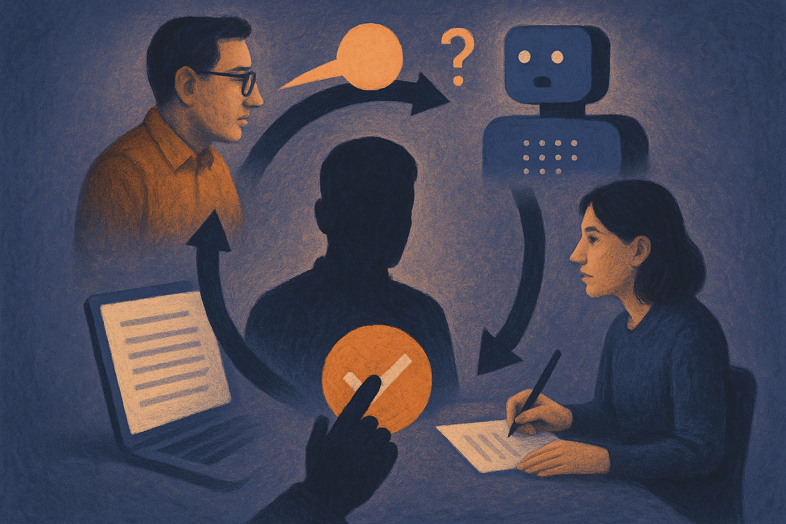

TL;DR: AI agents can make expert interviews easier to schedule and structure, but the real gain comes from turning messy expert knowledge into an auditable content workflow.

## What problem does an AI interview agent actually solve?

Marketing AI Institute’s **“How We're Using AI Agents to Interview Experts for Content”** names a very real bottleneck: you have a strong article idea, but the internal subject matter expert cannot find time for an interview.

That is not a writing problem. It is an operations problem.

Most content teams already know the pattern. The expert has the insight. The writer has the deadline. The marketer has the channel plan. Nobody has a clean hour on the calendar. So the article either gets delayed, gets written from shallow notes, or turns into generic “thought leadership” that sounds like every other company in the category.

An AI interview agent is useful because it changes the shape of the handoff. Instead of requiring a live call, the agent can collect answers asynchronously, ask follow-ups, and turn a vague topic into structured raw material for a human writer.

That matters because expert content usually fails at the intake layer. Not the prose layer.

The AI does not need to be brilliant to help here. It needs to be persistent, prepared, and consistent. Ask the obvious question. Ask the second question. Notice when the expert gives a claim without an example. Ask for the customer story, the tradeoff, the exception, the thing competitors get wrong.

That is work many teams intend to do, then skip under deadline pressure.

## Where does the human still matter?

The danger is treating the agent transcript as publishable truth.

Internal experts speak in shorthand. They assume context. They may mention customer situations that cannot be shared. They may overstate certainty. They may use language that is fine in a strategy meeting and risky in public.

So the workflow needs a human gate, not just an AI interviewer.

A good content process should separate four things: what the expert said, what the AI inferred, what the writer drafted, and what the expert approved. If those blur together, the team gets speed with hidden liability.

This is where I think many “AI content agent” demos get too cute. They show a clean draft appearing from a prompt. Nice theater. But the durable workflow is less magical: intake, transcript, extraction, draft, review, approval, publish.

The expert still owns the substance. The writer still owns the argument and voice. The editor still owns standards. The AI agent owns the boring middle: scheduling relief, question discipline, summarization, and follow-up.

That is a good job for software.

## What should teams measure before calling this a win?

Do not measure only output volume. That is how teams flood their own channels with mediocre posts.

Measure whether the agent improves the inputs. Did it capture specific examples? Did it surface disagreement between experts? Did it reduce review cycles? Did the published piece include claims the expert actually approved? Did the writer spend less time chasing context and more time shaping the argument?

Those are better signals.

I would also watch for a subtle failure mode: the agent can make weak ideas look complete. A polished interview summary is not the same thing as a strong point of view. If the expert has nothing specific to say, the agent will still produce tidy paragraphs. That is dangerous because tidy feels finished.

The practical bar should be higher. The agent should help identify when there is no article yet.

For builders, I would start small: pick one recurring content format, feed the agent the brief, audience, product context, and a few examples of strong past interviews, then have it run async intake with one expert. Do not let it draft directly to publication. First, compare its transcript and extracted notes against your normal human interview. The catch most readers miss: the agent is not the content engine. It is the intake layer. If you design that layer well, the rest of the workflow gets faster without turning your brand into autocomplete.
