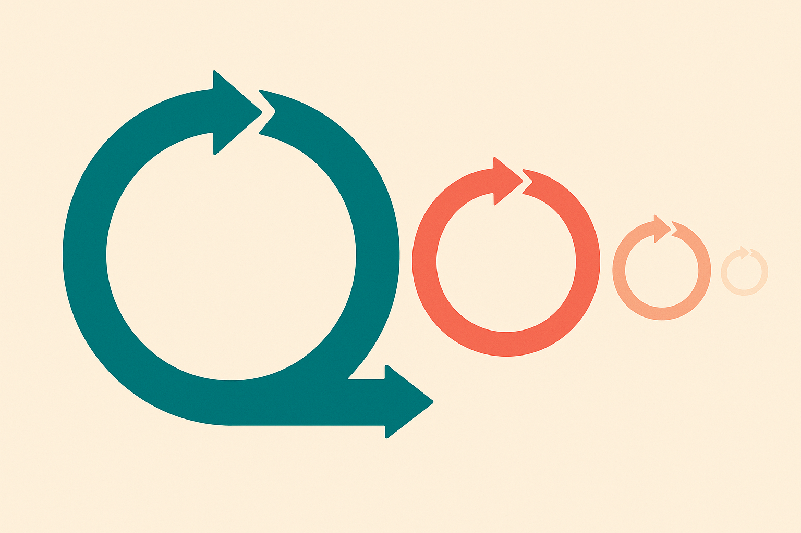

TL;DR: A paper called "Efficient SWE Agent Benchmarking via Trajectory-Aware Evaluation" argues that if you use how an agent explored code and attempted edits, not just whether tests passed, you can estimate its full-benchmark score from a much smaller slice of tasks, and beat the standard result-only methods at low budgets.

Testing a software engineering agent is expensive in a way that testing a chatbot is not. Every task can mean cloning a repo, reading files, editing code, running a test suite, and doing it again when the first patch fails. Multiply that by hundreds of tasks and several candidate models and you get a real compute bill. So people cut corners: run a representative subset, estimate the full score. The question this paper takes on is what "representative" should mean.

## What is PTA-IRT actually proposing?

The primary source here is "Efficient SWE Agent Benchmarking via Trajectory-Aware Evaluation," posted to arXiv under both cs.AI and cs.CL, with code at github.com/DeepSoftwareAnalytics/PTA-IRT. PTA-IRT stands for Privileged Trajectory-Aware Item Response Theory.

Item Response Theory is the old idea underneath this. It comes from psychometrics, the math behind standardized tests. Instead of treating every question as equal, IRT models each item as having a difficulty and a discrimination (how well it separates strong test-takers from weak ones), and each test-taker as having a latent ability. You can estimate ability from a smart subset of questions rather than the whole exam. Swap "test-taker" for "SWE agent" and "question" for "GitHub issue," and you have the setup a lot of efficient benchmarking already uses.

The paper's complaint is that existing efficient methods are "result-only." They fit historical pass/fail matrices or static task descriptions and throw away the most informative thing an agent produces: the trajectory. The path it took. Which files it opened, what edits it tried, how it worked toward a solution.

That contrast is the whole pitch. Two agents can both fail a task, but one failed after finding the right file and writing an almost-correct patch, and the other failed after wandering into unrelated code. Pass/fail scores them identically. The trajectory does not.

## Why does using trajectories help?

The clever move is calling trajectories "privileged information." That is a specific term from machine learning: data available at training or calibration time but not at test time. PTA-IRT uses historical execution trajectories to do two jobs. First, pick a better calibration subset, the tasks you actually run to estimate ability. Second, estimate the ability itself more accurately once you have those results.

Think about what pass/fail throws away. On a hard task that almost every agent fails, the result column is nearly all zeros, so it carries almost no signal for telling agents apart. But the trajectories on that task might be very different. A strong agent gets close; a weak one flails. That difference is exactly the discrimination IRT wants, and it is invisible if you only look at the final bit.

So the framework fuses process and outcome. The outcome tells you what happened. The process tells you how close it was and by what route. The paper reports that under low calibration budgets, PTA-IRT "consistently outperforms prior IRT baselines on score and ranking recovery across four SWE benchmarks." Two claims worth separating there. Score recovery means estimating the absolute number close to the true full-benchmark score. Ranking recovery means getting the ordering of agents right even if the numbers drift. For most practitioners, ranking is the one that matters. You usually want to know which model to ship, not the exact percentage.

The honest caveat: the abstract gives no numbers. No error bars, no size of the "low budget," no named benchmarks beyond "four." The two arXiv listings I have are identical abstracts, so there is no second independent framing to check against. The code is public, which is the right instinct, but I have not seen the results tables. Treat "consistently outperforms" as the authors' claim, not a settled fact, until you read the paper or run the repo.

## When does this pay off, and when does it not?

The value scales with how much you evaluate. If you test one agent once, subset selection is noise; run the whole thing. The payoff shows up when you evaluate repeatedly: comparing many candidate models, tracking a single agent across a training run, sweeping prompt or scaffold variations. That is the loop where full SWE-bench-style runs get genuinely painful and where shaving the task count matters.

There is a real dependency to notice. PTA-IRT needs historical trajectories to calibrate on. That is fine for established benchmarks where lots of agents have already run and logs exist. It is a chicken-and-egg problem for a brand-new benchmark or a novel agent architecture whose behavior looks nothing like the calibration set. Privileged information is only as good as its coverage. An agent that solves problems in a genuinely new way could be mis-estimated because the trajectory model has never seen that route.

And trajectories are not standardized. One framework logs tool calls, another logs a reasoning stream, another logs raw diffs. "Explored context, attempted edits, and solving paths" is easy to say and messy to extract across different agent scaffolds. The repo will tell you how portable their extraction actually is. That is the first thing I would check before assuming this drops into your own harness.

## The practitioner's take

If you run SWE agent evals more than occasionally, this is worth an afternoon. Clone github.com/DeepSoftwareAnalytics/PTA-IRT, point it at a benchmark you already have full results for, and check one thing: does the subset it selects recover your known ranking at a budget small enough to save you real time? Ranking recovery is your acceptance test, not the fancy score estimate. If the ordering holds at, say, a fraction of the tasks, you have a cheaper regression check for your model or scaffold iterations.

The catch most readers will miss is the calibration dependency. This is not a general-purpose scorer you can trust on a fresh agent that behaves unlike anything in the trajectory history. It is a way to compress a benchmark you already understand, using the behavior of agents you have already seen. Use it to iterate faster on known ground, and still run the full suite before you make a claim about a genuinely new system. Efficient evaluation is a convenience, not the source of truth, and the moment you forget that is the moment a weird new agent games your shortcut without you noticing.
