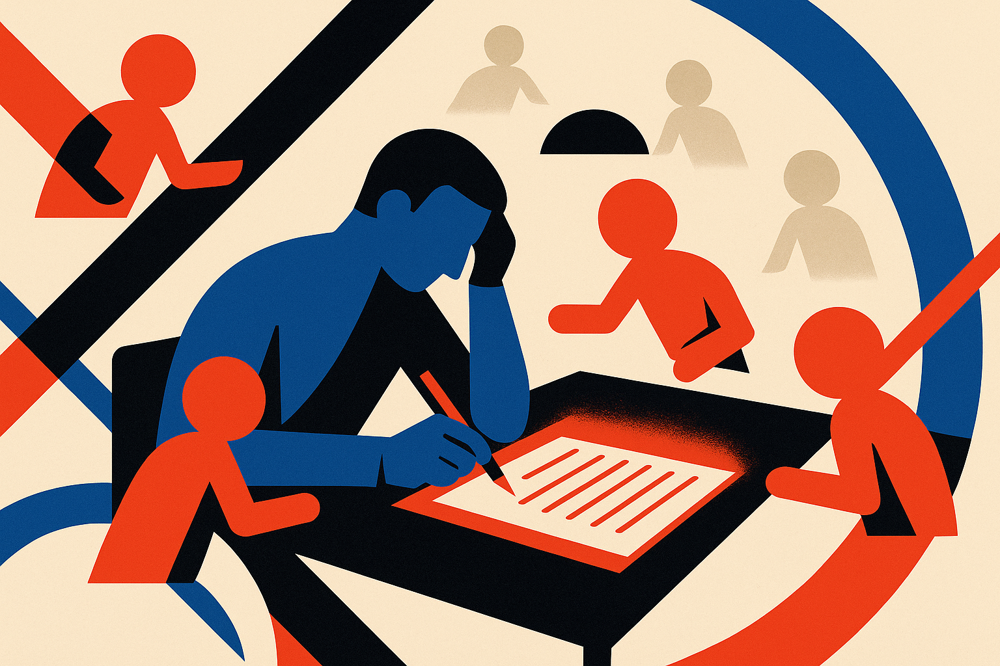

TL;DR: The useful version of proactive writing AI is not a louder autocomplete, it is a configurable set of quiet thought partners that intervene at the right moment with the right kind of cognitive support.

## What changes when the assistant speaks first?

The arXiv paper “Designing Proactive Thought Partners for Writing,” listed in cs.AI and cs.CL, studies a subtle but important shift in writing software: moving from reactive text generation to proactive cognitive support.

Most writing assistants wait for a prompt, a cursor pause, or a half-written sentence. Then they complete, rewrite, summarize, or polish. That is useful, but narrow. Writing is not only sentence production. It is deciding what belongs, noticing weak reasoning, keeping an audience in mind, finding the missing example, and knowing when a paragraph is pretending to work.

The paper frames “proactive thought partners” as AI agents that offer customizable, higher-level support while someone writes. The research team built a technology probe and deployed it with 16 participants for one week. Participants could create partners by configuring their roles and proactivity. As they wrote, relevant partners initiated suggestions at appropriate moments.

That last phrase is the hard part. “Appropriate moments” are where most agent demos get fuzzy. If an assistant interrupts too often, it becomes Clippy with a bigger model. If it waits forever, it is just ChatGPT in another pane. The interesting design problem is not whether the model can produce feedback. It is whether the system can sense what kind of help fits the writer’s current state.

## How much control does the writer need?

The strongest signal from the paper is that writers wanted control before the writing session, not just during it. The researchers report that participants configured proactive support through “prospective planning.” In plain English: they thought ahead about the kinds of help they might want.

That matters. A fiction writer might want a continuity watcher. A policy analyst might want a counterargument scout. A marketer might want a skeptical customer voice. A researcher might want a structure critic that only speaks after a section has enough substance to judge.

This is different from a generic sidebar that says, “Here are some suggestions.” It treats writing as a multi-role process. You are not asking one assistant to be everything. You are assigning lenses.

The paper also reports that participants used suggestions for both idea generation and self-monitoring. That second use case is underrated. The market loves generative features because they feel magical. But a lot of serious writing work is metacognitive: Am I repeating myself? Did I drift from the claim? Is this section doing the job I planned for it?

A good proactive partner may be less like a ghostwriter and more like a margin note from a sharp editor who knows when not to rewrite your sentence.

## What should product teams take from this?

The caution is scale. Sixteen participants over one week is a probe, not proof that every writing tool should start interrupting users. The abstract does not establish long-term productivity gains, quality gains, or how this behaves across professional domains. So I would not read this as a validation of “agentic writing” as a product category.

I would read it as a design brief.

The paper says participants valued lightweight visual representations and non-directive rhetorical framing for non-intrusive interventions. That is very practical. Don’t shove a full paragraph into the draft. Don’t frame every note as a correction. Show a small signal. Ask a useful question. Offer a lens. Let the writer decide.

For builders, the prototype to try is simple: create three configurable writing partners, each with a role, a trigger, and an interruption budget. For example: “audience skeptic, speak only after 300 words,” “structure checker, speak at section breaks,” “evidence scout, speak when claims lack examples.” The catch most readers miss is that proactivity is not a feature toggle. It is a trust contract. If the system speaks at the wrong time twice, the writer will mute it.
