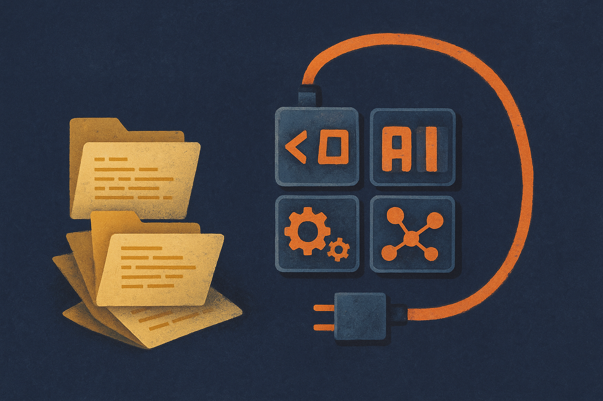

TL;DR: Research agents may get more useful by distilling working GitHub repos into small verified skills, so they can reuse hard-won implementation know-how instead of rediscovering it every run.

## What is a “skill” in this paper?

The primary source here is the arXiv paper “Repo-To-Skill: Distilling GitHub Repositories Into AI4AI Skills,” listed under cs.AI and cs.CL. The paper’s core claim is simple and pretty important: current research agents have model intelligence, planning, execution, memory, and verification, but they still miss a middle layer the paper calls “operational knowledge.”

That phrase is doing real work.

Operational knowledge is the stuff that separates “I know the method” from “I can make this method train, evaluate, debug, and produce a useful result.” It lives in repos, READMEs, scripts, configs, issue threads, paper appendices, and all the weird glue that experienced ML people learn by getting burned.

The paper proposes DisCo, a research agent that can create and use skills during ML research. A skill, in this framing, is not just a code snippet. It is compact, verified, reusable operating context distilled from larger artifacts. The point is to avoid stuffing an entire repository into context, then hoping the agent notices the one training trick, preprocessing assumption, or evaluation convention that matters.

That matches a pattern I keep seeing in applied AI work. The bottleneck is often not raw reasoning. It is knowing the local moves. Which script is canonical. Which flags matter. Which benchmark setup is accepted. Which dependency breaks silently. Which “simple baseline” actually has six hidden choices.

## Do the benchmark gains justify the framing?

The paper reports the AREX-Skill Library, with more than 5,000 verified skills distilled from 1,000 widely used ML repositories, organized into 20 areas and 178 capability families. That is the most concrete part of the work. Not “agents will read the internet.” More like: take known useful repositories, compress their working knowledge, verify the result, and make it callable during future tasks.

The reported gains are large in places. With the GPT-5.5 backbone, research harness, and downstream execution budget held fixed, the skill-equipped agent scores 134.3% higher on MLE-bench than the same agent without skills. It also scores 34.4% higher on PaperBench, 9.2% higher on FrontierCS, and 14.0% higher on PassNet.

I would not read those numbers as “skills solve research automation.” Benchmarks are benchmarks, and the paper’s setup matters. The important part is the control: same backbone, same harness, same execution budget. The changed variable is the addition of distilled operating context.

That is a useful signal. It suggests a cheaper axis of improvement than always reaching for a larger model or a longer context window. You can make the agent better by changing what it knows how to do before it starts.

## What should builders copy from this?

The builder takeaway is not “go build a 5,000-skill library.” Most teams do not need that. The practical move is to identify your own operational knowledge swamp and distill it.

For an internal coding agent, that might mean turning your top 50 repos into verified task skills: how tests run, how migrations work, how services are deployed, how feature flags are added, how metrics are named. For a data science team, it might mean skills for the accepted notebook-to-production path, the house evaluation templates, the feature store rituals, and the model review checklist. For customer ops, it might be playbooks distilled from resolved tickets, not just pasted into a giant retrieval index.

The catch most readers miss: retrieval is not the same as a skill. A retrieved document tells the model where information might be. A verified skill should tell the agent what action to take, when to take it, and how to check whether it worked. If I were applying this tomorrow, I would start with five painful recurring workflows, distill one compact skill for each, add a verification step, then A/B the agent with and without those skills on real tasks. Small library. High trust. Receipts before scale.
