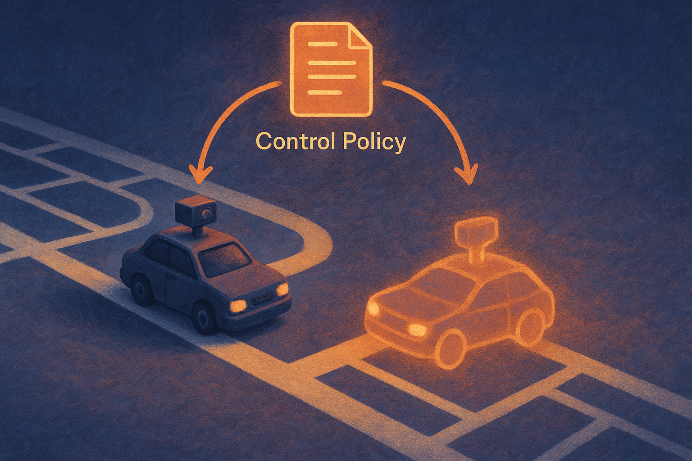

TL;DR: The practical win is not a tiny car that “drives itself,” it is an open, cheap, repeatable loop for testing whether end-to-end driving policies actually transfer from simulation to hardware.

## What does this platform actually test?

The primary source is the arXiv cs.AI/cs.LG paper titled “A Low-Cost, Open Platform for End-to-End Autonomous Driving on a Miniature Ackermann Vehicle.” It describes a full experimental stack: a miniature Ackermann-steering vehicle, a printed urban driving track, data collection tools, trajectory registration, and a Webots digital twin.

That mix matters. A lot of autonomy work gets stuck in one of two places. Either it is all simulation, where everything is measurable but too clean. Or it is real-world robotics, where everything is messy and expensive, so experiments are hard to repeat.

This paper aims at the middle. The car is small. The world is controlled. The task is narrow. But the loop is complete: collect demonstrations, train a visual policy, test it in closed loop, compare it to a simulated twin, then try synthetic data plus sim-to-real translation.

That is a good research shape. Not glamorous. Useful.

The vehicle uses command-conditioned behavior cloning as the first baseline. The policy gets an onboard camera image plus a high-level navigation command, then outputs steering and speed. So this is not planning in the full self-driving sense. It is imitation learning under constrained route commands.

## What did the baseline actually achieve?

On the physical track, the learned policy followed lanes and executed commanded turns. The paper reports a mean cross-track error of 6.1 cm against the reference route. Human demonstrations were at 4.7 cm.

That gap is small enough to be interesting, but the context is important. This is a miniature vehicle on a printed urban track, not a city street. The result says the setup can measure meaningful policy behavior in a repeatable way. It does not say end-to-end imitation learning is ready for open-road autonomy.

The digital twin produced one of the more useful findings: camera field of view mattered a lot. In simulation, widening the field of view from 58 degrees to 120 degrees reduced mean cross-track error from 35.6 cm to 3.3 cm.

That is the kind of detail builders should like. It is not a vague model-size claim. It is a concrete sensor-design result. The model was failing partly because it could not see enough context.

The paper also reports that the strongest closed-loop result came from combining synthetic driving data from the digital twin, a learned sim-to-real image translator, and real demonstrations. A higher-capacity policy trained that way was the only configuration that completed all four track routes. The compact baseline and the same network trained on real data alone completed fewer.

Again, no magic. Synthetic data helped when paired with real demonstrations and an appearance-gap reducer. Real-only data was not enough in that setup. Simulation-only is not presented as a free lunch.

## Why does this matter for AI builders outside robotics?

Because this is a clean example of evaluating AI systems as systems, not demos.

The model is only one part. The camera field of view changes the outcome. The quality of simulation changes the outcome. The data mix changes the outcome. The evaluation needs closed-loop testing, because one bad steering output changes what the model sees next.

That lesson travels well beyond toy cars. Agents, workflow automations, code assistants, browser controllers, and robotics policies all have the same problem: offline accuracy can look fine while closed-loop behavior falls apart.

The miniature car is a physical reminder of that. Once an AI system acts, it creates its next input.

Practitioner’s take: if you are building embodied AI, agents, or any workflow where model outputs affect future state, copy the experimental pattern here before copying the model. Build a cheap sandbox. Add a digital twin or replay environment. Track a simple error metric. Change one sensor or context variable at a time. Then run closed loop. The catch most readers miss is that the biggest gain may come from the system around the model, like field of view or data generation, not from swapping in a larger network.
