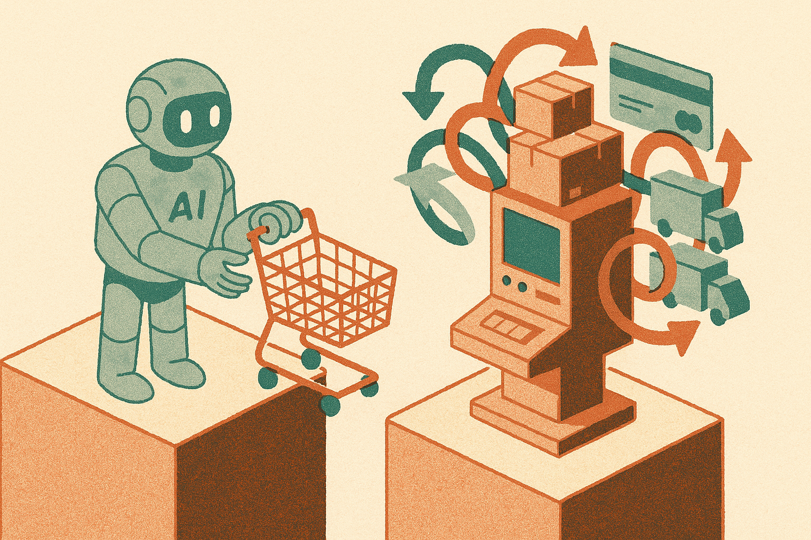

TL;DR: Retailers should treat ChatGPT visibility as top-of-funnel, because agentic commerce only matters if inventory, policies, identity, payment, tax, fraud, and fulfillment survive checkout.

## Is being found by ChatGPT enough?

Greg Jarboe’s Search Engine Journal piece, “Getting Your Product Into ChatGPT Isn’t The Hard Part, Getting It Through Checkout Is,” gets the framing right. Discovery is not the finish line. It is the handoff.

That sounds obvious until you watch how retail teams usually react to a new channel. First question: can we get listed? Second question: can we rank? Third question, often too late: can the customer actually buy the thing without the whole stack contradicting itself?

Agentic commerce makes that worse. A shopping agent is not a normal product page visitor. It may ask for availability, compare terms, assemble a cart, pass user preferences, trigger payment, and expect the retailer to honor the answer it gave five steps earlier. If the product feed says one thing, the PDP says another, and the checkout engine applies a hidden constraint, the agent will look broken. The retailer may be the actual broken piece.

Search Engine Journal’s headline points to the core shift: getting surfaced in ChatGPT is the easy half. The hard half is making the transaction deterministic enough for an intermediary to trust.

## What breaks when an agent reaches checkout?

The boring stuff. Which is where commerce lives.

Inventory is the first trap. Not “is this SKU in the catalog?” Real inventory. Store-specific inventory. Variant inventory. Substitutions. Backorder rules. Bundles. Perishable availability. Marketplace seller constraints.

Then price. The agent may quote a product based on one context, but checkout may add promotions, shipping thresholds, regional fees, tax, or membership pricing. Some of that is normal. Some of it creates a trust gap. A human can tolerate a bit of surprise. An agent acting on behalf of a user needs a cleaner contract.

Policies matter too. Can this item be returned? Is it age-restricted? Is it shippable to this address? Is it excluded from coupons? Is the delivery window real or optimistic? These rules are often scattered across ecommerce software, ERP, tax systems, fraud tools, fulfillment vendors, and customer service docs.

This is why “connect another agentic commerce protocol” should not be treated like adding another feed. A product feed can be stale and still produce traffic. A checkout promise cannot be stale without creating support tickets, chargebacks, cancellations, and customer anger.

## What should retailers test before adding another protocol?

I’d run three checks before chasing the next integration.

First, test promise consistency. Take 100 representative products across high-volume, edge-case, and regulated categories. Ask whether the same answer holds across search, product detail, cart, checkout, order confirmation, and customer service. Not close enough. The same commercial promise.

Second, test agent handoff failure. What happens when an item goes out of stock after recommendation? What if payment requires step-up authentication? What if an address fails validation? What if the cart contains an excluded item? If the system cannot explain the failure cleanly, the agent cannot recover cleanly.

Third, test ownership. When the AI assistant says one thing and checkout says another, who fixes it? Ecommerce? Search? Data engineering? Merchandising? Legal? Fraud? Customer support? If the answer is “we’ll make a Slack channel,” the operation is not ready.

The practical upside is real. AI assistants could become a meaningful commerce interface, especially for replenishment, comparison shopping, complex filters, and “find me the right thing” use cases. But retailers do not need to pretend the whole store is ready on day one. Start with categories where availability is stable, policies are simple, returns are clear, and fulfillment is predictable.

A builder should treat agentic commerce like an API reliability project, not a marketing placement project. Pick one narrow product category, map every promise from discovery through post-purchase, and build a test harness that simulates agent-driven carts. The catch most readers miss: the agent is not your customer yet. It is your auditor. It will expose every mismatch your human shoppers have been working around for years.
