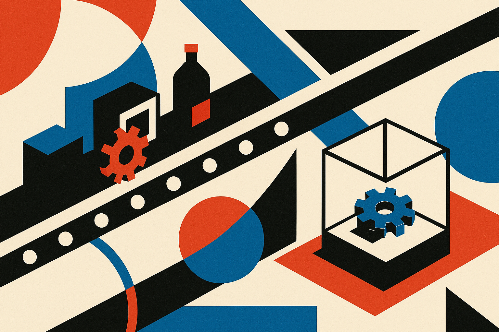

TL;DR: GPT-6 Astra is posting real gains on agentic coding and reasoning benchmarks, but the "welcome to the AGI era" framing is trade-press language, not something OpenAI's own system card asserts, so treat the numbers as promising and the label as marketing.

OpenAI has started rolling out GPT-6 Astra, and the first wave of coverage is doing what first waves always do: mixing verified benchmark results with breathless positioning. The primary first-party source here is OpenAI's system card, published at deploymentsafety.openai.com/gpt-6-astra, plus OpenAI's own announcement thread on X (status 2095595741528125780). Everything else circulating right now, including the VentureBeat "Welcome to the AGI era" headline and The Verge's writeup, is second-hand reporting pointing at that story. Worth keeping that distinction sharp, because the gap between what OpenAI claims and what reporters claim on OpenAI's behalf is where most people get misled.

## What did GPT-6 Astra actually score?

Two benchmark stories are driving the discussion. The first is GPT-6 Astra on ARC-AGI-3, the latest version of François Chollet's abstraction-and-reasoning challenge, which is specifically designed to resist memorization and reward on-the-fly generalization. The second, surfaced in a separate Hacker News thread, is that GPT-6 Astra "makes major gains in the Artificial Analysis Coding Agent Index," a benchmark that measures how well a model performs as an autonomous coding agent rather than a single-shot code generator.

Here is the honest limitation: the sources in front of me name these results but do not give me the actual numbers. I can tell you the model is being discussed on ARC-AGI-3 and that Artificial Analysis reports major coding-agent gains. I cannot tell you the exact scores, the delta over GPT-5 or Claude, or the test conditions, because none of the material provided states them. Anyone quoting you a precise ARC-AGI-3 figure right now is either reading the system card directly or making it up. Go check deploymentsafety.openai.com/gpt-6-astra before you repeat a number.

What I can say with confidence: ARC-AGI-3 and the Coding Agent Index are both harder-to-game targets than the saturated benchmarks labs used to wave around. ARC resists memorization by design. The Coding Agent Index measures multi-step tool use, which is closer to what actually breaks in production. If Astra genuinely moved on both, that is more meaningful than another MMLU point.

## Is this actually "the AGI era"?

No, and the framing matters. VentureBeat ran with "Welcome to the AGI era." That is a publication's editorial choice, not a claim I can trace to OpenAI's system card in these sources. This is the single most important thing to separate: a benchmark result is a measurement, and "AGI" is a marketing frame wrapped around that measurement.

ARC-AGI has "AGI" in its name, which invites exactly this confusion. Chollet has been consistent and public that ARC is a test of a specific capability, generalization to novel tasks, and that beating it is a necessary-not-sufficient signal, not a coronation. A high ARC-AGI-3 score would mean the model generalizes better than its predecessors. It would not mean the model is generally intelligent in the way the acronym implies to a casual reader. Those are different claims, and the headline collapses them.

I am an optimist about where this is heading. I still won't let a benchmark name do an argument's work. When a model does well on a test called ARC-AGI-3, the correct summary is "it did well on ARC-AGI-3," full stop. Add the AGI narrative only if OpenAI's own materials make that argument and back it, and from what these sources show me, the system card is the place to check, not the trade coverage.

## What can operators actually rely on right now?

Rollout language ("begins rolling out") tells you access is staged. That means whatever you read about availability, tiers, rate limits, and pricing is probably partial and changing by the day. None of the sources here give me confirmed pricing or a general-availability date, so I won't invent one. If someone tells you Astra costs X per million tokens or is available to everyone today, ask them for the OpenAI docs link. The company's own pages are the only authority on what you can use and what it costs.

For the coding-agent claim specifically, the useful move is to treat Artificial Analysis's index as a pointer, not a verdict. Independent benchmark aggregators are valuable precisely because they aren't the vendor. But a benchmark is a proxy for your workload, never a substitute. A model that tops the Coding Agent Index can still choke on your particular repo, your tool definitions, your error-handling conventions.

So the practical test sequence: pull three or four tasks from your real backlog that a previous model failed or handled clumsily. Run them through Astra with your actual agent scaffolding, not a clean demo harness. Watch specifically for the failure modes that benchmarks under-weight: silent wrong answers, tool-call loops, and confident hallucinated file paths. If Astra's ARC-style generalization gains are real, you should feel it most on the tasks that are slightly off-distribution from what you've automated before.

## Where the sources disagree or go thin

The disagreement here is less between sources and more between registers. OpenAI's system card and announcement are first-party and measured. The Hacker News threads are doing what HN does well: surfacing the specific benchmarks and linking the primary material. The trade coverage, VentureBeat especially, is doing what trade coverage does, which is reaching for the biggest available frame. All three can be simultaneously present in your feed and pull you in different directions.

My read: the benchmark story is probably real and worth your attention. The Coding Agent Index gain, if it holds up under independent replication, is the part an operator should care about most, because it maps to work you're actually trying to automate. The AGI framing is noise until OpenAI itself makes and defends that claim in writing.

The catch most readers will miss: everyone is going to quote numbers this week that they pulled from a headline about a benchmark, not from the benchmark or the system card. Before you cite an Astra score in a deck, a thread, or a planning doc, open deploymentsafety.openai.com/gpt-6-astra and the Artificial Analysis index and read the figure and its test conditions yourself. Then run your own three tasks. A benchmark tells you a model is worth testing. Your backlog tells you whether it's worth shipping. Those are the only two questions that matter this week, and only one of them can be answered by reading Twitter.
