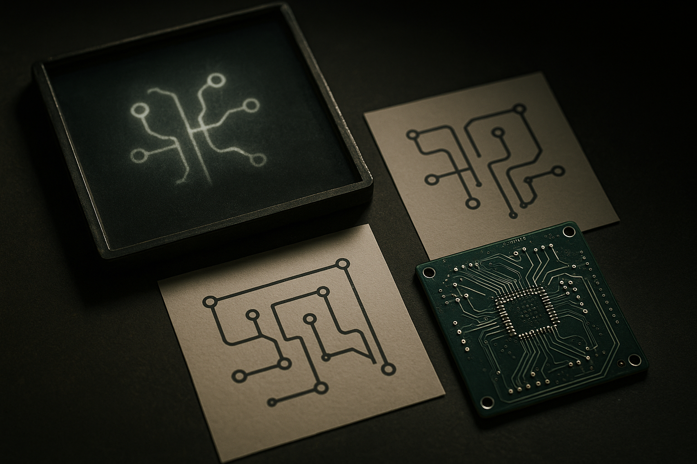

TL;DR: AI is already useful around PCB design, especially for research, scripting, checks, and documentation, but a board you can manufacture still needs human engineering judgment and tool-based verification.

## What does “design a circuit board” actually mean?

The primary source here is the Hacker News (AI) discussion titled “Can AI design circuit boards yet?” That question sounds simple, but it hides three different jobs.

One job is translating intent into a circuit: pick parts, read datasheets, wire interfaces, choose passives, think about power rails, tolerances, heat, connectors, and failure modes.

Another job is turning that circuit into a board: footprint selection, placement, routing, stackup, impedance, return paths, via strategy, creepage, clearance, test points, panel constraints, and assembly rules.

The last job is signoff: ERC, DRC, BOM sanity, fabrication outputs, assembly outputs, procurement risk, bring-up plan, and the painful question every hardware person knows, “What did we forget?”

AI can help with the first and third buckets more than the second. It can read a datasheet faster than I can. It can suggest a reference circuit. It can explain why a decoupling capacitor is placed near a pin. It can generate a KiCad script or a checklist. It can compare a schematic against a design note if you give it both.

But that is not the same as owning a board.

## Where is AI actually useful today?

The best use case is not “make me a PCB.” It is “sit next to me while I make a PCB.”

For a builder, that means using a model to reduce friction around the work: summarize datasheets, extract pin tables, draft net names, build a bring-up checklist, write small scripts for repetitive edits, create test procedures, and review whether the schematic matches the intended interfaces. If you are working in KiCad, that scripting surface matters. If you are in a larger EDA flow, the same idea applies, but the integration points are usually more formal and less forgiving.

The model is also good as a rubber duck with memory. Ask it to trace the path of a signal from connector to IC. Ask what assumptions a power tree makes. Ask which nets deserve special routing constraints. Ask what happens if a regulator starts late, a crystal fails to oscillate, or a user hot-plugs the wrong cable.

This is useful because PCB mistakes are often boring. Wrong footprint. Swapped pins. Missing pull-up. Bad connector orientation. A model that catches one of those before fabrication paid for itself, even if it cannot route DDR or make RF layout calls.

## What is the hard part AI still does not own?

The hard part is not drawing copper. EDA tools have had autorouting and rule checking for a long time. The hard part is knowing which rules matter, when a rule is incomplete, and when the real world will punish you.

A language model does not feel EMI. It does not know your enclosure, cable harness, assembly vendor, supply chain, compliance target, thermal environment, or the habits of the technician who will debug the first article at 11 p.m. It may confidently pick a footprint that looks plausible. It may miss the mechanical keepout that ruins the product. It may produce a clean-looking layout with a terrible return path.

That is why “AI designed this board” is usually less interesting than “AI helped produce artifacts an engineer could inspect.” The inspection boundary is the point. Once you can name the nets, constraints, assumptions, checks, and tests, AI becomes a useful tool. When those are implicit, it becomes a liability with a friendly chat box.

For builders, I would try this on a low-risk board first: give the model the datasheets, ask it to draft a schematic review checklist, use it to generate small CAD scripts, then run normal ERC, DRC, fabrication review, and human peer review. The catch most readers miss: the win is not replacing PCB expertise. The win is making expert review cheaper, earlier, and more repeatable.
