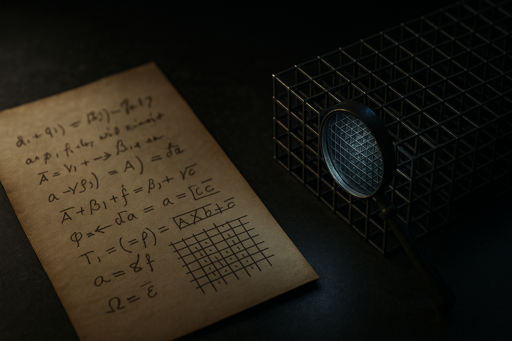

TL;DR: The useful takeaway is not that Claude “solved” Fermat’s Last Theorem, it is that AI may be getting better at turning hard human reasoning into machine-checkable artifacts.

## Did Claude actually solve Fermat’s Last Theorem?

Decrypt reported, in “AI Just Solved a 350-Year-Old Math Problem By Writing the Longest Proof Ever,” that Anthropic says Claude spent 11 days turning Fermat’s Last Theorem into 13 million lines of code a computer can check itself.

That is a wild sentence. It also needs careful reading.

Fermat’s Last Theorem was not sitting around unsolved. Andrew Wiles proved it in the 1990s, after centuries of failed attempts. So if Claude’s work is what Decrypt reports, the achievement is not “AI discovered the proof.” It is closer to “AI helped formalize a known proof into a form a proof checker can verify.”

That distinction matters.

Discovery is one kind of intelligence. Formalization is another. Formalization means taking arguments written for humans, with all their compression, conventions, and “obvious” steps, and converting them into strict symbolic steps accepted by software. That is tedious, brittle, and valuable. A human mathematician can read a line and fill in five hidden lemmas. A proof assistant cannot. It wants every bridge built.

So I would not call this “no human trust required,” at least not without seeing Anthropic’s own writeup and the actual verification setup. A formal checker reduces one kind of trust. It does not remove all trust. You still care about the proof assistant, the libraries, the translation process, the statement being proved, and whether the machine-checked theorem matches the theorem humans care about.

Still, this is not nothing. It is a serious direction.

## Why does 13 million lines matter?

Thirteen million lines sounds absurd because it is absurd, in a very specific way. It shows the cost of making implicit reasoning explicit.

Human math is dense. Formal math is often sprawling. A published proof can fit in papers and books because readers bring background knowledge. A verifier brings rules. Everything else has to be encoded.

That makes the reported 11-day run interesting. Not because long output is automatically good. Long output is usually a warning sign in software. But in formal proof work, length can mean the system is grinding through hidden structure that humans skip over.

The practical question is error rate. Did Claude generate code that mostly worked, with small fixes? Did it need heavy human steering? Did it repeatedly fail and recover? Was the proof checker the only judge, or were humans repairing large chunks along the way? Decrypt’s report gives the headline numbers, attributed to Anthropic, but those implementation details are where the real signal lives.

This is the pattern I care about across AI right now: not “model says smart thing,” but “model produces an artifact that another system can test.”

Code has unit tests. Math has proof checkers. Hardware design has simulators. Data pipelines have validation suites. Legal and finance have weaker versions, but still some structured checks. The more an AI workflow can end in a verifier, the less you have to rely on vibes.

## What changes for builders?

If Anthropic’s claim holds up, the near-term lesson is not “replace mathematicians.” It is “point models at work where correctness can be externally checked.”

That is a different product instinct than chatbots. You do not ask the model for an answer and ship the answer. You ask the model to produce a candidate artifact, then force it through a harsh gate. The gate can be a compiler, a proof assistant, a test suite, a schema validator, a simulator, or a human review checklist with hard constraints.

This is where agents get less silly. An agent that writes 13 million lines of unchecked text is a liability. An agent that writes formal code, runs a checker, reads the error, repairs the gap, and repeats for 11 days is closer to useful automation. Boring, expensive, and still fragile. But useful.

The catch most readers miss: verification does not make the generation step cheap or clean. It often makes the work look uglier before it gets better. Builders should try this on narrow domains first. Pick a workflow with a real verifier, give the model a constrained target, log every failure, and measure accepted artifacts rather than impressive drafts. If the checker cannot say no, you are back to trusting the model’s confidence. That is the old problem with better branding.
