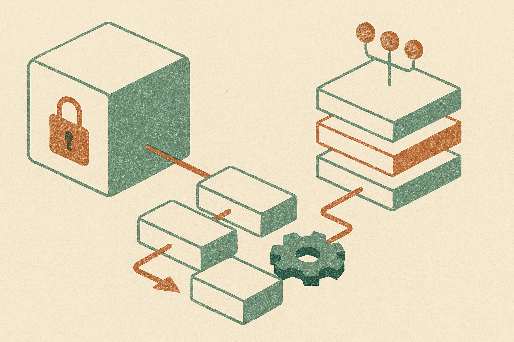

TL;DR: Open-weight AI is becoming normal enterprise infrastructure because companies want control over cost, data, latency, and customization, but the tradeoff is that they now own more of the hard parts.

## What does “hooked on open-source AI” actually mean?

The primary source here is the archived Hacker News item titled “Corporate America is getting hooked on open-source AI.” The useful signal is not that big companies suddenly became open-source idealists. They did not. The signal is that open-weight models are moving from hacker projects and research demos into the enterprise procurement conversation.

That matters because “open-source AI” is usually sloppy language. In software, open source means inspectable code, permissive rights, and community governance. In AI, it often means something narrower: downloadable model weights, a license with conditions, maybe a technical report, maybe training details, often not the full dataset or recipe.

Still useful. Just not magic.

Corporate buyers care less about the label and more about the control surface. Can the model run inside their cloud account? Can it be fine-tuned or adapted without sending sensitive data to a third-party API? Can inference costs be squeezed once usage gets large? Can teams swap models if one vendor changes pricing, terms, or product direction?

That is the real hook. Not purity. Optionality.

Closed frontier models still matter. They are often the easiest way to test a workflow, especially when accuracy, tool use, or multimodal capability is the bottleneck. But once an internal use case is proven, the question changes from “what is the smartest model?” to “what is the cheapest reliable system we can operate at scale?”

That is where open-weight models get interesting.

## Why would a company choose open weights over a hosted API?

Four reasons come up again and again.

First, data control. A bank, insurer, law firm, health system, or manufacturer may not want sensitive prompts and outputs flowing through an external model provider, even with contractual protections. Running an open-weight model in a controlled environment can simplify the internal argument, though it does not remove the need for security review.

Second, cost shape. Hosted APIs are great for pilots because there is no infrastructure to manage. But at high volume, token bills become a recurring tax. A smaller model, tuned for a narrow task and served efficiently, can be cheaper if the team has the infrastructure skill to run it well.

Third, latency and locality. Some workflows need fast responses, predictable behavior, or deployment close to existing systems. Open weights give teams more placement options.

Fourth, customization. Many enterprise tasks do not need a genius model. They need a boring model that follows company-specific rules, handles internal terminology, and returns structured outputs every time. Retrieval, fine-tuning, distillation, routing, and guardrails can matter more than benchmark rank.

This is where the hype gets misleading. “Open-source AI” does not automatically mean cheaper, safer, or better. It means the company has more knobs to turn. More knobs also means more ways to break production.

## What is the catch?

The catch is operations.

If a company uses a hosted model, the provider absorbs much of the ugly work: serving infrastructure, scaling, uptime, model updates, safety mitigations, and performance tuning. With open weights, more of that work comes home.

That means model evaluation becomes a real discipline, not a spreadsheet ritual. Teams need task-specific test sets, regression checks, red-team cases, latency budgets, hallucination handling, logging, access controls, and a plan for model drift. They also need license review. Some models are permissive. Some are not. Some are “open” in marketing more than in legal reality.

There is also a talent issue. Running a small model badly can cost more than calling a large hosted model well. GPU utilization, batching, quantization, caching, routing, and fallback design are not side quests once usage grows.

My read: enterprise AI stacks are heading toward a mixed model. Closed frontier models for the hardest reasoning and rapid experimentation. Open-weight models for repeatable internal workloads where cost, privacy, or control matters. Smaller specialist systems wrapped in boring software. Less demo theater, more plumbing.

A builder should not start by picking an ideology. Start with one workflow, one eval set, and two implementations: a hosted frontier model baseline and an open-weight candidate running where your data rules allow. Measure accuracy, latency, cost, failure modes, and maintenance burden. The catch most teams miss is that model access is not the product. The product is the operating loop that keeps the model useful after week one.
