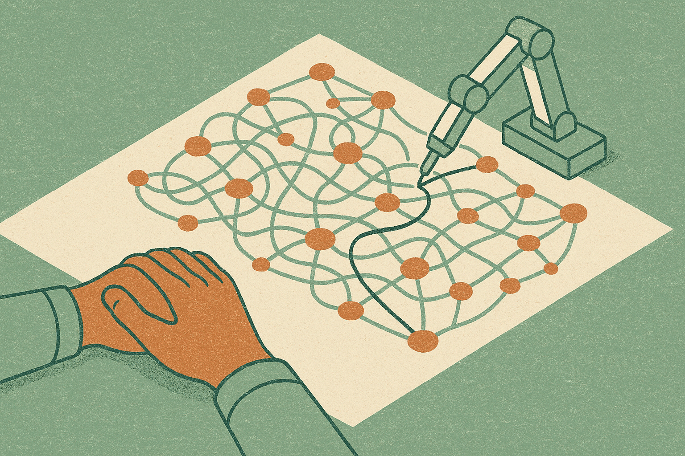

TL;DR: Letting AI run your incidents is a real speed win, but the muscle it atrophies is the one you need most during the outage the AI cannot handle, so you have to design for practice on purpose.

The prompt for this one is thin: a Hacker News discussion titled "AI handles incidents, engineers lose touch with their systems." No paper, no vendor announcement, no benchmark. So I want to be honest about what this is. It is not a study. It is a worry that keeps showing up in on-call channels and postmortems, and it is worth taking seriously precisely because nobody has good numbers on it yet. I have watched a version of this play out on teams I have worked with, and the pattern is consistent enough to write down.

## What actually happens when AI handles the incident?

Incident response is a loop: something breaks, someone forms a hypothesis, they pull logs and metrics to test it, they narrow the cause, they mitigate, they write it up. AI tooling is getting genuinely good at the middle of that loop. It correlates a spike with a deploy, summarizes the noisy log stream, suggests the runbook step, drafts the timeline. For the common case, a stateless service falling over after a bad config push, this is a clear win. The mean time to resolution drops. The 3am pages get less brutal.

The catch is what the human does during that faster loop. When the AI forms the hypothesis and the human clicks approve, the human never builds the hypothesis themselves. They stop reading the raw logs because the summary is right there. They stop holding a mental model of how the pieces connect, because the model lives in the tool now. This is not laziness. It is exactly what the tool is designed to encourage, and it works, which is the problem.

The knowledge that erodes is not trivia. It is the felt sense of "this smells like the database, not the network," the intuition that comes from having personally chased fifty incidents to their root. That intuition is what you fall back on when the tool is confidently wrong, or when the failure is novel enough that there is no runbook and no similar incident in the training window.

## Is this different from every other automation panic?

Fair challenge. Engineers said the same thing about compilers, about managed databases, about Kubernetes hiding the machines. Abstraction has always traded deep knowledge of the layer below for productivity at the layer above, and mostly that trade has been correct. I do not think "AI will rot your brain" is a serious argument, and I am not making it.

But incident response has a property that most abstractions do not. The abstraction is supposed to fail. A managed database is designed to hide the disk from you and keep hiding it. Incident tooling is the opposite: its entire reason to exist is the moment the normal path broke. So the skill it automates is the same skill you need when it hits its own limit. That is a different shape of risk than "I forgot how memory allocation works because the runtime handles it." Here you forget the thing precisely because the tool handled it, and then the tool taps out and hands you the hardest version of the problem cold.

There is a second wrinkle. Automation that fails loudly is safer than automation that fails quietly. A compiler error stops you. An AI incident assistant that confidently mislabels the root cause does not stop you: it points the whole response in the wrong direction, and a team that has lost its own judgment has nothing to check it against. Speed plus a wrong shared hypothesis is how a small outage becomes a long one.

## How do you keep the speed without going soft?

The answer is not to refuse the tooling. That is nostalgia, and it loses to teams that ship faster. The answer is to treat hands-on incident skill as a thing you now have to practice on purpose, because the daily reps that used to build it for free are gone.

A few concrete moves. Run game days where the AI assistant is turned off, so engineers reconstruct the loop themselves. This is the on-call equivalent of pilots practicing manual landings even though autopilot flies the plane. Rotate who leads the response so the same three senior people are not the only ones with live intuition. When the AI proposes a root cause, require the responder to state their own read before they see the suggestion, even one line in the incident channel. That tiny bit of friction keeps the human forming hypotheses instead of just approving them.

On the tooling side, prefer assistants that show their work. A tool that says "error rate rose after deploy abc123, these three log lines match, here is the runbook" teaches something. A tool that says "restart the pod" teaches nothing and trains you to obey. Ask your vendor, or your internal platform team, whether the assistant exposes the evidence chain or just the conclusion. That single question separates tools that build your team from tools that hollow it out.

And measure the thing you actually care about. MTTR is easy to track and it will look great. What you want to know is how the team does on the incidents the AI got wrong or could not touch. Tag those. Review them separately. That is your real skill signal, and it is the number that quietly rots while your dashboard stays green.

## What is the honest state of the evidence?

Thin, and I will not pretend otherwise. This is a lived observation circulating among practitioners, not a measured effect with a sample size. I have not seen a rigorous study putting a number on skill decay from AI incident tooling, and if someone runs one I will happily update. What I am confident about is the mechanism, because it is the same mechanism behind every well-documented case of automation-induced skill loss, from aviation to radiology. The tool does the reps, the human stops getting them, the skill fades until the day it is needed. AI incident response fits that pattern cleanly enough that waiting for the study is the expensive choice.

Here is the practitioner's take. Adopt the AI incident tooling: the MTTR win is real and refusing it is a losing move. But budget for skill the way you budget for on-call load. Schedule tool-off game days quarterly. Require a human hypothesis before the AI's suggestion is revealed. Track your performance on the incidents the AI missed, not just the average. The catch most people miss is that the failure mode is invisible on the dashboard you are already watching: your metrics improve right up until the incident that needs a human who has not practiced in a year, and by then the skill you needed is already gone.
