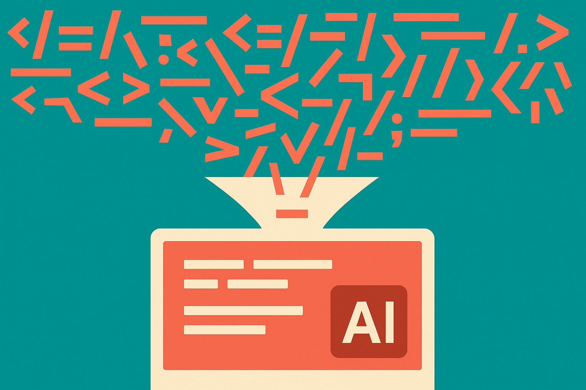

TL;DR: The practical win is not “use this one tool,” it is “stop dumping whole repos into coding agents when a smaller, structured slice will do.”

## Did Portal by Spotify really cut Claude Code token use by 90%?

The primary source here is the Hacker News item titled “Portal by Spotify cut my Claude Code token usage by 90%.” That is a big claim, and also a thin one from the material available here.

I would not treat “90%” as a benchmark. We do not have the repo size, task mix, Claude Code settings, prompts, before-and-after transcripts, cache behavior, model choice, or whether the same work got done at the same quality. Any one of those can swing token use hard.

But I do think the claim points at a real pattern.

Coding agents are hungry because software projects are messy. A simple change can pull in source files, configs, docs, dependency graphs, tickets, API contracts, test logs, and tribal knowledge. Most agent workflows solve that by stuffing more context into the model. That works until it gets expensive, slow, or noisy.

The better answer is usually context routing. Give the agent less, but give it the right less.

If Portal by Spotify helped this user reduce Claude Code token use, the interesting mechanism is likely not magic compression. It is probably structure: clearer ownership, service boundaries, docs, metadata, or retrieval paths that prevent the agent from rereading irrelevant project sprawl. I am being careful here because the supplied source does not include Spotify’s own documentation or announcement for Portal, so I am not going to state product mechanics as fact.

Still, the operator lesson is strong.

## Why does context discipline matter more than model size?

Bigger context windows are useful. They are also a trap.

When a coding agent has a giant window, teams tend to treat it like a junk drawer. “Here is the repo. Here are the docs. Here are the logs. Figure it out.” Sometimes it does. Sometimes it burns tokens summarizing files it never needed, follows stale docs, or makes a plausible edit in the wrong layer of the system.

The workflow I trust more is boring:

Start with a small task brief. Add the specific files touched by the failing test or feature request. Add the closest interface contract. Add one architectural note if the system has non-obvious rules. Let the agent ask for more context before it gets more context.

That sounds slower. It is often faster.

A human engineer does this naturally. They do not read the whole monorepo to rename a field. They trace the boundary, inspect the call path, run the narrow test, then widen only when something breaks. Coding agents need the same habit encoded into tools.

This is where developer portals, repo maps, ownership files, dependency indexes, and good internal docs become AI infrastructure. Not because they are flashy. Because they reduce ambiguity before the model starts spending tokens.

## What should builders test before buying the 90% story?

I would run a simple measurement before changing tools.

Pick ten real Claude Code tasks from your last two weeks. Include bug fixes, test repairs, refactors, and one vague product request. Save the prompts, files included, token use, elapsed time, and whether the output passed review. Then repeat with a stricter context plan.

Do not only measure token reduction. A 90% cut that produces worse patches is not a win. Track accepted diffs, reviewer comments, test pass rate, and how often the agent had to ask for missing information. The goal is lower waste, not smaller prompts for their own sake.

Also watch for hidden labor. If a senior engineer spends twenty minutes hand-packing context so the model saves tokens, the savings may be fake. The durable version is automated: repo indexes, code search, service catalogs, dependency graphs, and docs that are current because they are part of the engineering workflow.

The claim in “Portal by Spotify cut my Claude Code token usage by 90%” is best read as a signal, not proof. Something about structured developer knowledge can make coding agents cheaper to run. That is believable. The exact percentage needs receipts.

Practitioner's take: before chasing a new coding-agent stack, add a context budget to your current one. For each task, force the agent to start with the smallest useful slice: task, relevant files, failing output, and one system note. Let it request more. Measure tokens and review quality side by side. The catch most teams miss is that agent performance often improves when you remove context, as long as the remaining context is the part the work actually depends on.
