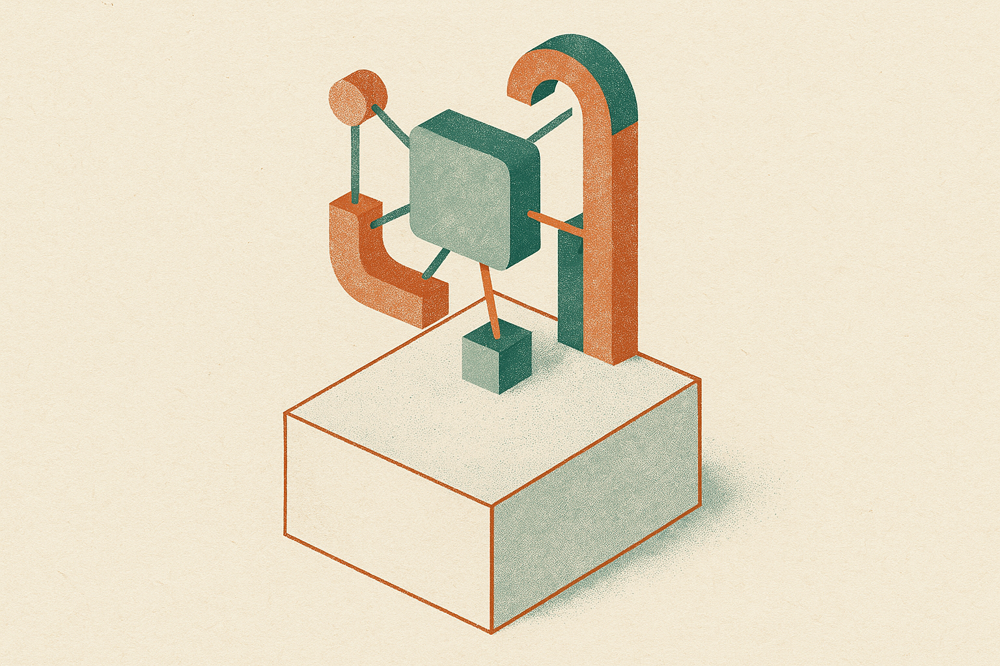

TL;DR: langchain-core 1.6.2 is a maintenance release, but two of its fixes (async tools for OpenAI and stopping silent mutation of standard content) matter more than the version number suggests if you run agents at any scale.

The primary source here is the GitHub release notes for `langchain-ai/langchain langchain-core==1.6.2`, listing the changes since `langchain-core==1.6.1`. That's it. No blog post, no thread, no keynote. Which is exactly why it's worth writing about. The interesting stuff in agent frameworks rarely arrives with fanfare. It shows up as a five-line changelog that quietly removes a class of bug you didn't know you had.

Let me be precise about what's actually in this release, because the value of a patch note is knowing what it does and does not promise. Five entries: a version bump (`#40209`), async tool support for OpenAI (`#40208`), two dependency bumps (mistune and tornado), and two mutation fixes in the standard content path (one for google-genai in `#40023`, one for bedrock converse in `#40022`). That's the whole surface area. Everything below is my read on why three of those five matter.

## What does async tool support for OpenAI actually change?

The line reads `feat(openai): support async tools (#40208)`. Short. The implication is not.

If you've built anything with tool-calling agents, you know the pattern: the model decides to call a tool, your code runs that tool, you feed the result back. When the tool is a synchronous function, that's fine. But a lot of real tools are I/O bound. Hitting a database. Calling another API. Reading a file. Waiting on a vector store. In an async application, running those synchronously blocks the event loop, and blocking the event loop under concurrent load is how you turn a snappy agent into a queue.

Async tool support means your tools can be coroutines and the framework will await them properly instead of forcing a sync execution path. For a single-user script, you won't notice. For a service handling many agent sessions at once, this is the difference between concurrency that works and concurrency that pretends to. I want to be careful not to overclaim from a one-line changelog: the note tells us the capability landed for the OpenAI integration, not the exact API shape or edge-case behavior. Check the actual signatures in the docs before you rewire anything. But the direction is right, and it's the kind of thing you only appreciate after you've debugged a mysteriously stalled agent at 2am.

## Why do two "avoid mutation" fixes deserve attention?

Here are the two easiest lines to skim past:

`fix(core): avoid mutation in google-genai standard content (#40023)` and `fix(core): avoid mutation in bedrock converse standard content (#40022)`.

Mutation bugs are the quiet assassins of agent code. The word "standard content" refers to LangChain's normalized message-content representation, the layer that lets you write code once and have it work across providers like Google's Gemini and Bedrock's Converse API. When a function mutates that shared content in place instead of returning a copy, you get action at a distance: something modifies an object another part of your code still holds a reference to, and now the same message means two different things depending on when you look at it.

This is the category of bug that doesn't crash. It corrupts. You get a message history that's subtly wrong, a tool call that references content that changed under it, a retry that replays a mutated state. And because it's provider-specific (one fix for google-genai, one for bedrock converse), it's the sort of thing that shows up only when you switch models or run a multi-provider setup. If you've ever had an agent behave differently on Gemini than on Claude for no reason you could name, this class of fix is why. Two providers patched in one release tells me the maintainers found a shared pattern and are cleaning it up methodically. Good sign.

## Should you upgrade, and what's the catch?

The two dependency bumps, mistune 3.3.0 to 3.3.3 and tornado 6.5.7 to 6.5.8, are routine hygiene. Patch-level bumps on a markdown parser and an async networking library, almost certainly pulling in upstream fixes. Nothing to negotiate there.

The honest answer on upgrading: a patch release from `1.6.1` to `1.6.2` inside the same minor version signals no breaking changes by semver convention, and nothing in these five lines contradicts that. So the risk is low. But "low risk" is not "no testing." The mutation fixes change behavior, quietly and for the better, which means if any of your code was accidentally depending on the old mutating behavior (unlikely, but I've seen weirder), it'll surface here. Async tools add a capability rather than changing an existing one, so that's additive.

What most readers miss reading a changelog like this: the absence of drama is the point. There's no new agent abstraction, no rebranded chain, no "introducing" anything. This is a framework maturing at the layer where correctness lives, the message and content plumbing that everything else sits on top of. That layer being boring is a feature. You want your excitement in your product, not in your dependency's content-normalization code.

The practitioner's take: if you run LangChain agents against OpenAI in an async service, upgrade to 1.6.2 and refactor your I/O-bound tools to be proper coroutines, then load-test with real concurrency to confirm the event loop stops blocking. If you run multi-provider setups touching Gemini or Bedrock Converse, upgrade specifically for the two mutation fixes and re-run any test that compares message history across providers, because those bugs hid in exactly that seam. The catch: read the actual docs for the async tool API before you assume the shape, because a one-line changelog tells you a thing exists, not how to hold it. Treat the release note as a pointer, verify against the code, then ship.
