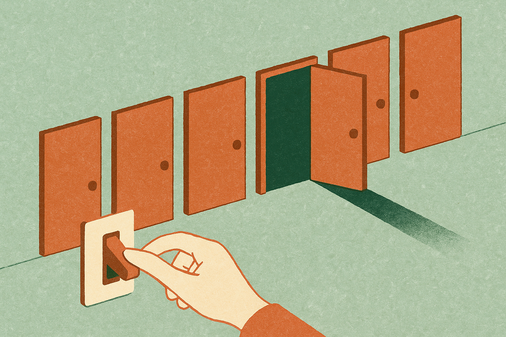
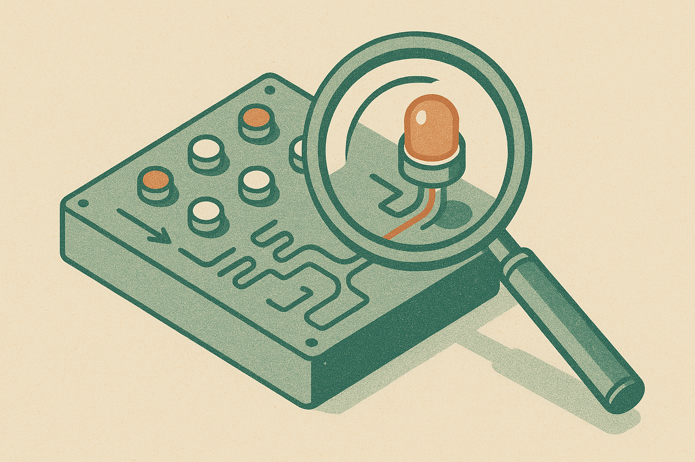

TL;DR: A Hacker News thread flags that Chrome again treats some Google-owned sites differently from every other site when you tell it to clear data on exit, and if that holds up it matters less as a scandal and more as a reminder that the company writing the browser also runs the destination.

I want to be careful here, because the only source I have is a Hacker News post titled "Chrome again exempts Google from user site data settings." That is a pointer to a story, not the story itself. I do not have Google's own documentation, a bug report number, or a reproducible test in front of me. So treat everything downstream as reported behavior worth checking, not settled fact. The word "again" in that headline is the interesting part, and it is the part I can actually reason about.

## What is the claim, exactly?

The claim, as posted, is that Chrome exempts Google's own properties from a user-facing setting meant to control site data. In plain terms: you tell the browser to wipe cookies and local storage for sites when you close it, or you set data to clear on exit, and certain Google domains survive that instruction when other domains do not.

I cannot confirm the mechanism from a single headline. It could be a genuine carve-out, an unintended interaction between sign-in state and storage, or a narrower behavior than the title implies. HN titles compress hard and editorialize. What I can say is that this has surfaced before under similar framing, which is why "again" is doing so much work.

If the behavior is real and scoped to Google domains, the honest description is not "spyware." It is a default that favors the browser maker's own services, applied through the browser the maker controls. That is a smaller and more durable problem than a dramatic one.

## Why does "again" matter more than the specifics?

Because a one-off bug gets patched and forgotten. A pattern tells you something structural.

Google builds Chrome. Google builds Search, Gmail, YouTube, Ads. When the same company owns the pipe and the water, every default in the pipe is also a business decision about the water. Most of the time those defaults are boring and reasonable. But the incentive to treat first-party Google domains as slightly special is always present, and it does not require malice to express itself. It just requires nobody inside the org pushing back hard on a convenient exception.

That is the real story for anyone who thinks about platforms: not this specific setting, but the fact that the browser deciding what "clear my data" means is not a neutral party. Chrome holds roughly two thirds of the browser market by most public trackers. When its defaults tilt, the web tilts with them.

I bring this into an AI-focused note on purpose. The next round of this exact fight is already here, and it is not about cookies.

## How does this connect to AI browsers and agents?

Here is the through-line. We are moving from browsers that render pages to browsers and agents that act on your behalf. Chrome is shipping Gemini features. Perplexity has Comet. OpenAI and others are building agents that click, log in, and read your accounts. Every one of those systems needs persistent state: who you are, what you are signed into, what it is allowed to remember.

A cookie exemption is a low-stakes version of a question that gets very high-stakes with agents. When you tell an AI browser to "forget this," does it actually forget? When the company that makes the agent also runs the services the agent talks to, whose interest wins when those two things conflict? A model that keeps you signed into the maker's ecosystem is more useful to the maker and, sometimes, to you. The friction is that "sometimes" is where trust leaks out.

The cookie case is legible. You can inspect storage, you can reproduce it, you can post it to HN. Agent memory is far less legible. It lives in server-side context, in account graphs, in "personalization" you cannot easily audit. If a browser maker will quietly exempt its own domains from a visible setting, the reasonable prior is that the invisible ones get the same treatment unless proven otherwise. Not because anyone is evil. Because the incentive points one direction and nobody is watching the other.

## What should a builder actually do about it?

Stop treating "clear on exit" or "delete my data" toggles as guarantees and start treating them as claims you verify.

If you ship anything that runs inside Chrome or on top of an AI browser, do not assume the platform's privacy controls behave uniformly across domains, including the platform owner's own. Test it. Open dev tools, set the browser to clear site data, close and reopen, and inspect what actually persisted for your domain versus first-party platform domains. If your product's promise to users depends on the browser honoring a setting, you own the gap when the browser quietly does not.

For agent builders the same discipline applies one layer up. If you offer a "forget this session" feature, define exactly what it clears: local storage, server context, the account graph, the vendor's memory. Users will assume the strongest reading. Ship the weakest reading and you inherit the reputational cost the first time someone posts a repro.

The catch most people miss: the fix here is not a different browser, because the same structural incentive exists at every vendor that owns both the client and the services. Firefox is the partial exception because Mozilla does not run a giant first-party ad-and-account empire, but it also does not have the market share to set defaults for the web. So the practical move is not tribal browser-switching. It is auditing behavior instead of trusting labels, writing your own product's data promises in terms you can verify, and assuming that any control you did not test yourself is a marketing statement rather than a technical one.

I would love to update this with Google's own explanation, a bug ID, or a clean reproduction, and if the behavior turns out narrower than the headline, I will say so. Until then the useful takeaway stands on its own: on the browser most of the web runs through, the company writing the rules is also playing the game, and "again" means that is not an accident you can wait out.
