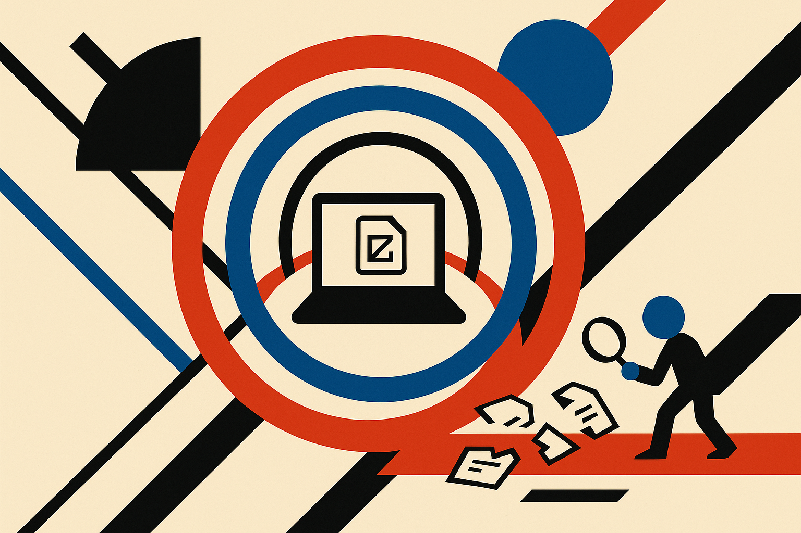

TL;DR: A local LLM can be useful during a live security scare because it keeps helping after you pull the network cable, but it should guide containment and evidence gathering, not freelance as antivirus.

## What actually mattered in the r/LocalLLaMA story?

The primary source here is the r/LocalLLaMA post titled **“Qwen3.8-27B ‘Unhacked’ my PC.”** It is not a lab report. It is not a clean incident writeup. It is one person describing a very normal bad night: a sketchy “watch a movie” link, a fake installer, Chrome and Discord crashing, Discord account takeover, 2FA spam, threats, blackmail, Windows Defender finding nothing, and AdwCleaner spotting an old AVG Toolbar entry that kept coming back.

That messiness is the point.

Most consumer security incidents do not start with a tidy IOC list. They start with panic, ambiguous symptoms, and too many decisions at once. Do I unplug the network? Which passwords first? Is this a RAT, a session stealer, ransomware, or just social engineering after credential theft? Do I reboot? Do I run the suspicious file again? Do I wipe the machine?

The Reddit poster says they disconnected the PC from the internet and asked a local Qwen model to inspect files in the project folder, explicitly telling it not to run the suspicious executable. That constraint matters. The useful move was not “AI removed malware.” The useful move was “an offline assistant helped structure the next hour when the user could not safely search the web from the compromised machine.”

That is a real use case.

## Where can a local model help during an incident?

The best role is triage copilot.

A local model can turn panic into a checklist. It can ask what changed, what accounts received 2FA prompts, what processes look new, what startup entries exist, where downloads landed, what browser extensions appeared, and which credentials should be rotated first from a clean device.

It can also help read artifacts. Filenames, scripts, scheduled tasks, registry export snippets, startup folders, browser profile paths, PowerShell history, suspicious archive contents if safely extracted. A 27B-class local model is often good enough to explain what a command does, compare two file trees, or spot that a supposed installer behaves like a credential grabber.

The offline part is underrated. When the sane instruction is “disconnect the infected machine,” cloud chatbots become less useful unless you have a second clean device. A local model already on the box, or on a separate offline laptop, can still reason over notes and copied text.

But there is a hard line. Do not let the model run malware. Do not ask it to “clean everything” with broad shell commands you do not understand. Do not paste active secrets. Do not assume it knows whether a binary is safe. And do not treat a Reddit success story as validation that this works against modern stealers or persistence mechanisms.

The model is a calm rubber duck with domain knowledge. Not an EDR.

## What is the catch most people will miss?

The catch is that local AI is only useful here if you prepared before the incident.

If the model is not installed, tested, and usable offline, it will not help when the network is pulled. If you have no clean device, no password manager recovery path, and no backups, a model cannot invent operational safety. If your Discord, email, domain registrar, and cloud accounts all share weak recovery assumptions, the fastest “malware cleanup” may still lose to account takeover.

The r/LocalLLaMA post is valuable because it points at a workflow, not because it proves Qwen is a security product. The workflow is: isolate first, preserve evidence, rotate critical credentials from a clean device, inspect persistence, verify with known tools, and rebuild if trust is gone. The model can keep you moving through that workflow when your brain is overloaded.

Practitioner’s take: set up one local model on a clean machine and write a small “incident prompt” now. Include rules like “do not execute suspicious files,” “ask before suggesting destructive commands,” and “prioritize containment, account recovery, and evidence.” Test it on harmless sample logs. The model will not save you by magic, but it can buy you clarity in the first 60 minutes, which is when most people make the expensive mistakes.
