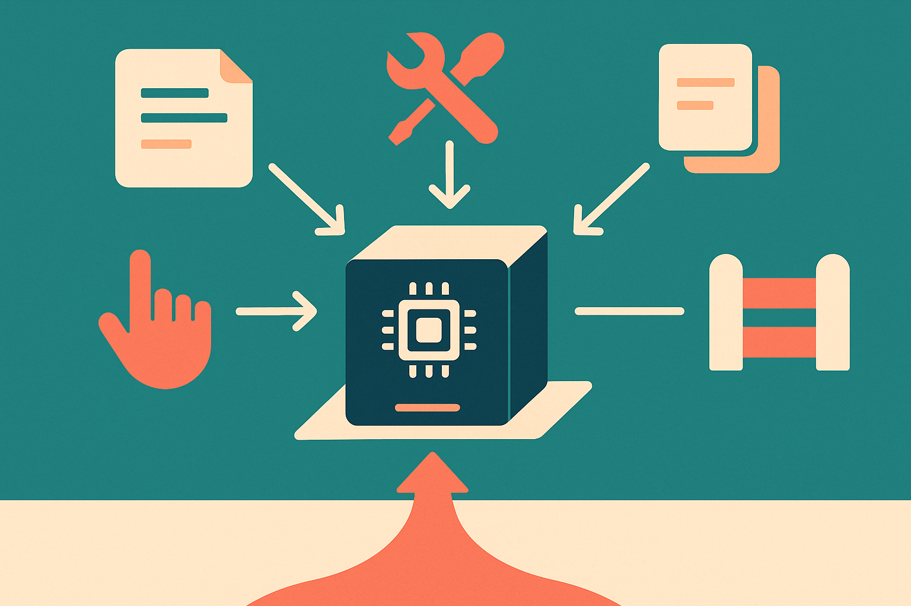

TL;DR: “Next-token predictor” is technically accurate, but it is a poor working model for builders because the behavior you ship depends on context design, tool access, constraints, and feedback loops.

## Is “next-token predictor” wrong?

The Hacker News discussion titled “Next-token predictor” is the wrong mental model for LLMs lands on a phrase I hear constantly, usually as a dunk.

The dunk goes like this: LLMs are “just” predicting the next token, so any talk of reasoning, planning, world models, or agency is marketing fog.

There is a clean truth inside that. Autoregressive language models are trained to predict token sequences. If you are explaining pretraining, “next-token prediction” is not wrong. It is the loss function. It is part of the machinery.

But as a product mental model, it compresses away nearly everything that matters.

A calculator is “just” moving charges through logic gates. True. Not useful if you are designing a spreadsheet. A compiler is “just” transforming strings. True. Not useful if you are debugging a production build system.

The useful question is not whether the phrase is technically defensible. It is whether it helps you predict failure modes and design better systems.

For most builders, it does not. It makes people stare at the model in isolation, as if the whole product is a single completion call. That was closer to reality in 2020. It is a bad fit for 2026 workflows, where the model sits inside a system with retrieval, tools, code execution, policies, memories, evals, human review, and state.

## What mental model should builders use instead?

I prefer: an LLM is a context-conditioned behavior engine.

That sounds less cute, but it points your attention to the knobs you actually control.

The model does not answer in a vacuum. It reacts to the full situation you build around it: system prompt, examples, retrieved documents, tool schemas, prior messages, hidden instructions, output format, latency budget, and whatever state your app passes in. Change those and you often get a different “capability” from the same weights.

This is why two products using the same model can feel wildly different. One feels like a clever autocomplete box. Another feels like a competent analyst. The gap is rarely magic. It is usually scaffolding.

A good agent loop turns model guesses into checked work. Ask for a plan, call tools, inspect results, retry, compare against criteria, cite the evidence, hand off edge cases. The model still emits tokens at each step, yes. But the system behavior is not reducible to one token guess any more than a database-backed web app is reducible to SQL strings.

The next-token frame also hides an important split: training explains origin, not deployment behavior. A model trained on token prediction can still learn internal structure useful for translation, coding, math, search, and instruction following. That does not mean it “understands” in the human sense. It means the training objective can produce machinery that generalizes beyond the obvious surface description.

I do not like mystical language here. I also do not like reductive language that stops investigation.

## Where does the “just prediction” frame still help?

It helps when expectations get sloppy.

LLMs are not databases. They can state false things fluently. They can overfit to phrasing. They can imitate confidence. They can produce valid-looking JSON that is wrong in the one field you care about. The next-token frame is a useful reminder that the model is not consulting truth by default.

It also helps with interface design. If you ask vague questions, you often get plausible vague answers. If you provide the relevant context, define success, constrain the output, and give the model tools to check itself, you usually get better work. Not always. Enough to matter.

So I would keep the phrase for training lectures and epistemic hygiene. I would not use it as the main frame for product building.

A better builder question is: what information, tools, constraints, and verification does this model need to produce the behavior I want, repeatedly, under messy user input?

That question leads to evals. It leads to logging. It leads to fallback paths. It leads to smaller scoped agents instead of one giant chatbot. It leads to products that survive contact with users.

Practitioner’s Take: If you are building with LLMs this week, stop debating whether your model is “just” a next-token predictor and map the system around it. Write down the inputs it sees, the tools it can call, the checks after each step, and the cases that must route to a human. Then run 20 ugly examples through it. The catch most teams miss: model choice matters, but the workflow around the model usually decides whether the product feels smart or merely fluent.
