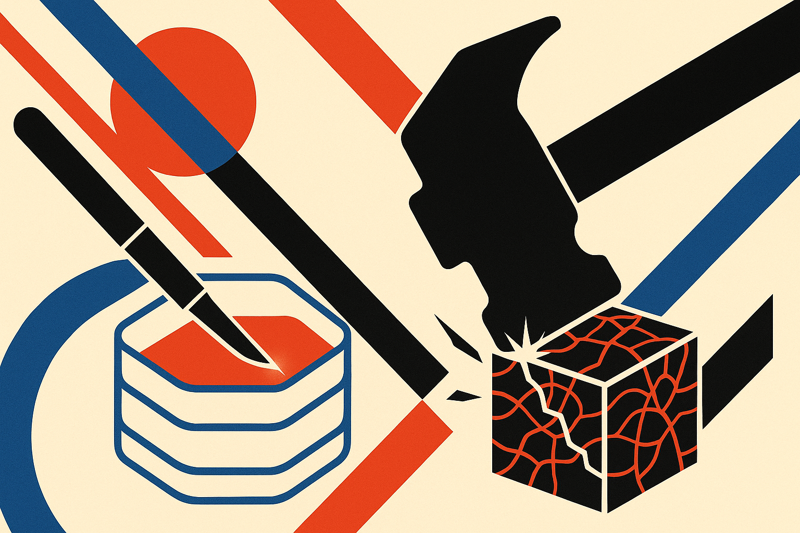

TL;DR: For local “uncensored” models, the best edit is often the smallest verified one, because aggressive weight surgery can trade refusals for broken reasoning, hidden prompt hacks, and worse usability.

## What did Abliterlitics actually test?

The primary source here is Abliterlitics’ report, “8 uncensored Qwen 3.8 27B variants, one base, 167 GPU hours,” shared on r/LocalLLaMA with the full report at abliterlitics.dev/models/qwen38-27b.

Abliterlitics compared eight abliterated Qwen 3.8 27B variants against the base model. The test took 11 days and about 167 GPU hours. Their pipeline included weight comparison, KL divergence measurement, 13 benchmarks, and refusal testing with HarmBench 400 classic.

That matters because “uncensored” model comparisons are usually vibes. Someone uploads a model card, claims a method, posts a few spicy prompts, and users infer the rest. Abliterlitics did the more annoying work: checking whether the claimed edits match the weights, measuring behavior across attack categories, and watching for quality loss.

The ranking by LLM judge HarmBench attack success rate put orcarouter first at 82.2%, apostate second at 78.7%, and huihui third at 75.6%. The base model sat at 4.5%, which Abliterlitics described as a wall, with zero compliance on chem and bio, harassment, harmful content, and copyright.

That is the surface result. The useful result is stranger.

## Did heavier uncensoring work better?

No. Abliterlitics’ clearest finding is that surgical edits beat broad edits.

The top two variants were also the two smallest verified edits. Orcarouter used what Abliterlitics called an Arditi-style single direction at layer 38, affecting 131 matrices, and was the only model card where every claim checked out against the weights. Apostate used its KCRN method, with 41 real edits, the lowest measured KL divergence at 0.0439, and near-identity capabilities according to the report.

The heavy edit did not win. Obliteratus touched 841 of 850 tensors and ranked second to last among the variants, at 63.9%. Abliterlitics said it was the only variant that got meaningfully dumber, and 44.8% of its HarmBench responses never finished their thinking block before the 15,360-token budget ran out.

That last point is important. Qwen 3.8 27B is a “thinking” model. It reasons before answering. Aggressive refusal removal did not just change what the model would say. It changed whether the model could complete a usable answer under adversarial pressure. Abliterlitics reported that GSM8K math loops disappeared at the higher token budget, with all arms within 1.2 percentage points of base on answered-only results. So this was not generic broken reasoning. School math converged. HarmBench-style adversarial deliberation did not.

Copyright also looks like a separate wall now. Abliterlitics reported that no variant exceeded 39% on copyright unlock, and five of nine models were at or below 3.2%. Chem and bio, historically harder in many refusal tests, became easier to unlock in this panel. That does not mean the models are safe or unsafe in any broad sense. It means refusal behavior is category-specific, and a single “uncensored” label hides too much.

## Why should builders care about chat templates?

Because the weights were not the whole product.

Abliterlitics found that blackfrost shipped a 1,457-character jailbreak prompt inside its chat template. That means every prompt sent through the packaged chat format was being modified before it reached the model. Obliteratus shipped “thinking-off.” Ultra_heretic deleted the stock reasoning-effort prompt. Abliterlitics pinned the stock template for every arm because, in their words, the template was a stronger behavioral lever than many people assume.

This is the part local model users miss. A model is not just a tensor file. It is weights plus tokenizer plus template plus sampler plus system prompt defaults plus inference stack. If one variant looks more “uncensored,” it may be because it was edited cleanly, or because someone stuffed a jailbreak into the wrapper.

I do not read this report as a recommendation to chase the highest attack success rate. I read it as evidence that local model evaluation needs forensics. Check claims against weights. Compare KL. Run refusal tests by category. Inspect the chat template. Watch completion behavior, not just whether the model eventually says the forbidden thing inside an endless reasoning trace.

Practitioner’s take: if you are testing local Qwen variants, start with the least invasive model that passes your actual task suite, not the loudest “uncensored” upload. Run your own prompts with a known clean template, cap and log reasoning tokens, and track failures where the answer never exits the think block. The catch is that a model can look compliant in a benchmark trace and still be useless in production because it thinks forever, ships hidden prompt baggage, or loses the exact capability you needed.
