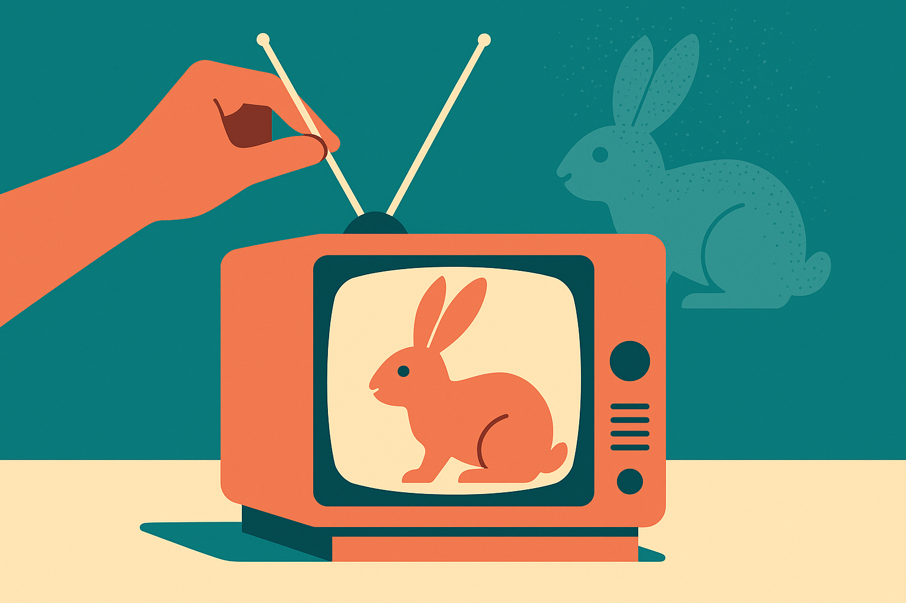

TL;DR: Diffusion TV points to a better pattern for explaining generative AI: let people manipulate the process, not just inspect the output.

## What does a CRT teach that a dashboard does not?

The arXiv cs.AI paper, "Diffusion TV: Experiencing Diffusion Models through Tangible, Embodied Interaction," describes an interactive AI art installation built around a modified CRT television. Participants adjust the TV antenna to control the clarity of AI-generated images and sounds. That physical act maps onto the denoising process behind diffusion models.

That is the useful part.

Most explanations of diffusion models still rely on diagrams: noise on the left, image on the right, some arrows in between. Fine for a slide. Weak as an experience. Diffusion TV takes the same core idea and makes it bodily. You reach for the antenna. The image sharpens or falls apart. The sound changes with it. The model is no longer a black box that spits out a final asset. It becomes a process you can poke.

The tuning knob adds another layer. Participants switch between three channels: Past, Present, and Future. The Past shows extinct species. The Present shows endangered species. The Future shows speculative creatures. That framing matters because it keeps the piece from becoming a cute interface demo. The generative system is tied to ecological memory and prediction, both areas where AI outputs can feel seductive and slippery.

## Is this explainable AI, or just good art?

I would call it explainable AI, but not in the usual enterprise sense.

Diffusion TV does not appear to teach the math explicitly. It does not walk people through U-Nets, schedulers, latent spaces, or classifier-free guidance. The paper frames it as an alternative, embodied mode of explainable AI. That phrase can get squishy, but the underlying claim is practical: people can understand a system better by acting on it and feeling its intermediate states.

That is especially relevant for generative AI because the intermediate states are often hidden. In most products, the user enters a prompt, waits, and receives a polished result. The messy middle is abstracted away. That makes products feel magical, which is good for demos and bad for judgment. If users never see uncertainty, drift, noise, or convergence, they over-trust the final image, paragraph, clip, or answer.

Diffusion TV foregrounds the middle. It treats intermediate states as material, not waste. That is a subtle but important design move. For builders, it suggests that explanation does not always need more text. Sometimes it needs a control surface.

## What can product teams borrow from this?

Do not copy the CRT unless the CRT is the point. Copy the interaction pattern.

If you are building with image, audio, video, or agentic systems, expose a meaningful part of the generation process. Let users scrub through drafts. Let them steer uncertainty. Let them compare partial states. Let them see what changed when they adjusted a constraint. A slider, timeline, knob, or staged preview can teach more than a tooltip that says “the model is thinking.”

The catch is that the control has to map to something real. Fake knobs are worse than no knobs. If a user action only changes the vibe while pretending to reveal model behavior, you have built theater. Diffusion TV works as a concept because the antenna interaction tracks the metaphor of denoising: noisy signal to clearer signal. The physical action and the computational process rhyme.

I also like the ecological channel design because it reminds builders that interfaces carry politics and assumptions. “Past, Present, Future” is not neutral. It frames generation as memory, risk, and speculation. That can be good, if intentional. It can also mislead, if the model’s outputs start feeling like evidence rather than generated possibilities.

For a practitioner, the move is simple: take one opaque AI workflow and design a small interaction that reveals its middle state. Not a giant explainability panel. One control that changes something users can see, hear, or compare. Try it in onboarding, model evaluation, creative review, or agent supervision. The missed catch is fidelity. The interaction must correspond to the system’s actual behavior, or users will learn the wrong lesson faster than they learn the right one.
