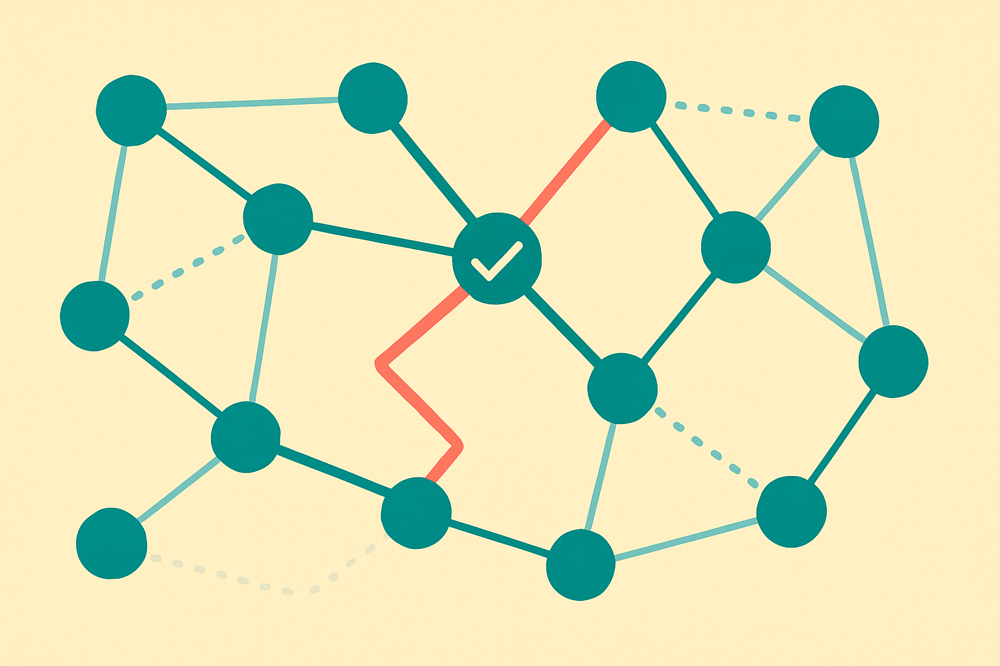
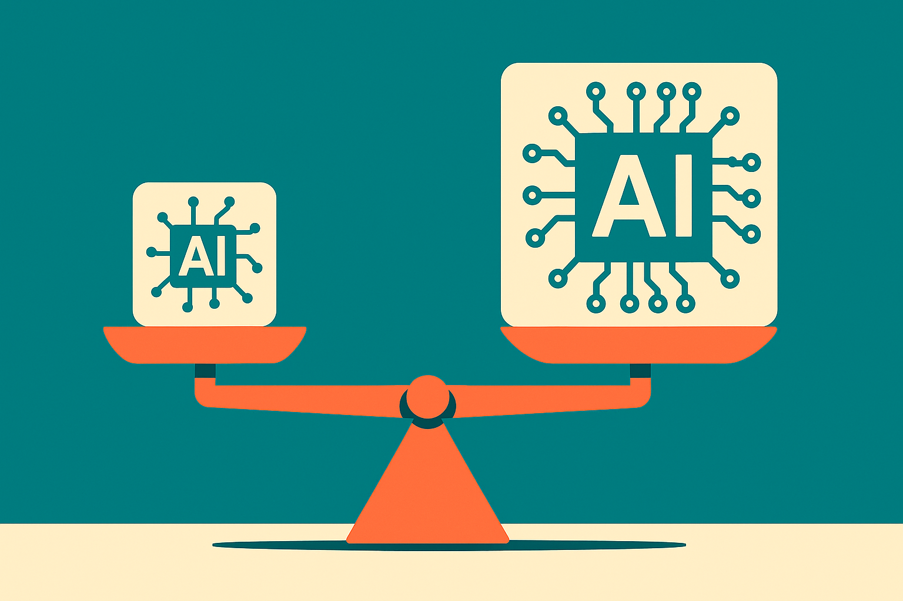

TL;DR: A team building for data-sovereignty rules synthesized tool-calling training data by running real API calls instead of imagining them, and their fine-tuned 9B model nearly caught a 27B model from the same family on multi-step government-API tasks.

The paper is "Multi-Step Tool-Calling over Korean Open Public APIs: A Benchmark and a Data-Synthesis Recipe," posted to arXiv under both cs.AI and cs.CL. It does two things at once: it ships a benchmark called KOPA-Bench, 145 real tasks over live Korean public-sector APIs, and it introduces a data recipe called EDGE that generates training trajectories by executing tools for real and keeping only the links that work. That combination is the interesting part. Most tool-calling work either measures the gap or tries to close it. This one does both, and the closing move is grounded in execution rather than in a model's guess about what an API returns.

## Why does data sovereignty force this problem into the open?

The motivation here is not academic. Data-sovereignty regulations push public institutions toward open-source, on-premise LLM agents. You cannot send a citizen's tax record to a hosted frontier model in another jurisdiction, so the agent has to run on infrastructure you control, which in practice means an open-weight model you can host yourself.

The catch the authors call out: open-source models consistently underperform on multi-step tool-calling, and until now no benchmark measured that gap on live government APIs specifically. So you have a regulatory requirement pushing toward a class of model that happens to be worst at the exact job. That is the squeeze KOPA-Bench is built to expose.

This is a pattern worth noting beyond Korea. Anywhere with residency rules, health data, or classified environments, the "just call GPT" answer is off the table. The real question becomes how good a self-hosted model can get at chaining internal tools, and how cheaply you can make it good.

## What is EDGE actually doing differently?

EDGE stands for Execution-grounded Dynamic Graph for tool-calling data synthesis. Strip the acronym and the idea is simple to state and harder to do.

Multi-step tool-calling means one tool's output feeds another tool's input. Search returns an ID, you pass that ID to a lookup, the lookup returns coordinates, you pass those to a mapping call. To train a model on this you need trajectories: sequences of calls that actually connect. The lazy way to generate those is to have a big model write plausible-looking sequences. The problem is that plausible and executable are different things. An API you have never called might reject your parameter format, return a null where you expected an object, or rate-limit you into a different code path.

EDGE builds a graph of how each tool's output can feed another tool's input, then keeps only the edges that succeed when actually called against the live APIs. It traverses those verified links to synthesize multi-step trajectories that are executable by construction. The grounding is the whole point. You are not training on what an API should do, you are training on what it did.

That is the part I would underline for anyone building agents internally. Synthetic tool-calling data is easy to generate and easy to fool yourself with. Data that survived contact with a real endpoint is a different asset.

## Does grounded data actually close the size gap?

This is where the claim gets specific, and where I want to be careful about what the sources say versus what I would want to know.

The authors fine-tuned a 9B model via GRPO on the EDGE-generated dataset. GRPO is the reinforcement-style optimization approach popularized in recent open-model training, and the reported result is that their tuned 9B model nearly matches the untuned 27B model from the same family. Not just on KOPA-Bench, the home benchmark, but also on BFCL, the Berkeley Function-Calling Leaderboard, which is a widely used external check. Improving on an outside benchmark matters because it argues the gains are about tool-calling skill, not memorizing the shape of one test set.

"Nearly matches" is doing real work in that sentence, and the abstract does not give the exact margins, the base model family, or the compute cost. So treat the headline as reported by the authors, not as an independently verified 3x efficiency win. What I can say is that the direction is consistent with a lot of 2025 and 2026 results: for narrow, well-defined capabilities, targeted data plus RL on a smaller model can recover much of the distance to a bigger sibling. Tool-calling is a good candidate for this because success is checkable. A call either executes and returns the right thing or it does not, which gives you a clean reward signal for GRPO.

The honest caveat: nearly matching a 27B model on a 145-task benchmark is a strong signal, not a finished product. Government deployment cares about the tail. The task you fail once in a hundred is the one that mishandles a benefits application.

## What should a builder take from this?

The transferable idea is not "Korean APIs." It is a method you can copy. If you are building an agent over your own internal or public APIs, generate training and evaluation data by executing real calls and keeping only the chains that succeed. Build the tool-output-to-tool-input graph, verify the edges against live endpoints, and let verified paths become your trajectories. You end up with data that reflects your actual failure modes: the auth quirks, the pagination, the fields that are documented but empty.

Then, if you have the appetite, fine-tune a small open model on that data with an RL method like GRPO, using execution success as the reward. The payoff the authors report is that you may not need the big model at all, which for an on-premise deployment is the difference between one GPU and several.

The catch most readers will miss is that this whole approach depends on having live APIs you can hammer during data synthesis. EDGE works because it can call the real endpoints, repeatedly, to prune bad edges. If your APIs are rate-limited, expensive per call, or have side effects that write to production, you cannot casually execute thousands of speculative chains against them. Before you copy the recipe, figure out whether you have a safe execution sandbox or a staging environment that behaves like production. That constraint, not the model size, is what will decide whether you can reproduce this. Start there, build the verified graph on data you are allowed to break, and only then worry about which 9B model to tune.
