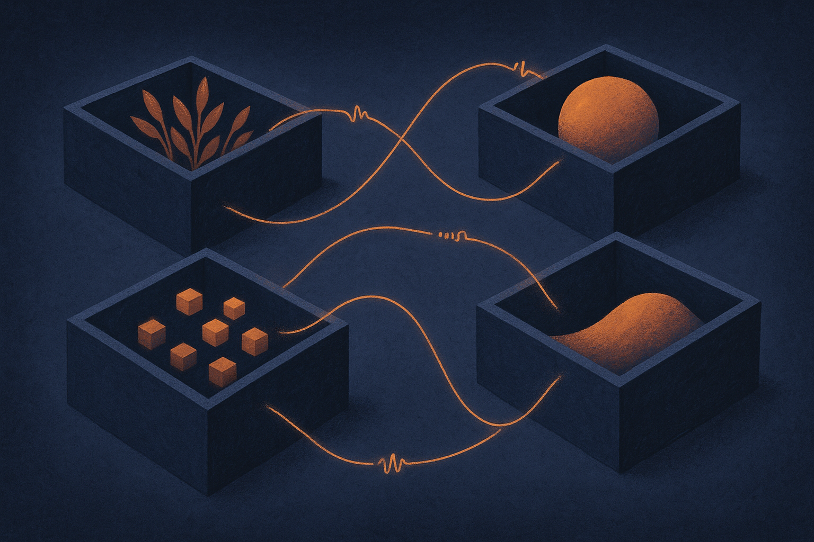

TL;DR: RegionFed personalizes retail search models region by region by watching where regional and global gradients disagree, which sidesteps the parameter-level tricks that break transformers like T5 and gets within 0.23 points of the accuracy you'd get by pooling everyone's data illegally.

The paper is "RegionFed: Federated Learning for Personalized Query Understanding in Heterogeneous Retail Environments," posted to arXiv under both cs.AI and cs.LG. I'm treating the abstract as the primary source here, so a few things I'd normally want (per-region breakdowns, the full ablation table, wall-clock cost) aren't in front of me. What is in front of me is a clean idea, and the idea is the interesting part.

## What problem is RegionFed actually solving?

Retail search is not one problem. A query typed in one region carries different vocabulary, different product preferences, and different intent than the same words typed somewhere else. "Boot" means one thing in a work-gear market and another in a fashion market. If you train one global model on everyone, you flatten those differences and every region gets a slightly-wrong model. If you train per-region models on isolated data, each region is data-starved.

Federated learning is the standard answer to the privacy half of this: train locally, share updates instead of raw data, never pool the queries. But the authors point out that plain FL gives you back a global model, which is exactly the flattening problem you were trying to avoid. So you reach for personalized federated learning, which tries to keep a shared backbone while letting each region tune its own piece.

Here's the wall they hit. Existing personalized FL methods work at the parameter level: they decide which layers or weights are "personal" versus "shared." On modern transformers that logic falls apart. The authors report those methods collapsing below 10 percent accuracy on T5. The culprits they name are tied embeddings (input and output embedding matrices sharing weights) and LayerNorm interactions. Slice a transformer along parameter lines and you cut through structures that were never meant to be split.

## How does working at the gradient level change things?

RegionFed's move is to stop touching parameters and instead read the gradients. Specifically it uses the L2 conflict between a region's gradient and the global gradient as a single signal. Think of it as measuring how hard each region is pulling against the group during training.

That one number does three jobs. It diagnoses how heterogeneous a region is (big conflict means the region really is different). It routes each region to what the authors call "the cheapest sufficient personalization strategy" (a region that barely disagrees doesn't need heavy custom treatment). And it adaptively controls how strong the personalization should be. One measurement, three decisions.

The payoff of staying at the gradient level is portability. Because RegionFed treats the model as a differentiable black box, the abstract says it runs on T5-Small, T5-3B, RoBERTa, and a CNN with zero code changes. That's the claim I find most useful if it holds up. Parameter-level methods have to know the architecture intimately, which is why they break when the architecture uses tricks like tied embeddings. Gradient-level methods don't care what's inside the box. You could swap the model and keep the framework.

I'd want to see the routing logic in detail before I fully buy "cheapest sufficient," because that phrase is doing a lot of work and the abstract doesn't show the cost accounting. But the core intuition, gradient conflict as a heterogeneity meter, is the kind of simple mechanism that tends to generalize.

## Do the numbers hold up against the honest baseline?

The headline result: RegionFed-Meta hits 92.27 percent across three public datasets (Amazon ESCI, Amazon Reviews, LEAF-FEMNIST) and four architectures. The comparison that matters is the upper bound. The authors put the centralized version, the one that pools all the data and does regional weighting, at 92.04 percent. RegionFed comes in 0.23 points *above* that, which they frame as within one standard deviation, so effectively a tie.

Read that carefully. The centralized number is described as the "privacy-violating" upper bound, the thing you get if you ignore privacy and pool everything. RegionFed matches it while providing differential privacy at roughly epsilon 0.60 and O(1/√T) convergence. Matching a pooled-data ceiling while keeping data federated and adding a strong DP guarantee is the real claim.

That epsilon deserves a note. Epsilon around 0.60 is a genuinely tight privacy budget, tighter than a lot of deployed DP systems that live in the single-digit-to-double-digit range. If that number holds under scrutiny, it's the most impressive line in the abstract, more than the accuracy tie. The catch: DP accounting is easy to state and hard to verify from an abstract, and the relationship between epsilon, the noise mechanism, and that 92.27 accuracy is exactly the thing you can't see without the full paper. Take the epsilon as a claim to check, not a settled fact.

## Where this actually matters beyond retail

The framing is retail search, but the mechanism is general. Any system with data split across owners who won't or can't pool it, and where each owner's data is genuinely different, fits the shape. Hospitals with different patient populations. Banks with different fraud patterns. Devices with different users. The heterogeneity-plus-privacy combination is everywhere once you look.

What makes this worth a builder's attention is the architecture-robustness angle specifically. Most federated learning research assumes you'll live with whatever model the framework supports. RegionFed inverts that: pick your model, then federate it. If you've been holding off on FL because your production model is a fine-tuned transformer and the existing personalized methods choke on it, this is the paper that says maybe you don't have to choose.

If I were putting this to work, I'd start by measuring gradient conflict on my own regions or clients before committing to any framework, because that single L2 signal is cheap to compute and it tells you whether you even have a heterogeneity problem worth personalizing for. Plenty of teams assume their segments differ and then discover the gradients barely diverge, which means a plain global model would have been fine. RegionFed's contribution, if the paper backs the abstract, is turning that diagnosis into an automatic routing decision rather than a manual one. The catch most readers will miss: the 92.27-versus-92.04 tie is against a *weighted* centralized baseline on public datasets, not against your messy production data, and the epsilon 0.60 figure needs the full DP accounting before you quote it to a compliance team. Read the mechanism now, validate the numbers on your own data before you build on them.
