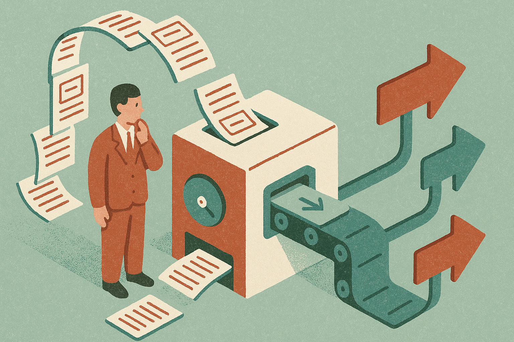

TL;DR: If the public sees search marketing as morally acceptable to automate, the job protection story gets weaker, so marketers need to move up from task execution to judgment, systems, and accountability.

## What did Harvard reportedly measure?

Search Engine Journal’s Greg Jarboe, in “Harvard Found The Public Has Little Objection To AI Taking Search Marketers’ Jobs,” reported that Harvard scored 940 occupations on how morally objectionable the public finds automating them.

Search marketing landed low: 2.31 out of 7.

That is the number that matters here. Not because public opinion decides product roadmaps by itself. It does not. But public tolerance affects the temperature around automation. It shapes what executives feel comfortable approving, what vendors feel comfortable selling, and how much friction a company expects when a workflow gets handed to software.

A low moral-objection score does not mean search marketers are useless. It means the public may not see the work as sacred, sensitive, or socially protected in the same way it might view automation in caregiving, education, medicine, or public safety.

That distinction is easy to miss. AI does not need people to hate your job before it changes your job. It only needs buyers to see automation as normal enough.

## Why would search marketing score so low?

Search marketing has spent years describing itself in machine terms.

Keywords. Rankings. Bid adjustments. Metadata. SERP features. Content velocity. Programmatic pages. Technical audits. Dashboards. Conversion rates.

That language is useful. It also makes the work sound automatable.

A lot of search marketing is pattern work. Find gaps. Cluster queries. Produce briefs. Rewrite titles. Compare competitors. Monitor position changes. Generate variants. Report deltas. AI systems are already decent at parts of that, especially where the output is a draft, a classification, or a recommendation rather than a final business decision.

The trap is pretending the task list is the job.

The real value in search marketing is not “write 50 title tags.” It is deciding which search demand is worth pursuing, what the brand can credibly answer, how to avoid producing junk at scale, how to connect organic visibility to revenue, and when not to chase a query because the traffic is low intent or reputationally risky.

The public may not object to automating the visible chores. Fair enough. I do not object either. But companies that automate the chores and remove the judgment usually get louder mediocrity. More pages. More dashboards. More “optimized” content that says nothing.

AI makes that cheaper. It does not make it good.

## What changes for search marketers now?

The defensive argument, “a human should do this because a human has always done it,” is getting weaker. Jarboe’s reported Harvard number is a reminder that the public may not provide much moral cover for preserving routine search work.

So the practical move is to separate the work into three buckets.

First, tasks AI should probably do: first-pass keyword clustering, brief generation, log analysis summaries, internal link suggestions, SERP pattern extraction, schema checks, ad copy variants, and reporting drafts.

Second, tasks AI can assist but should not own: content strategy, editorial judgment, brand positioning, experiment design, conversion diagnosis, and prioritization across channels.

Third, tasks humans must be accountable for: what gets published, what claims are made, which audiences are targeted, how performance is interpreted, and whether the company is creating value or just filling the internet with plausible filler.

That last bucket is where the durable job lives.

Search marketers should also be careful with the politics of this. If the public has little objection to automation, arguing from job preservation alone may fail. A stronger argument is quality, trust, and liability. Bad search content wastes user time. Bad local SEO can mislead customers. Bad medical, financial, or legal content can harm people. Bad measurement can push companies to spend money in the wrong places.

For builders and operators, start by mapping your search workflow by risk, not by convenience. Automate the repetitive research and drafting steps first, keep human review where claims, brand, and prioritization enter the system, and measure whether the AI-assisted process improves outcomes instead of only increasing output. The catch most teams miss: if you use AI to make more of the same thin work, you are not building a moat. You are training everyone, including your customers, to care less about what you publish.
