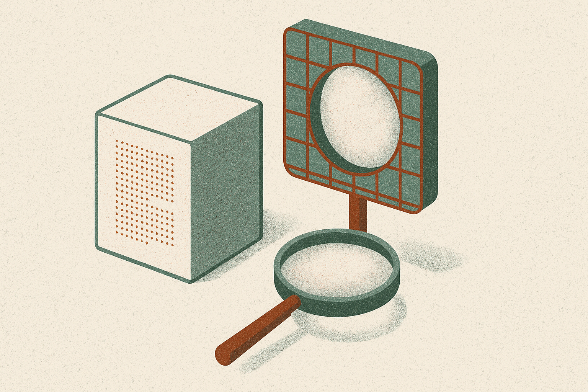

TL;DR: Swapping the model under an existing agent can quietly corrupt its memory, and how badly depends entirely on your storage format: fixed-schema knowledge graphs survive almost untouched, model-compressed notes swing by double digits, and you cannot repair the damage unless you kept the raw source history.

Most teams treat a model upgrade as a drop-in. New checkpoint, same memory store, ship it. The paper "Does Your Agent's Memory Survive a Model Upgrade? A Controlled Study of Memory Portability" (posted to arXiv under both cs.AI and cs.CL) says that assumption is where agents quietly start forgetting things they used to know. The memory store didn't change. The reader did. And the reader was never neutral.

That's the part I find worth sitting with. We talk about memory as if it's a database the agent queries. But in most stacks, memory is a collaboration between a writer model that decided what to save and a reader model that decides what it means. Change either one and the contract breaks.

## What actually breaks when the model changes?

The study sets up a clean comparison. Take the same conversation history and store it four ways: kept verbatim for long-context reading (LC-RAW), split into chunks for retrieval (RAG), compressed by a model into natural-language notes (NOTES), or normalized into a fixed-schema knowledge graph (KG-fixed). Then swap the model that reads or writes that memory and measure how accuracy moves. The setup uses 48 synthetic histories with randomized answer codes and exact scoring, run on two open-weight models under 10 billion parameters.

The headline result: format determines fate.

KG-fixed barely moved. Accuracy shifted by +0.0004 ± 0.0020 after a writer swap. That's noise. A fixed schema forces both models to speak the same structured language, so there's nothing left to reinterpret. The graph says "entity, relation, value" and there is no room for a new model to have opinions about it.

NOTES behaved the opposite way. Compressed natural-language notes showed high coupling to the specific model, with accuracy swinging +9.91 or -13.28 percentage points depending on which direction you migrated. Read that twice. The same notes, the same questions, and the outcome flips by more than 20 points across the two directions. Notes written by one model and read by another are a translation problem you didn't know you signed up for.

## Why is the failure direction-dependent?

This is the detail I'd tattach a sticky note to. The damage is asymmetric. Migrating from model A to model B is not the same as B to A. One direction gained roughly 10 points, the other lost roughly 13.

That kills the intuition that "newer model, better memory" is monotonic. There's no upgrade arrow. There's a specific pairing, and each pairing has its own behavior. Which means you cannot reason about this in the abstract. You have to test the exact migration you're about to run, in the exact direction you're running it. The paper calls this direction-specific migration testing, and it's the practical spine of the whole thing.

RAG has its own version of the trap. Partial embedding migrations, where you re-embed half your index and leave half on the old model, captured only a 4.96-point accuracy improvement out of the 11.90-point gain available from a full re-embed. Mixing embedding spaces doesn't get you half the benefit. It forfeits most of it, because vectors from two different embedding models don't share a coordinate system. Similarity scores across the boundary are meaningless. So the "we'll re-embed gradually" plan, which sounds responsible, is close to the worst option. The paper's recommendation is blunt: strict embedding space isolation. All old or all new, never mixed.

## Where does the accuracy actually leak out?

The authors decompose the failures, and this is where you learn what to fix versus what to accept.

For NOTES, 80% of the accuracy deficit (0.467 ± 0.014) came from information lost during construction. The note-writing step threw away detail that was never coming back. The reader wasn't the main culprit. The compression was. Once you've summarized a history into prose, the facts you dropped are gone, and no amount of clever reading recovers them.

For RAG, the pattern inverts. Retrieval failures drove 81% of the deficit (0.364 ± 0.012). The information was still sitting in the store. The system just couldn't surface the right chunk. That's a very different bug, and it points at the retriever and the embedding boundary, not at the storage.

So NOTES fails at write time and RAG fails at read time. If you only remember one thing from the decomposition, remember that, because it tells you where to spend engineering effort for each format.

## Can you repair a broken memory after the fact?

Here's the closer, and it reframes what "memory" should mean architecturally.

Store-only repair of NOTES failed to hit a 90% recovery target in all 48 cases. Every single one. If all you kept was the compressed notes, you cannot rebuild what the compression discarded. There is no source to go back to.

But when the raw source history was retained, repair succeeded in 34 of 48 cases for one tested direction. The raw history is the thing that makes recovery possible. The derived artifacts, the notes and the graphs and the embeddings, are all disposable caches. The source is the asset.

That's the mental model shift. Your agent's memory store is not the ground truth. It's a lossy projection of the ground truth, tuned to whatever model built it. Treat the projection as ground truth and you lose the ability to ever fix it.

Two honest caveats. This is 48 synthetic histories and two sub-10B open-weight models, so the exact point swings won't transfer to your GPT-class or Claude-class stack. And synthetic histories with randomized answer codes are a clean test but not a messy production log. What does transfer is the structure of the findings: fixed schemas are portable, compression couples to the model, mixed embeddings are worse than either extreme, and raw source is your only repair path.

If you run agents with persistent memory, do three things before your next model swap. Keep the raw source history for anything you care about recovering, always, and treat everything else as a rebuildable cache. Never run a mixed-embedding index during a migration: cut over fully or not at all, per store. And run the migration in the exact direction you'll ship, with real recovery scoring, because the paper's asymmetry result means a passing test in one direction tells you nothing about the other. The catch most people miss is that the failure is silent. Nothing errors. The agent just answers a little worse, and you find out from a user, not a log. Direction-specific testing is the only thing that catches it before they do.
