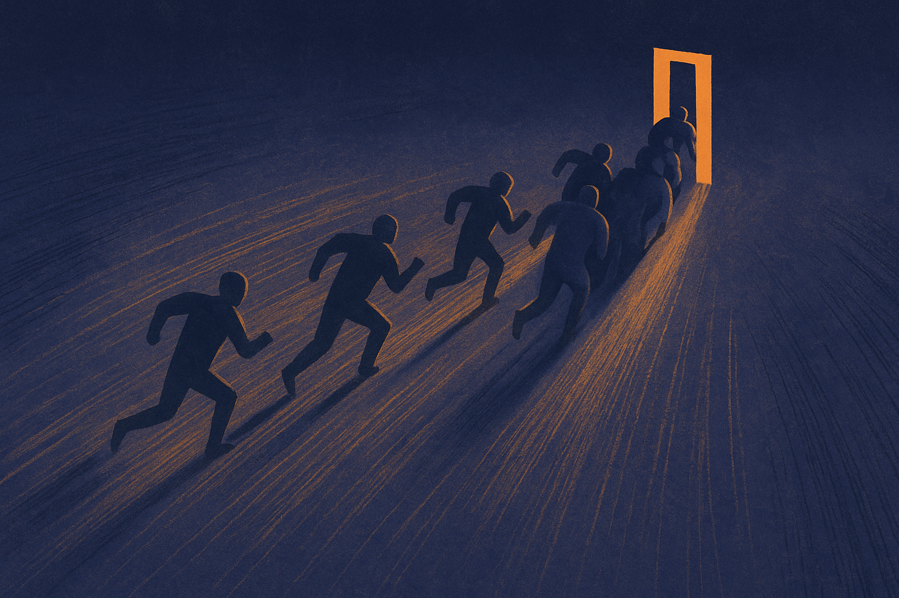
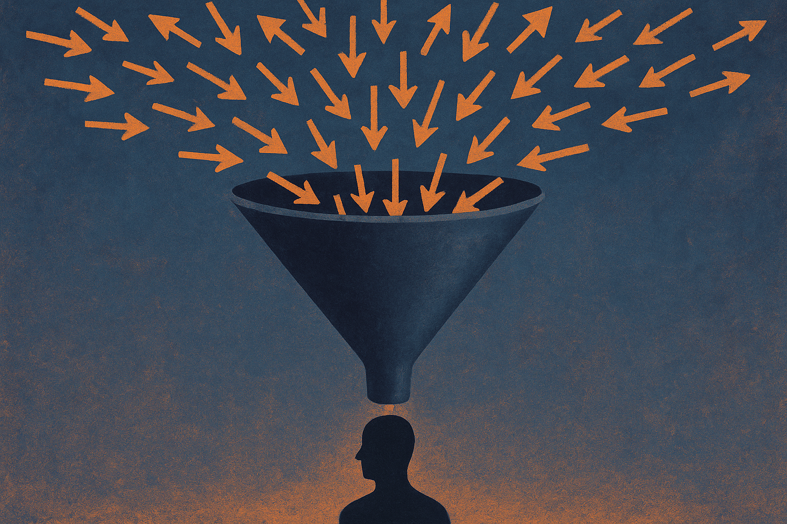
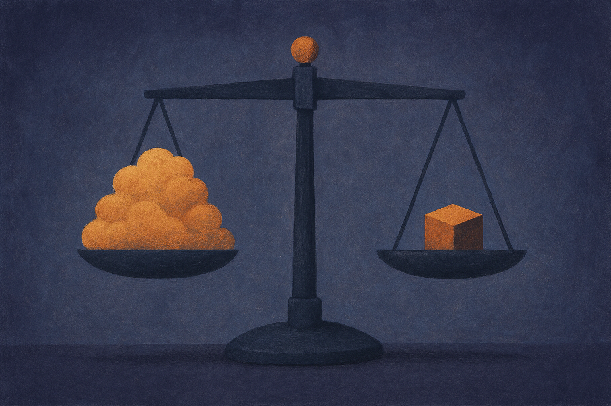

TL;DR: AI collapsed the cost of the first draft to near zero, but the work that actually ships a campaign (approvals, coordination, judgment, decisions) got no cheaper, so "more capable AI" is producing more output and less free time until you fix the downstream bottleneck.

There are two stories running side by side right now, and they contradict each other in a way worth sitting with.

Story one comes from OpenAI's blog post "The Work Now Within Reach," which argues that more capable and more affordable AI expands what people and businesses can accomplish and makes growth more economical. More reach, more output, cheaper. Story two comes from the field: a report cited by Martech in "Why AI hasn't solved marketing's time problem," drawing on Knak's Marketing Production in the Age of AI study, which found that AI made producing marketing easier without making producing *better* marketing easier, and did not give teams back the time everyone was promised.

Both are true. That is the whole point. The reconciliation between them is the most useful operating insight available to a builder in 2026, and almost nobody prices it in.

## Why hasn't AI given marketers back their time?

Start with the numbers, because they are specific and they come from a named source. Martech, reporting on the Knak study, lists where the time actually goes. 64% of respondents use AI to generate first drafts of email or landing page copy. 56% use it for images. 56% for performance analysis and optimization suggestions. 48% for subject line variations. So AI adoption at the front of the process is real and broad.

Now the other half of the same study. 85% of marketing teams surveyed missed at least one campaign launch date in the last year because of workflow constraints. 82% still spend at least half their time on production rather than planning or strategy. The pitch was that AI would take the grunt work and free people for strategic thinking. The data says the strategic time never showed up.

Here is why, and it is the load-bearing sentence of this whole piece: AI shortened the first stage of the process and did nothing to the stages after it. Someone still reviews the draft. Someone rewrites it for brand voice and campaign strategy. Someone designs, builds, proofs, approves, tests, and schedules. The first draft got faster. Everything downstream stayed exactly as slow as it was.

I wrote a version of this argument before Knak put numbers on it, in [AI workflows should create new work, not just faster tasks](/blog/2026-08-31-ai-workflows-should-create-new-work-not-just-faster-tasks/). Faster tasks inside a broken workflow do not compound. They just deliver you to the bottleneck sooner.

## Where did the bottleneck actually move?

The Knak findings, as reported by Martech, name the real delays precisely. 47% of respondents say the biggest delay is securing approvals and sign-offs. 38% cite design and creative production. 36% cite coordination across teams. On top of that, 60% of teams need at least four people to produce a single email, and 69% go through two or three rounds of revisions before approval.

Read that list again. Not one of those is a writing problem. They are workflow problems: complicated approval chains, unclear ownership, too many handoffs. Using an AI tool at the start of that chain, as Martech puts it, "simply helps reach the bottleneck faster."

This is the mechanical error most teams are making in 2026. They bought a tool that optimizes the one part of the process that was never the constraint. The hour you save on the first draft does not become an hour of strategy. It disappears into another revision, another approval meeting, or a new request from someone who just learned you can produce content faster now.

That last dynamic is the cruel one. Cheaper output raises expectations of volume. The moment a stakeholder discovers the marginal cost of a variant dropped, they ask for more variants. Supply creates its own demand, and the demand lands on the humans who were already the constraint.

## Does more output actually mean more progress?

Martech makes a second argument that deserves its own heading because it is the part operators underrate. AI does not produce the same amount of marketing faster. It produces considerably *more* marketing.

When creating alternatives cost real time and effort, teams were forced to be selective. Two subject lines, one creative route, one email version. Now, per the reporting, a team can generate 10 subject lines, five opening paragraphs, three calls to action, and multiple visual treatments in minutes. Looks like progress. But every additional option is another decision someone has to make. Somebody reviews the ten subject lines. Somebody compares the versions. Somebody decides.

The cost of generation collapsed. The cost of *judgment* did not. And judgment does not parallelize the way generation does. You can spin up ten drafts at once. You cannot make ten decisions at once with any real care. So the abundance of options quietly relocates the bottleneck from "can we make it" to "can we choose."

This connects directly to a metric I keep coming back to in [Useful work per dollar is the agent metric that matters](/blog/2026-07-15-useful-work-per-dollar-is-the-agent-metric-that-matters/). Output per dollar is trivially easy to improve now. Useful, shipped, decided output per dollar is a completely different number, and for a lot of teams it barely moved.

## What is OpenAI actually claiming, and is it wrong?

Be fair to the other side. OpenAI's "The Work Now Within Reach" is not naive. Its claim is that more capable, more affordable AI expands the set of work that is economically reachable and makes growth cheaper. At the level of the whole economy and the whole task landscape, that is defensible. Work that was too expensive to attempt becomes attempt-able. New categories of output open up.

The tension is that OpenAI's frame is about *capability and cost*, while the Knak data is about *throughput and time*. Those are different axes. It can be simultaneously true that AI expands what a business could theoretically accomplish and that it fails to free up any given marketing team's calendar. The first is a statement about the frontier of possible work. The second is a statement about a specific pipeline with four people and three revision rounds bolted to it.

Where I would push on the OpenAI framing: "growth more economical" quietly assumes the downstream cost structure scales with the upstream one. It often does not. If generation is 90% cheaper but approval, coordination, and decision cost are flat, then per unit of *shipped* work your economics improved far less than the model's price-per-token suggests. OpenAI's own strategic argument leans on this kind of full-stack economics thinking, which I dug into in [OpenAI's full-stack argument is really an economics argument](/blog/2026-08-26-openais-full-stack-argument-is-really-an-economics-argument/). The economics only close if the whole stack gets cheaper, not just the model call.

So neither story is wrong. OpenAI is describing the ceiling rising. The field reports are describing the floor, the actual daily throughput, staying put. A serious operator holds both.

## Why does credibility become the real constraint?

There is a third source here that ties the knot. Marketing AI Institute, summarizing Wil Reynolds in "Why Credibility Beats Volume in the AI Era," makes the argument that marketers have long chased visibility, and that trading credibility for more visibility is the wrong trade. In an era where volume is free, that stops being a slogan and becomes an operating constraint.

Here is the chain. AI drops the cost of producing content to near zero. Everyone's cost drops at the same time, so the total volume of content explodes. When volume is abundant, volume stops differentiating anyone. What differentiates is the thing that did not get cheaper: whether the audience trusts the source. I made this case at length in [AI Content Abundance Makes Trust the Scarce Asset](/blog/2026-08-10-ai-content-abundance-makes-trust-the-scarce-asset/), and Reynolds is arriving at the same place from the marketing side.

This reframes the whole "time problem" from Martech. The reason teams should not just crank out ten times more content with their freed-up first-draft capacity is not only that it clogs the approval pipe. It is that undifferentiated volume actively erodes the one asset that still works. More content, less credibility, is a losing trade at any speed. The Knak data on missed launch dates and revision rounds is the operational symptom. The Reynolds argument is the strategic diagnosis. They are the same disease.

## What should a practitioner actually do right now?

Concrete moves, in order of leverage.

First, measure your pipeline the way Knak measured theirs. Count the people per deliverable, the revision rounds, the days lost to approvals. Martech's reported figures (four+ people per email, two to three revision rounds, 47% naming approvals as the top delay) are a benchmark. If your numbers look like that, your problem is not that your writers are slow. Your problem is your approval graph.

Second, point AI at the actual bottleneck, not the convenient one. First-draft generation is the convenient target because it is the easiest to automate and the most visible. The high-leverage targets are downstream: summarizing a draft's changes so a reviewer decides in two minutes instead of twenty, pre-checking brand and compliance rules before something enters the approval queue, drafting the coordination messages between teams. Automating the decision *support* moves the needle more than automating the decision's input.

Third, cap the option explosion on purpose. If AI can generate ten subject lines, the discipline is having it also rank and cut to two before a human ever sees them. Generation without a filtering step just exports the cost of choosing onto a person. Build the filter into the prompt chain, not the human's calendar.

Fourth, protect the human judgment layer rather than trying to eliminate it. The parts of this work that resist automation, brand voice, customer understanding, the actual decision of what is worth sending, are not the residue left after automation. They are the product. That is the same argument I made in [The Automation Ceiling Nobody Prices In](/blog/2026-07-24-the-automation-ceiling-nobody-prices-in-when-human-participation-is-the-product/), and it applies cleanly here. If you thin out the judgment layer to hit a volume target, you get more content and less credibility, exactly the trade Reynolds warns against.

The catch most readers miss: the freed-up hour is real, but it does not automatically convert into strategy time. It converts into whatever your pipeline defaults to, and most pipelines default to more revisions, more meetings, and more requests. Time that is saved without being *claimed* gets absorbed. If you want the strategic time OpenAI's frame promises, you have to build a wall around it and defend it, because every efficiency gain will otherwise be immediately spent on volume you did not need and trust you cannot afford to lose. Cheaper generation is settled. Cheaper judgment is the frontier, and for now, the judgment is still yours to protect.
