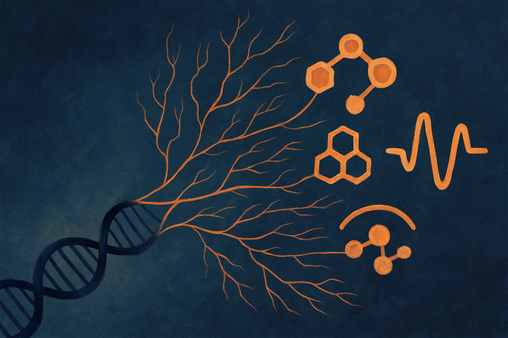

TL;DR: AlphaGenome Atlas is best read as a genome-scale prioritization layer, not an oracle, because predicted molecular effects can help researchers choose what to test before they spend scarce lab time.

## What did Google DeepMind actually map?

Google DeepMind’s primary announcement is titled “AlphaGenome Atlas: A predictive map of every possible DNA letter change in the human genome.” The headline claim is big and specific: AlphaGenome Atlas maps the molecular effects of 9 billion single-letter DNA variants across the human genome.

That matters because the human genome is not short, and most possible one-letter changes have not been directly measured in a wet lab. If you are trying to understand which variants might alter gene regulation, expression, splicing, or other molecular behavior, the bottleneck is not imagination. It is coverage. There are too many possible changes, too many cell contexts, and too much experimental cost.

A map like this changes the first step. Instead of starting from a tiny set of known variants, a research team can start from a predicted landscape. Not “this mutation causes this disease.” That would be a stronger claim than the announcement supports. The stated object is molecular effect prediction. Still useful. Very useful, if handled correctly.

The simple way to think about it: AlphaGenome Atlas is trying to make variant interpretation less blank-sheet and more search problem.

## Where is the real utility?

The immediate use case is triage.

Researchers, clinical genetics teams, and biotech groups routinely face long lists of candidate variants. Some are common. Some are rare. Some sit in protein-coding regions. Many sit outside them, in regulatory regions where interpretation gets messy fast. If a model can score or characterize molecular effects across the full genome, it can help sort the pile.

That does not replace experiments. It changes which experiments get run first.

This is the part I find practical. AI in biology often gets framed as “the model will discover the cure.” Sometimes that framing hides the actual operational win: better queues. Better filters. Better guesses before expensive work begins.

A genome-wide atlas could help a team ask sharper questions:

Which variants look inert at the molecular level?

Which ones seem likely to disrupt regulation?

Which variants should be grouped because they appear to affect similar mechanisms?

Which candidates deserve validation in a specific assay?

The catch is that a prediction map is only as useful as the decisions wrapped around it. If a lab treats the model output as a ranked to-do list without checking context, it can fool itself faster. Biology is full of conditional effects. Cell type, developmental timing, ancestry, environment, and measurement choice all matter. A global map is a starting layer, not the whole stack.

## What should builders take from this?

The bigger signal is that biology AI is moving from impressive one-off demos toward reusable substrate.

Protein structure prediction had this flavor. Once structure predictions became easy to query, many workflows changed around them. Not every prediction was the answer. But the existence of a broad predictive layer altered how people searched, designed, and tested.

AlphaGenome Atlas points in that same direction for human genetic variation. If you can query predicted effects for billions of possible DNA edits, the interface becomes as important as the model. Search, filtering, provenance, uncertainty display, assay integration, and feedback loops become product problems.

That is where operators should pay attention. The raw model is DeepMind-scale. The useful products around it may not be. There is room for tools that help geneticists compare predicted molecular effects against internal datasets, literature evidence, cohort observations, and lab results. There is room for workflow software that turns a massive atlas into decisions a team can defend.

Practitioner’s take: if you build in genomics or bio tooling, do not pitch this as automated truth. Try it as a prioritization layer inside an existing variant review or assay-planning workflow. Pick a narrow domain, compare predictions against variants your team already understands, and track where the model changes the next experiment. The missed catch is uncertainty handling. The teams that win will not just show a score, they will show when not to trust it.
