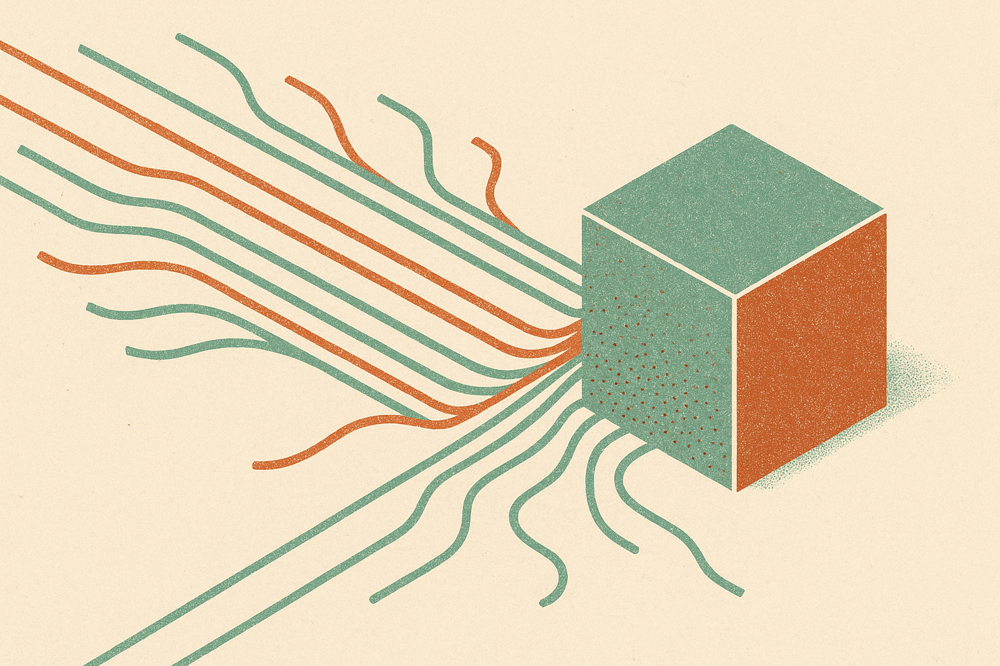

TL;DR: Treat OpenAI’s reported $1 million math-problem claim as a serious signal about AI-assisted research, but not as a solved-problem moment until the proof, provenance, and independent validation are public.

## Did OpenAI actually solve a Millennium Prize Problem?

CoinDesk’s report, “OpenAI says 10,000 AI agents solved a $1 million math problem. Now mathematicians are fighting,” is the primary source for this note. CoinDesk reported that an internal OpenAI model, described as more capable than GPT-6 Astra, produced a proposed solution to one of the seven Millennium Prize Problems using 10,000 AI agents. Matthew Berman also covered the claim and emphasized the same explosive detail: OpenAI allegedly used an unnamed next-generation model that is already “significantly more capable” than Astra.

That is a big claim. It is also not the same as a settled mathematical result.

The supplied material does not include a first-party OpenAI research post, a paper, a formal proof, an arXiv link, or a Clay Mathematics Institute review. So I would not write “OpenAI solved it” without a lot of qualifiers. The right wording is closer to this: CoinDesk reported that OpenAI says it produced a proposed solution, and mathematicians are now disputing or examining how independent and valid that solution is.

That distinction matters. Mathematics does not move because a model generated a plausible proof-shaped artifact. It moves when specialists can check every step, locate dependencies, challenge hidden assumptions, and agree the result holds.

## Why does the “10,000 agents” detail matter?

The agent count is the most operationally interesting part of the story.

If the report is accurate, this was not one chatbot thinking very hard. It was a distributed search process. Thousands of agents likely explored subproblems, proof paths, lemmas, counterexamples, references, and possible formalizations. That is closer to running a research factory than asking a model for an answer.

This is where the hype and the real shift overlap. The hype says “AI is now a genius mathematician.” The real shift says “AI systems may become useful at organizing large-scale intellectual search, especially when the domain has crisp verification rules.”

Math is unusually friendly to that pattern. A proof can, at least in principle, be checked. Code has a similar property. Some science does too, when simulation or experiment closes the loop. Most business work does not. A fleet of agents drafting strategy docs is not the same kind of progress as a fleet of agents grinding through proof candidates that can be rejected or confirmed.

The catch is attribution. CoinDesk’s subtitle says questions are emerging over how independently the system got there. That is not a side issue. If the model assembled pieces from known work, leaned on unpublished human hints, or reproduced a flawed argument with new packaging, the result changes category. It may still be useful. It is not the same achievement.

## What should builders take from this without buying the hype?

The builder lesson is not “spin up 10,000 agents.” Most teams cannot afford that, and most problems do not deserve it.

The lesson is to separate generation from verification. Open-ended agent swarms are noisy. They become useful when there is a hard check at the end: a proof checker, a test suite, a simulator, a compiler, a database constraint, a human review board with domain expertise. Without that, more agents just mean more confident-looking output.

This also puts pressure on AI evals. If OpenAI has an internal model ahead of Astra, as CoinDesk and Berman describe, benchmark charts will not tell us much. The interesting eval is whether the system can produce work that survives adversarial expert review. Not “does it answer contest problems,” but “does it create a contribution that changes what experts believe after inspection.”

For now, I would track three receipts: publication of the full proposed proof, independent commentary from active mathematicians in the relevant field, and any formal verification effort. Until then, this is an important research claim, not a final scoreboard update.

If you are building with agents today, copy the structure, not the spectacle. Pick a narrow problem, launch multiple agents with different roles, force them to leave audit trails, and run every output through a verifier that can say no. The part most readers miss: the intelligence is not only in the model. It is in the review loop that catches the model when it sounds brilliant and is wrong.
