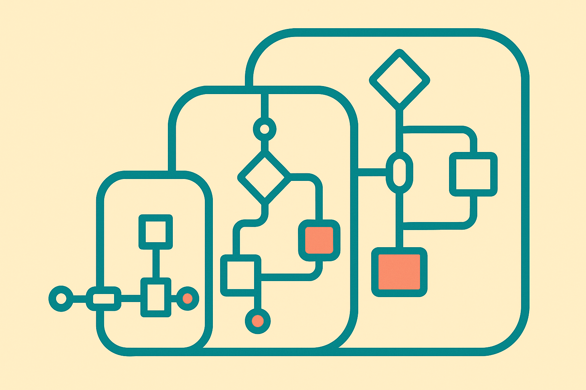

TL;DR: The practical move is to score automation candidates before building them, because the wrong workflow can make even a cheap bot expensive.

## What should hospitals automate first?

The primary source here is the arXiv paper titled “A Data-Driven Framework for Identifying and Prioritizing RPA Opportunities in Healthcare Processes.” It tackles a boring, expensive problem: hospitals often choose RPA projects informally, then wonder why a meaningful share underperforms.

The paper cites an estimated 30% to 50% of RPA initiatives underperforming in U.S. hospitals because teams lack a repeatable way to catalogue processes, rank candidates, match them to the right tool tier, and forecast return before work starts. That tracks with what I see outside healthcare too. Automation failure is often not a model problem. It is a selection problem.

The framework has four parts. First, a taxonomy of 20 recurring hospital processes across five value streams. Second, a prioritization module that creates an Automation Suitability Index using an Analytic Hierarchy Process matrix, including a consistency check. Third, a tool-tier selection module that recommends the least-cost technology sufficient for the job, from a Python bot, to an open-source orchestrator like n8n, to an enterprise platform like UiPath. Fourth, an ROI model covering labor savings, avoided error costs, payback, and net present value.

That sequence matters. Most teams invert it. They start with UiPath, Zapier, n8n, Claude, or a custom agent, then go hunting for workflows that justify the purchase. The better pattern is less glamorous: define the process universe, score the candidates, then pick the smallest tool that can safely do the work.

## What does the framework actually prove?

The paper’s strongest contribution is structure, not empirical proof.

Applied to a synthetic portfolio covering all 20 processes, 12 cleared the prioritization threshold. The ranking held up under plus or minus 20% weight perturbation, with Spearman correlation of 0.83, and the top-five set preserved 97.7% of the time across 2,000 Monte Carlo trials. The paper also reports that an Automation Risk Index flagged four qualifying processes as Critical risk.

That last detail is the one operators should underline. A process can be attractive and still dangerous. In healthcare, that danger may involve HIPAA exposure, brittle EHR integration, payer workflow complexity, or downstream patient impact. In other industries, translate that to regulated data, revenue recognition, compliance workflows, or customer-facing failure modes.

The budget analysis is useful too. The paper reports diminishing marginal net present value as spend scales from $400K to $1.03M, and a second Monte Carlo analysis where portfolio NPV remains positive at the 5th percentile. Do not read those numbers as hospital benchmarks. The paper is clear that the portfolio is synthetic and the framework is a conceptual synthesis of prior literature, not an instrument calibrated on primary hospital data.

That caveat is not a weakness if you use the work correctly. It means you should borrow the method, not the outputs.

## Why does this matter beyond RPA?

Because the same mistake is now happening with AI agents.

Teams are taking messy back-office work, adding an LLM, and calling it an agentic workflow. Sometimes that works. Often it just wraps uncertainty around a process that was never mapped. RPA at least forced people to admit when a workflow was rules-based. LLMs make it easier to skip that discipline because they can handle ambiguity, until they cannot.

The paper’s tiering idea is especially useful. Not every automation deserves an agent. Some tasks need a spreadsheet macro. Some need a Python script. Some need n8n with human approvals. Some need a full enterprise workflow platform. Some should not be automated yet because the exception paths are the real work.

The catch is that ROI spreadsheets can create fake confidence. Labor savings are easy to overstate. Error-cost avoidance is hard to prove. Integration drag is usually underestimated. Governance work shows up late. So I would treat the Automation Suitability Index as a decision aid, not a decision machine.

Practitioner’s take: before you build another AI workflow, make a 20-item process inventory, score each process on volume, rule clarity, integration difficulty, compliance exposure, exception rate, and measurable payoff, then assign the cheapest sufficient tool tier. Start with the top two low-risk candidates, not the flashiest one. The catch most teams miss is that “high ROI” and “safe to automate first” are not the same thing.
