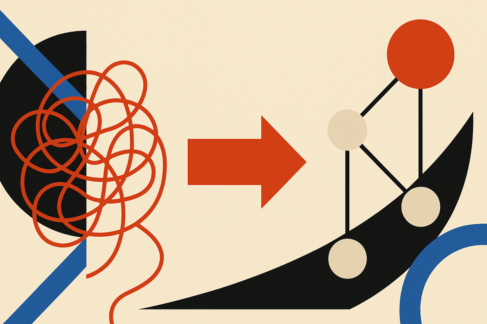
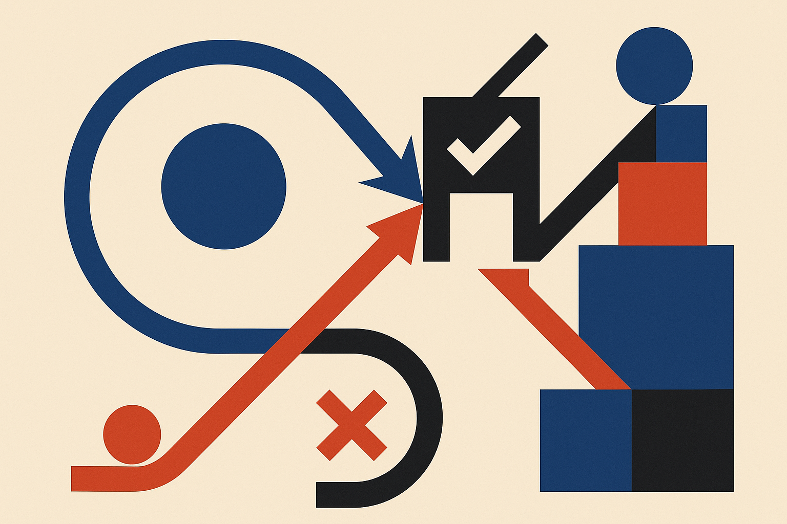
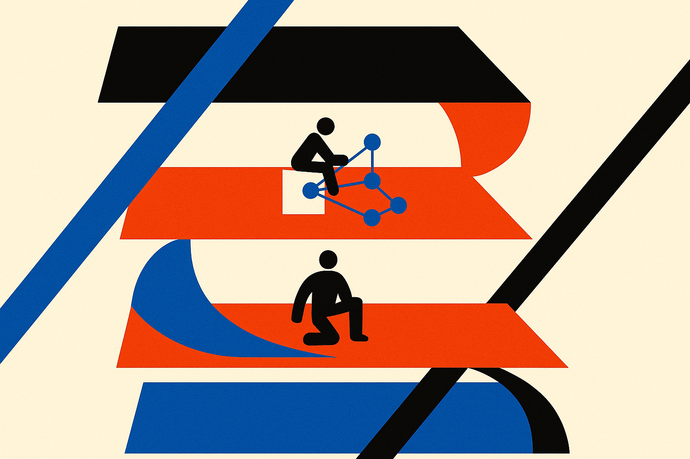

TL;DR: A paper called "Procedural Graphs: Self-Evolving Execution Structures for LLM Agents" argues that the fix for agents that lose the plot on long tasks is not more context, it is a structured, self-editing graph of procedures that nudges the next action without scripting it.

Most agents today work like a person taking notes on a single scroll of paper. Every observation, tool call, and stray thought gets appended to one growing history, and at each step the model reads the whole thing and decides what to do next. That works for short tasks. It falls apart on long ones. The agent forgets its objective, calls tools in the wrong order, and loops on actions that already failed. Anyone who has watched a coding agent re-run the same broken command three times knows the failure shape.

The Procedural Graph paper, posted to arXiv under both cs.AI and cs.CL, goes after this directly. Its claim is that agents are missing a place to store *procedural* knowledge: what to do, in what order, under which conditions. Not facts. Steps.

## What is a Procedural Graph, actually?

The analogy the authors lean on is clean. A knowledge graph stores facts as (entity, relation, entity) triplets, the kind of structure that answers "what is" questions. Paris, capital-of, France. A Procedural Graph stores know-how as (procedure, relation, procedure) triplets, the kind that answers "what to do" questions. Check inventory, before, place order.

So instead of the agent's method living implicitly inside a wall of past text, it lives in an explicit graph of steps and the relationships between them.

At each decision point the framework does two things. It localizes where the agent currently is on the graph (which node is active), and a separate guidance model reads the surrounding subgraph and turns it into step-level situational advice. The important word in the paper is *biases*. The guidance nudges the solver's next action. It does not dictate it. That distinction matters, because hard-coded workflows are brittle and models that ignore all structure wander. This sits in between: a rail that suggests rather than forces.

If you have built with LangGraph or hand-written state machines, the shape will feel familiar. The difference is where the structure comes from and who maintains it.

## How does the graph write itself?

This is the part worth slowing down on. The graph is self-evolving. An LLM refiner contrasts failed trajectories against successful ones and edits the graph's topology and attributes: it adds nodes, changes relations, rewrites step descriptions.

The edit-acceptance rule is the clever bit. An edit gets committed only if it preserves or improves performance on a held-out validation set. Edits that get rejected are not just thrown away. They are retained as a record, so the loop does not keep re-proposing the same bad change. It is a memory of what did not work, applied to the process of building the process.

That is a meaningful design choice. A lot of "self-improving agent" work quietly overfits to whatever trace it just saw. Gating edits on held-out validation is the difference between learning and memorizing the last run. I would want to see the details of how large and representative that validation set is, because the whole guarantee rests on it. The abstract asserts the gains; it does not, in what I have, quantify them by dataset.

The paper makes two claims about starting conditions that are worth separating. First, starting from a minimal skeleton, the loop builds graphs that match or surpass hand-designed ones. Second, it can repair a flawed expert prior. Those are different and both useful. The first says you do not need a domain expert to draw the workflow. The second says that if you *do* hand it your expert's workflow and your expert was wrong somewhere, the system can find and fix the wrong part rather than inheriting the mistake. For teams that have accumulated a pile of carefully tuned prompt-chains, the second claim is the one that should get attention.

## Is this better than just giving the agent memory?

That is the comparison the authors chose to make, and it is the right one. They report consistent gains over memory-based baselines across multiple datasets, task types, and LLMs, with self-evolution adding further improvement on top of the base graph.

Here is why the distinction is real and not just framing. Memory approaches, including most RAG-over-past-trajectories setups, retrieve relevant *content* and drop it into context. That helps the agent remember what happened. It does not impose an order on what should happen next. A Procedural Graph is structure, not recall. It says "you are here, these are the reachable next steps, these are the conditions." Retrieval hands you a stack of relevant notes; the graph hands you a position on a map.

The honest caveat: "consistent gains" and "across multiple datasets" are abstract-level claims, and I am reading the abstract, not a full results table with error bars. Cross-model consistency is the claim I would stress-test hardest, because guidance that helps a weaker model follow a rail can just as easily constrain a stronger model that would have found a better path on its own. The paper says the guidance biases rather than dictates, which is exactly the design you would want to avoid that trap, but I would want the numbers per model before believing it holds everywhere.

## Where does this fit in the agent stack?

Think of three layers most agent frameworks already have. There is the model that generates actions, the tools it can call, and the memory of what happened. Procedural Graphs add a fourth layer between memory and generation: an explicit, editable representation of method. It is closer to a policy than to a knowledge store.

That placement is why I think this line of work matters more than a single benchmark number. The industry has spent two years making the generation layer smarter and the memory layer bigger. The procedural layer has mostly been humans writing graphs by hand in tools like n8n, LangGraph, or bespoke state machines. If a system can grow and repair that layer from its own runs, the maintenance cost of a complex agent drops, and the workflow stops rotting the moment your tools or task distribution shift.

Practitioner's take: if you run a long-horizon agent that loops, forgets its goal, or calls tools out of order, the immediate lesson does not require the full framework. Externalize the procedure. Give the agent an explicit representation of steps, valid orderings, and conditions, and check its position against that structure at each turn instead of trusting a growing history to hold everything. Start with a minimal skeleton, log your failed and successful runs side by side, and let a contrast between them propose edits, but gate every edit on a held-out set of tasks the agent did not see while editing. That gate is the whole game. Skip it and you build a system that confidently converges on the mistakes it made most recently. The catch most readers will miss: this shines on tasks with real procedural structure and repeatable failure modes, and it will add overhead with little payoff on one-shot or genuinely open-ended work where there is no stable "right order" to learn.
