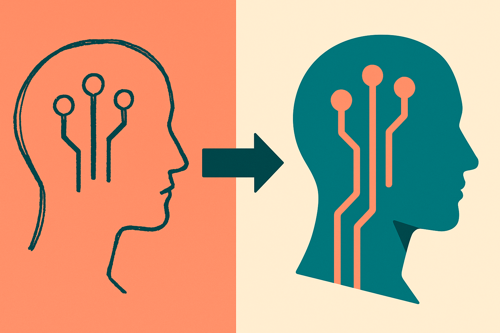
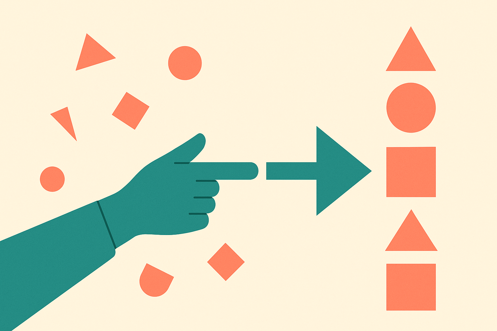

TL;DR: OpenAI says ChatGPT Images 2.5 turns sketches and reference photos into more personalized, polished output, but the announcement is short on specifics, so treat the "better" claim as a hypothesis to test on your own inputs, not a settled upgrade.

The primary source here is OpenAI's own blog post, "Introducing ChatGPT Images 2.5," which describes the release as a way to "turn your ideas, sketches, and reference photos into more personalized, polished images that better reflect your ideas." That is the whole pitch, more or less. Hacker News picked it up, but as of this writing the discussion there adds a title and not much else. So this post is going to do something a little unusual: hold a light to what OpenAI actually said, separate it from what people will assume, and give you a way to check the difference yourself.

## What did OpenAI actually announce?

Strip out the adjectives and the confirmed claims are narrow. OpenAI announced a version bump to its image model inside ChatGPT, positioned around three input types: ideas (text prompts), sketches, and reference photos. The stated goal is output that is "more personalized" and "better reflect[s] your ideas."

That word "personalized" is the interesting one, and also the one OpenAI does not define in the post. It could mean the model holds your style across a session. It could mean it uses reference photos more faithfully. It could mean something tied to memory or account-level preferences. The announcement does not say, and I am not going to invent a mechanism it did not claim.

Here is what is not in the source material, which matters just as much: no pricing, no rollout schedule, no rate limits, no word on which tiers get it (free, Plus, Pro, Team, Enterprise, API), no resolution or aspect-ratio specifics, no statement about commercial usage rights or C2PA content credentials. If you see those numbers floating around, check whether they trace back to OpenAI's docs or to someone's guess. On a day-one announcement like this, a lot of "facts" are extrapolation.

## Why does "sketch to image" matter more than another quality bump?

Text-to-image has been good enough for mood boards and thumbnails for a while. The friction was never generating something pretty. It was generating the specific thing in your head. Anyone who has fought a prompt for twenty minutes to move one object knows the gap between "nice image" and "the image I meant."

Sketches and reference photos are how you close that gap. A crude box-and-arrow sketch communicates layout and intent far faster than a paragraph of prose. If ChatGPT Images 2.5 genuinely respects the geometry of a sketch (where things go, how big, facing which way) and holds the identity of a reference photo across edits, that is a workflow change, not a demo trick. It moves image generation from "slot machine" to "direction."

But respect is the operative word, and it is exactly the thing the announcement asserts without showing. "Better reflect your ideas" is a claim about fidelity. Fidelity is measurable. So measure it.

## How should a working team test it before trusting it?

Do not run the marketing examples. Run your own hard cases, the ones your current tool fails on. I would set up a small before-and-after battery like this:

Take five sketches you have actually drawn for real projects, the messy ones, and generate against each. Score whether layout survives: did the model keep your composition or reinvent it? Then take three reference photos of a specific person, product, or space and ask for variations. Score identity drift: does the product still look like your product across five outputs, or does the logo melt by image three?

Run the same prompts through whatever you use now (Midjourney, Google's Imagen line, Adobe Firefly, the previous ChatGPT image model) and compare on the axes you care about: prompt adherence, reference fidelity, text rendering inside images, edit stability, and how many attempts it takes to get one keeper. That last metric, keepers per attempt, is the one that actually shows up in your time and your bill. A model that is 10 percent prettier but needs twice the retries is a downgrade.

If you touch anything client-facing or commercial, log the boring questions too. Where do content credentials land? What does OpenAI's usage policy say about the reference photos you upload, especially photos of real people who did not consent? None of that is answered in this announcement, so it is on you to check the terms before a reference-photo feature turns into a legal problem.

## Is the "personalized" angle a real shift or marketing?

I genuinely do not know yet, and neither does anyone quoting this announcement. The honest read is that OpenAI is signaling a direction: image generation that adapts to you rather than starting cold every time. If that is backed by session memory or account-level style profiles, it is a meaningful step, because consistency is the thing every brand and every solo creator actually needs. Repeatable beats impressive.

The skeptical read is that "personalized" and "polished" are the two easiest words to put on any image release, and the post gives no evidence of a new mechanism. Both reads are valid right now. The tie-breaker is not more discussion. It is your own test battery hitting your own inputs.

Practitioner's take: treat ChatGPT Images 2.5 as a candidate, not a replacement. Spend an hour building a fixed test set (your real sketches, your real reference photos, your five toughest prompts) and keep it, because you will reuse it on the next model too. Measure keepers per attempt and reference fidelity, not vibes. Confirm pricing, tier access, usage rights, and content credentials from OpenAI's own docs before you put it in a client pipeline, since the announcement does not cover any of that. The catch most people will miss: a model that is better at "personalized" is only useful if it is consistently personalized across a whole set, so grade the fifth image, not the first.
