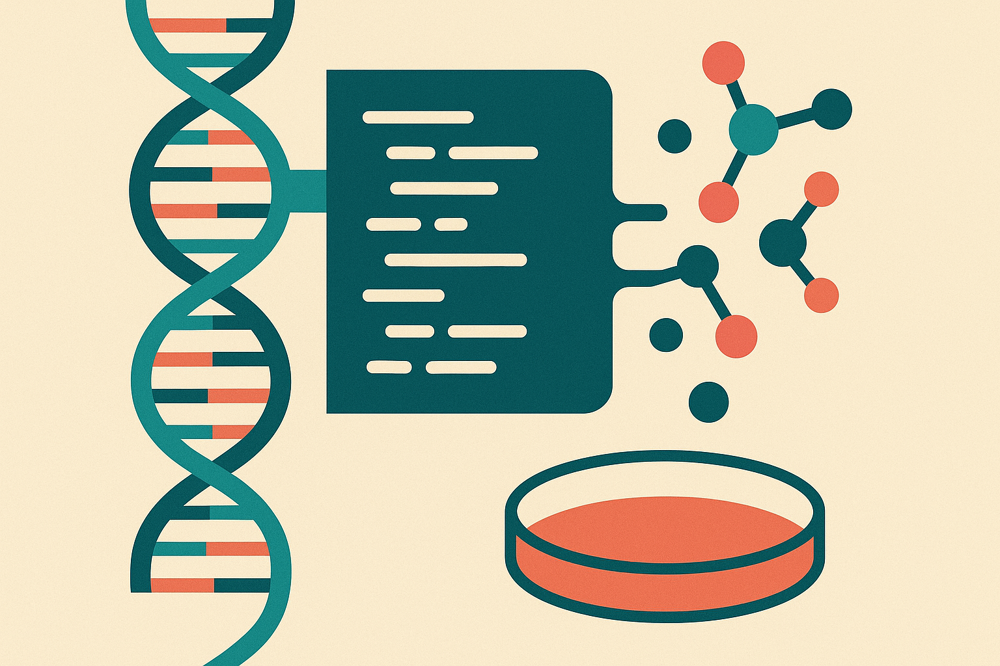

TL;DR: Codex and ChatGPT are most useful in antimicrobial discovery when they act as search and workflow accelerators, not as substitutes for experimental proof.

## What is the AI actually doing in the lab?

OpenAI’s primary account here is its blog post, “How a researcher uses Codex and ChatGPT to search for new antimicrobial molecules.” OpenAI says César de la Fuente’s lab uses Codex and ChatGPT to search living and extinct genomes for antimicrobial candidates aimed at drug-resistant infections.

That is a specific claim, and a useful one. The interesting part is not “AI discovers drugs,” which is the headline version that usually gets overcooked. The practical version is narrower: a research group is using language and coding tools to search biological sequence data for molecules that might be worth testing.

That matters because antimicrobial discovery is a search problem before it is a medicine problem. Genomes are full of possible peptide sequences. Most will not matter. Some may have properties that make them candidates. Finding those candidates requires code, data wrangling, pattern matching, ranking, and repeated iteration between computational ideas and lab reality.

Codex fits naturally into that middle layer. Not because it knows biology in some magical way, but because scientific work has a lot of software-shaped friction. Scripts. Parsers. Batch jobs. Data cleaning. Prompted exploration. Rewriting analysis code. Checking alternative filters. ChatGPT fits the adjacent layer: explaining, brainstorming, summarizing, and helping researchers move between biological intent and computational steps.

The key word is “candidates.” OpenAI’s description does not say these tools produce approved drugs. It says the lab uses them to search for antimicrobial candidates. That distinction is the whole story.

## Why search living and extinct genomes?

The extinct-genome angle is the hook, but it is also more than a novelty. If a genome can be analyzed, it can become part of the search space. That means researchers are not limited to organisms currently alive, easy to culture, or already well represented in lab pipelines.

There is a good operator lesson here: AI systems get more interesting when they let a team ask a larger question without making the workflow collapse. “Search more genomes” sounds simple. In practice, it means more formats, more candidate extraction, more ranking logic, more failure cases, and more bookkeeping.

This is where the current generation of AI coding tools has real value. They compress the cost of trying another analysis path. They help a researcher write the next script faster, inspect an output, change the filter, or build a small tool that would otherwise sit in the “nice idea, no time” pile.

But the hype risk is obvious. A larger search space is not the same as a better answer. Ancient or unusual sequences may produce interesting candidates, but they still need validation. A model can help find needles. It can also generate bigger haystacks.

## What should builders take from this?

The pattern generalizes beyond biology. A domain expert has a huge search space, some judgment about what matters, and a pile of small technical tasks blocking iteration. The AI system does not need to “replace the expert.” It needs to speed up the loop between question, code, result, and next question.

That is a much more believable product shape than the full-autonomous-scientist story. Give the user control. Make intermediate artifacts inspectable. Keep provenance clear. Treat generated code and generated hypotheses as drafts. Make it easy to rerun, compare, and discard.

For scientific teams, the useful product is probably not one giant chat box. It is a workflow: data in, candidate criteria, generated code, ranking, review, export for testing, and a record of what changed. Chat is the interface for some steps. Codex-style code generation is the workhorse for others. The lab notebook, the data pipeline, and the assay results still matter.

Practitioner’s take: if you are building with AI in research or any technical domain, copy the shape, not the headline. Pick one search space your team already cares about. Use an AI coding agent to reduce the cost of extracting and ranking candidates. Then put a hard gate after the model output where a human or real-world test decides what survives. The catch most people miss: the value is not the first generated answer. It is the faster, documented loop that gets you to a testable short list.
