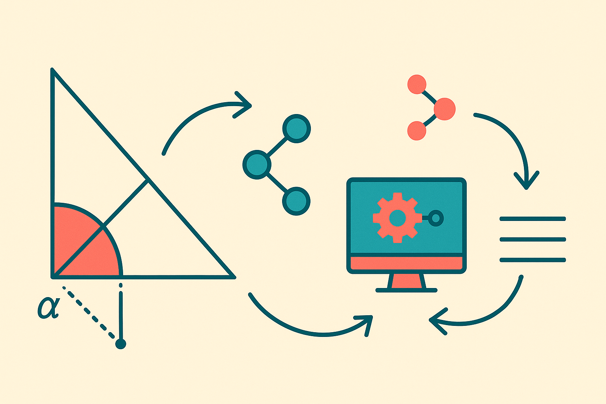

TL;DR: The useful lesson from this geometry work is not that LLMs suddenly “solve math,” it is that structured perception plus symbolic deduction can make model reasoning more inspectable and less guessy.

## What is the paper actually claiming?

The primary source is **“From Symbolic Perception to Logical Deduction: A Framework for Guiding Language Models in Geometric Reasoning,”** listed on arXiv cs.AI and cs.CL.

The claim is narrow, which is good. Plane geometry is hard for AI because it asks for two different skills at once: reading a diagram, then doing formal mathematical reasoning over the objects in that diagram. Large multimodal models can take the whole thing in as an image and text prompt, but the paper argues they can be expensive and hard to inspect when they fail.

So the proposed system does not ask one model to do everything. It splits the work.

A Geometric Vision Parser translates the diagram into symbolic form. A Symbolic Solver then performs formal deductions. The language model sits inside a guided system rather than acting as a free-form oracle. According to the paper, this setup can perform comparably to Gemini 2.5 Pro on complex geometry problems, while producing clearer, more human-like solutions.

That comparison needs a little restraint. We do not get the full table here, and “comparable” can hide a lot of detail. But the architectural point is still useful: the system is designed so that intermediate reasoning has structure. That matters more than another vague “AI got better at math” headline.

## Why does symbolic structure still matter?

Because diagrams are traps for language models.

A model can describe what it sees. It can infer likely relationships. It can pattern-match against training examples. But geometry often turns on exact constraints: parallel lines, equal angles, midpoint definitions, congruent triangles, circle theorems. If the system invents one relationship, the proof may look fluent and still be wrong.

The paper’s pipeline attacks that failure mode directly. The parser turns visual input into symbolic objects. The solver checks relationships through formal deduction. That does not make the system magically correct, since parsing errors can still poison the process. But it changes where errors live. Instead of hunting through a paragraph of confident prose, you can inspect the symbolic representation and the deduction chain.

That is the part I care about.

A lot of AI product work still treats the model as the whole system. Prompt in, answer out. For low-stakes drafting, fine. For geometry, contracts, medicine, compliance, finance ops, or engineering review, that pattern is often too mushy. You want typed objects. You want constraints. You want checks. You want a way to say, “This step follows,” not just, “This sounds right.”

## Is the benchmark meaningful?

The paper reports a curated benchmark of challenging problems from the 2025 Chinese Zhongkao examinations. That is a smart choice for two reasons.

First, it targets data novelty. If the goal is to test deduction instead of memorization, fresh exam problems are better than recycled internet examples. Second, middle-school geometry is deceptively demanding. It is not advanced math, but it requires clean multi-step reasoning grounded in a visual setup. That makes it a good stress test for systems that claim to combine perception and reasoning.

Still, one benchmark is one benchmark. Zhongkao geometry has its own style, conventions, and diagram patterns. A system tuned for that format may not generalize to messy whiteboard sketches, CAD-like diagrams, textbook scans, or student-drawn figures. The paper’s result is a signal, not a universal verdict on visual reasoning.

The bigger takeaway is about system design. The path forward for many “reasoning” applications may look less like bigger chat boxes and more like hybrid stacks: perception module, symbolic state, verifier, solver, language interface. Less glamorous. More useful.

For builders, try this pattern anywhere your AI workflow depends on exact relationships. Do not ask the model to both read the world and prove the answer in one shot. Extract structure first, store it in a format you can inspect, run deterministic or semi-deterministic checks, then let the model explain or coordinate. The catch most teams miss: the parser becomes the critical component. If your symbolic input is wrong, the cleanest solver in the world will still produce a polished mistake.
