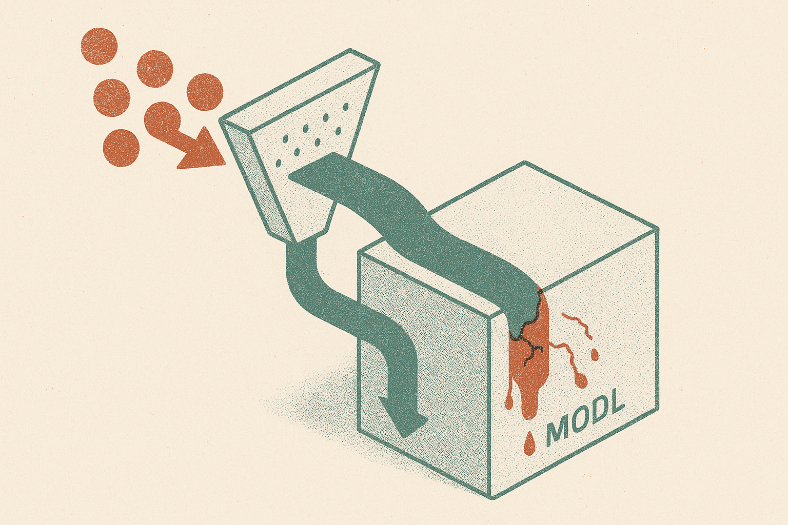

TL;DR: Treat claims that a lab trained on conversations as provenance disputes, not vibes: demand timestamps, dataset paths, contamination tests, and reproducible performance changes before crediting or dismissing them.

## What is actually being claimed?

Hacker News carried an item titled “Another researcher says OpenAI trained on conversations, then claimed breakthrou,” and r/LocalLLaMA carried the same framed claim as “ANOTHER researcher accuses OpenAI of training on conversations and then claiming a breakthrough.”

That is all the provided material establishes. Not the researcher’s name. Not the conversations. Not which OpenAI model. Not which benchmark or “breakthrough.” Not whether the data was public, private, licensed, opt-in, scraped, leaked, synthetic, or part of a user-product feedback loop.

So I would not write this as “OpenAI trained on conversations.” I would write it as what it is: an accusation circulating in AI communities, without enough primary evidence in the provided sources to evaluate it.

Still, the shape of the accusation matters. A lot.

If a lab trains on examples that later appear in an eval, the eval can stop measuring generalization and start measuring recall. If it trains on researcher conversations, benchmark discussions, or prompt traces that contain solution strategies, a later score jump can look like reasoning progress when some of it is actually data exposure. That does not mean every gain is fake. It means the burden shifts to provenance.

The hard part is that “trained on conversations” can mean several different things. Training on public forum conversations is one legal and scientific question. Training on private chats is another. Training on opt-in product logs is another. Training on benchmark-adjacent discussions is another. Lumping them together makes the claim louder, but less useful.

## How would you test whether this is contamination?

A serious version of this claim needs artifacts.

You would want exact conversation records, timestamps, and a plausible path into the training data. You would want to know whether those conversations predate a model’s training cutoff or post-training window. You would want canaries or unusual phrases that can be probed later. You would also want model comparisons across releases, not just anecdotes from one prompt.

The basic test is simple in concept: does the model perform unusually well on near-duplicates of the disputed conversations, then fall apart when the surface form changes?

A contamination check should include verbatim prompts, paraphrases, swapped entities, changed numbers, reordered facts, and new cases with the same reasoning structure. If performance stays high across clean variants, that supports a real capability gain. If it spikes only on familiar phrasings, that is a warning sign.

For any OpenAI-specific claim, first-party evidence should come from OpenAI’s own model cards, system cards, technical reports, or policy disclosures. Community threads are useful smoke signals. They are not enough to settle data provenance.

That standard cuts both ways. Labs should not get automatic trust because they are famous. Accusers should not get automatic belief because the claim matches public suspicion.

## Why should builders care if the accusation is unproven?

Because this is not only a frontier-lab drama problem. It is an everyday eval problem.

Most teams building AI products are sitting on messy piles of support tickets, Slack threads, sales calls, docs, chat transcripts, and user feedback. Then they use that same pile to build RAG, fine-tune models, write evals, and judge progress. The result is predictable: the system starts passing tests because the test set and training context share too much blood.

That is how teams fool themselves.

If you are building agents, customer-service bots, coding assistants, or internal search tools, split data by time and purpose. Keep a sealed eval set that never enters training, retrieval indexes, prompt examples, or manual debugging. Add canary examples. Log who viewed or edited evals. Treat “we improved from 62% to 81%” as incomplete until you can show the eval was clean.

Vendor claims deserve the same posture. Ask what data was excluded. Ask whether benchmark items were public. Ask whether user logs were used. Ask whether an external party replicated the result. If the answer is mostly “trust us,” price that into your confidence.

For a builder, the move is practical: before celebrating a model jump, run a contamination audit on your own workflow. Pick one eval, trace every place its examples may have leaked, then rebuild a smaller sealed set from later data. The catch most readers miss is that contamination usually is not malicious. It is a spreadsheet copied into a prompt, a support ticket reused as a demo, or a “temporary” test case that quietly becomes training fuel.
