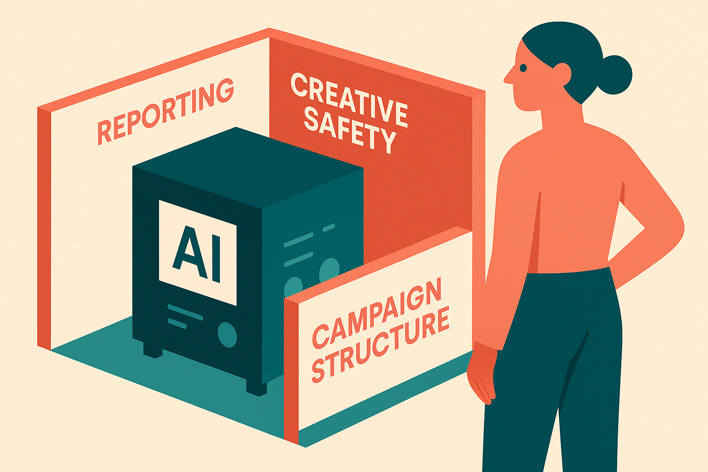

TL;DR: Treat AI-driven PPC automation like a junior media buyer with budget access: useful, fast, and never allowed to run without reporting, creative limits, and campaign structure that preserve human control.

## What control actually means when platforms automate the account

Search Engine Journal’s Ask A PPC column, “How Do I Keep Control As Platforms Automate My Account?” by Navah Hopkins, frames the core PPC problem well: the question is not whether automation is coming. It is how much decision-making you hand over, and where you keep hard boundaries.

That is the right lens. A lot of PPC teams still talk about automation as if the choice is manual purity or full platform autopilot. In practice, the operator’s job has moved up a layer. You are not just editing bids, exclusions, audiences, and creative variants. You are designing the box automation is allowed to operate inside.

That box has three parts.

First, reporting that shows what changed and what happened after the change. If the platform optimizes toward a blended goal but you cannot see channel, query, creative, audience, or conversion-quality movement, you do not have automation. You have a black-box spend machine.

Second, creative guardrails. Brand safety is not only about avoiding offensive copy. It is also about tone, claims, offers, compliance language, exclusions, and what the brand refuses to imply. Automated asset generation can drift into mushy sameness or risky specificity. Both cost money.

Third, campaign structure. If every objective, product, audience, and margin profile gets poured into one bucket, the system may still “perform” on average while hiding the part that is failing. Structure is how you make automation auditable.

## Where does automation help, and where does it get dangerous?

Automation is strongest when the goal is clear, the data is clean, and the cost of a wrong move is bounded. That is why automated PPC can be helpful for pattern detection, budget pacing, asset testing, and finding combinations a human would not try manually.

It gets dangerous when the business goal is not the same as the platform goal.

A platform may optimize toward conversions, but the business may care about qualified leads, repeat buyers, margin, sales velocity, or geographic constraints. If the account feeds weak signals into the system, the system will optimize toward weak signals with confidence. That is the quiet failure mode. Not a dramatic hallucination. Just efficient waste.

Hopkins’ emphasis on transparent reporting and campaign structures matters because they turn “AI performance” back into something a marketer can inspect. I would add one operator rule: never judge automation only on the metric it was asked to improve. Watch the adjacent damage. Lower CPA with worse lead quality is not a win. More conversions with weaker brand positioning is not a win. Higher volume that trains sales to ignore PPC leads is not a win.

## What should PPC teams document before turning more automation on?

The missing artifact in many accounts is an automation brief.

Not a 40-page strategy deck. A one-page control document that says: what the platform is allowed to optimize, what it must not touch, what data is trusted, what creative claims are banned, what segments need separate visibility, and what threshold triggers a human review.

This matters because automation changes the failure pattern. In a manual account, one person can make one bad decision at a time. In an automated account, the system can compound a weak signal across bids, placements, targeting, and creative. Faster than your weekly meeting cycle.

The brief also protects the team from fake control. If the only “control” left is pausing the whole thing after it underperforms, that is not control. That is an emergency brake. Real control means smaller blast radius, readable changes, and the ability to compare automated decisions against business outcomes.

Practitioner’s take: start with one campaign area where the objective is clean and the downside is limited. Write the automation brief before changing settings. Then review performance by both platform metrics and business-quality metrics, especially lead quality, margin, or retained revenue. The catch most teams miss: automation does not remove account strategy. It punishes vague strategy faster.
