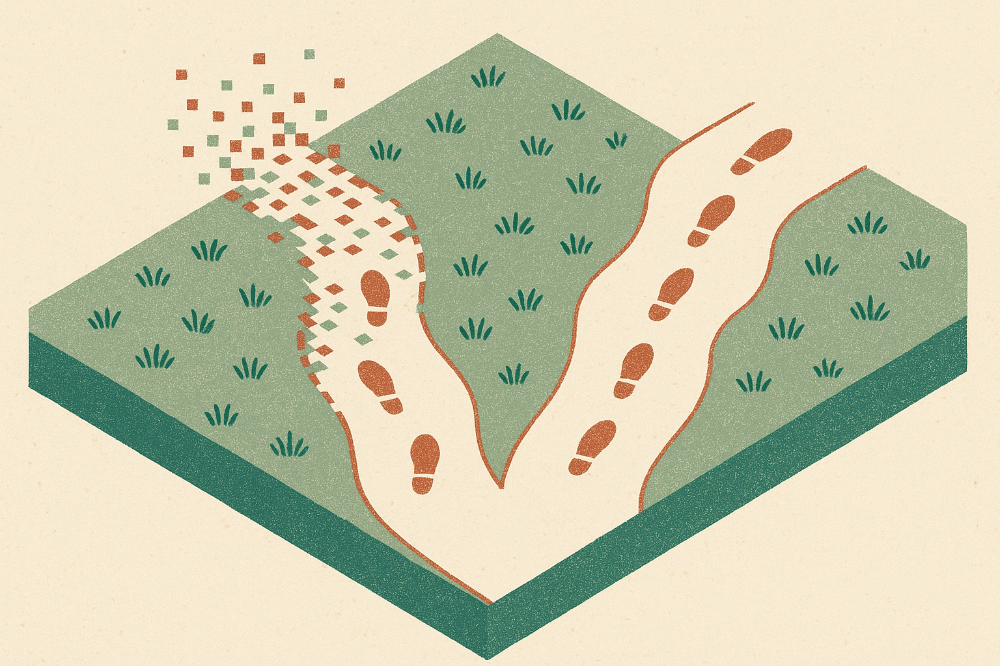

TL;DR: SG-JEPA suggests physics generalization in world models may depend less on a clever predictor and more on training the encoder to keep only the state features that stay useful across multi-step rollouts.

## What did SG-JEPA actually test?

The primary source is the arXiv cs.AI/cs.LG paper titled “Semigroup-JEPA: Latent Dynamics Consistency for Zero-Shot Physics Generalization,” with a project page at https://sg-jepa.github.io.

The paper is about JEPA-style world models. A JEPA learns a compact latent representation, then predicts future latent states rather than future pixels. That matters because pixels are noisy and expensive, while useful latent states can support prediction, planning, and control.

SG-JEPA extends the LeWorldModel setup by feeding the physics parameter into the temporal model through action-conditioning. In plain English: the model is told something about the law governing the environment, then it has to roll forward in latent space.

The test is simple in concept and nasty in practice. The tasks use different gravitational fields. Same underlying physical law, very different behavior. Weak gravity gives floating motion. Strong gravity gives fast bouncing. A model that only memorized the training look and feel should break when gravity changes enough.

That is the useful part. A lot of “world model” demos look good inside the simulator distribution they trained on. SG-JEPA asks a sharper question: can the learned representation support zero-shot physics changes where the surface motion changes, but the law family stays shared?

## Why does the encoder matter more than the predictor?

The paper reports two main performance claims. Compared with DINO-WM, SG-JEPA reduces open-loop prediction error by up to 2 times on two-dimensional datasets. It also increases control success rate by up to 2.5 times on three-dimensional robotic datasets, where independent diffusion policies are trained.

Those are meaningful numbers, but the mechanism is the more interesting claim.

The SG-JEPA work develops a linear feature model to separate two problems. First, local law-conditioned error. Second, the recursive amplification of that error during rollout. Anyone who has built multi-step systems knows the second part hurts. A small wrong turn at step three can become nonsense by step thirty.

Their finding: back-propagating the multi-step rollout loss into the representation trains the encoder to preserve features the predictor can carry forward. Those retained features are also the ones the dynamics depend on. So most of the gain comes from better features, not a better dynamics predictor.

That is a subtle but important shift. The naive instinct is to make the simulator head more powerful. Bigger temporal model. More parameters. More compute. SG-JEPA points at another bottleneck: if the latent state drops the wrong information, the predictor cannot recover it later. The model does not just need to predict. It needs to remember the right abstractions before prediction starts.

## What should builders take from this?

For robotics and embodied AI, SG-JEPA is not a finished recipe. The tasks are controlled. The gravity parameter is known and supplied. Real robots face friction, contact weirdness, sensor noise, delays, wear, and the cheerful chaos of the physical world. The paper’s strongest evidence is inside designed physics variation, not open-ended deployment.

Still, the lesson travels.

If you are building an agent that plans over imagined future states, do not evaluate only one-step prediction. One-step metrics can flatter models that drift badly over rollout. Test open-loop rollouts. Test policy success after the learned model is used. Change one governing factor and see whether the behavior collapses.

Also, treat representation training as part of the control system. SG-JEPA’s result says the encoder is not just a compression layer. It is deciding what future planning is allowed to know. If the encoder keeps appearance details but loses dynamics-critical state, the rest of the stack is already boxed in.

This connects to a broader pattern in AI systems. Better downstream reasoning often starts upstream, in what the model is forced to represent. For language agents, that might be task state and tool results. For world models, it is physical state. Same bug, different medium: garbage abstractions in, unstable plans out.

Practitioner's Take: If I were applying this, I would add multi-step rollout loss early, then run ablations that freeze or swap encoders before touching the predictor size. I would test across one controlled parameter shift, not just random train/test splits. The catch most teams miss: a nicer predicted frame or lower one-step loss may not mean your planner has a usable world model. The real test is whether errors stay bounded when the model has to live with its own predictions.
