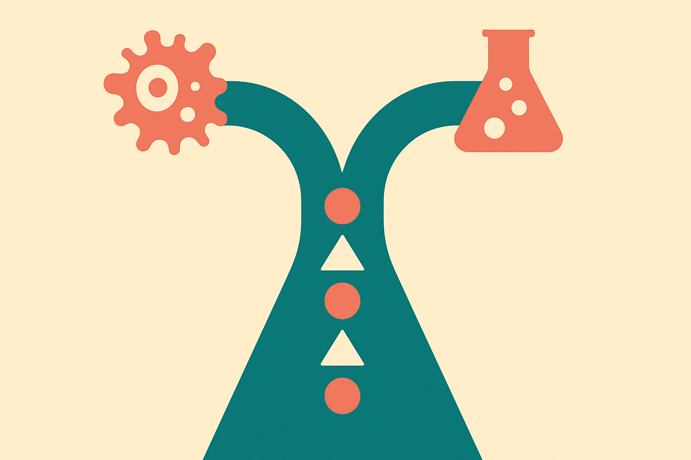

TL;DR: The useful AI pattern in CRISPR screening is not “ask an LLM for targets,” it is learning which experiment to run next from many previous experimental loops, then using language-model biology as a starting prior.

## What problem is AssayLoop actually solving?

The primary source here is the arXiv paper “Biology-in-the-loop: Amortized Adaptive Hit Discovery in CRISPR Screens,” listed under cs.AI and cs.CL. The paper takes on a very real lab constraint: in many CRISPR screens, you cannot test every perturbation you might want to test. You have a large candidate library, a limited experimental budget, and several rounds where each result should change what you do next.

That is the important part. This is not a one-shot prediction task. It is sequential decision-making under cost pressure.

The paper introduces AssayBench-Loop, a benchmark with 1,389 CRISPR screens across five phenotype categories. That scale matters because most adaptive discovery benchmarks are too small to train a general strategy for choosing the next experiment. If every campaign is treated as a bespoke optimization problem, you throw away the learning signal from previous campaigns.

AssayLoop tries to keep that signal. It combines AssayFormer, described as a transformer-based amortized acquisition policy trained across historical screens, with LLM-derived biological priors through an adaptive handoff. Plain English: use prior biological knowledge to seed the search, then let a model trained on previous screen dynamics learn how feedback should change the next batch of experiments.

## Where does the LLM help, and where should it get out of the way?

The most interesting design choice is the handoff.

Standalone LLMs can contain useful biological associations, especially for seeding plausible candidates. But a CRISPR screen is not won by sounding biologically informed. It is won by picking perturbations that reveal hits efficiently as evidence accumulates.

According to “Biology-in-the-loop,” AssayLoop recovered 27.7% of hits after assaying about 5% of the candidate library on temporally held-out screens, with a 5.67-fold enrichment over random selection. The paper reports that AssayLoop outperformed existing adaptive-design methods, standalone LLMs, and AssayFormer alone. That last comparison matters. The claim is not “LLMs beat science.” It is closer to “historical experimental learning plus LLM priors beats either piece by itself.”

The paper also introduces AssayLLM, showing that task-specific post-training can apply the same principle directly to an LLM. I read that as a useful direction, not a free pass. The stronger operator lesson is architectural: LLMs are often better as priors, translators, and cold-start helpers than as the whole decision system.

There is also a generalization claim worth watching. The paper reports that performance improves with more historical training data and transfers to phenotype categories excluded from training. That is exactly the kind of result scientific AI needs. But I would want to see how brittle that transfer is across labs, assay protocols, cell types, noise profiles, and negative-result reporting. Historical data is powerful. Historical bias is powerful too.

## What should builders take from this?

AssayLoop is part of a bigger shift from static prediction to closed-loop discovery. The model is not just answering “what looks promising?” It is answering “given what we tested and what happened, what should we test next?”

That pattern applies beyond CRISPR. Materials, drug combinations, enzyme engineering, agriculture, robotics labs, even growth experiments in software products. Anywhere experiments are expensive and sequential, the valuable model is the one that improves the next experimental choice, not the one that writes the best rationale.

The catch is data shape. You need more than outcomes. You need the order of experiments, the candidates not chosen, the budget constraints, the assay context, and the feedback available at each step. Most organizations store final results. Far fewer preserve the decision trail.

For a builder, the practical move is to start logging experiments as loops, not records. Capture the candidate set, the model’s proposed batch, the human override, the actual results, and the next decision. Try a simple acquisition policy before reaching for a custom transformer. Use an LLM to enrich metadata or propose initial candidates, but measure it against random selection and cheap heuristics. The catch most readers miss: the moat is not the chatbot interface. It is the accumulated history of decisions under constraint.
