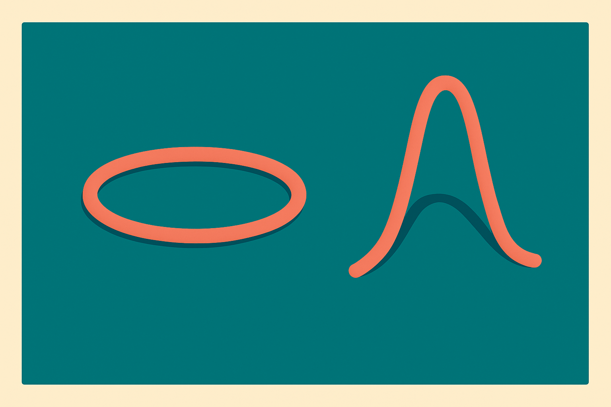
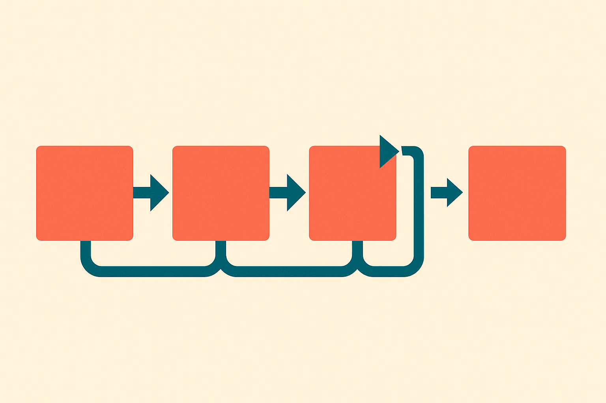

TL;DR: A benchmark called MindTopo shows multimodal models can often name topological relations but fall apart when they have to act on them, and video generators bolted on as world models don't fix the gap.

Most spatial benchmarks for AI ask about distance, angle, size, viewpoint. Metric stuff. Can the model tell which object is closer, which is bigger, where the camera is. Useful, but it skips a whole category of spatial understanding that cognitive scientists consider more foundational: topology. Whether a loop is closed. Whether one shape is inside another. Whether two things are linked or separate. These relations survive stretching and bending, which is exactly why they matter for reasoning about the physical world.

That's the gap "MindTopo: Can Foundation Models Reason in Topological Space?" (arXiv, cs.AI and cs.CL) sets out to measure. It's worth reading closely because it separates two things most agent evaluations blur together: knowing a relation and using it.

## What is MindTopo actually testing?

The benchmark covers five topological properties drawn from cognitive science and formal topology: continuity, separation, order, enclosure, and knots. Think of continuity as whether a path connects without breaks, separation as whether regions are divided, order as sequence along a curve, enclosure as inside-versus-outside, and knots as how strands link and tangle.

MindTopo splits every property across two cognitive levels, and this split is the whole point. The first level, reasoning, asks a model to identify a topological relation or predict how it changes. The second level, planning, drops the model into a closed-loop environment as an agent, where its policy has to pick actions and see them through. One is recognition. The other is control.

There are 11,030 instances across 13 procedurally generated task types, and the difficulty is controllable. That procedural generation matters: it means the tasks aren't a fixed set someone could overfit to, and the difficulty knob lets you see where performance degrades rather than just getting a single pass rate.

## Why do models reason well but plan badly?

The headline result from the authors: every one of the 14 multimodal LLMs they benchmarked did better on reasoning than on planning. And the best model still landed far below the human performance they observed.

This is the pattern I keep seeing across agent evaluations, and MindTopo isolates it cleanly. Naming a relation in a static image is a perception-plus-classification task. The model looks, matches against learned patterns, answers. Planning is different. The model has to maintain a mental model of the environment across steps, predict how its own actions change the topological state, and correct when reality diverges from what it expected. That's where things break.

The gap between recognition and control is not a detail. It's the difference between a model that can describe a knot and a model that can untie one. Most demos live in the first world. Real agent work lives in the second. If you're building anything that acts over multiple steps in a physical or physical-like space, the reasoning score is the easy number and the planning score is the one that predicts whether your thing works.

## Does fine-tuning or RL close the gap?

The authors ran training experiments on Qwen3-VL-2B-Instruct, a small model, using both supervised fine-tuning and reinforcement learning. Both helped. But here's the catch that operators should sit with: they improved reasoning more than planning.

So the interventions we reach for by default, more labeled examples and reward shaping, push hardest on the capability that was already the stronger one. The harder capability, closed-loop planning, moves less. That's a mild result on a single small model, so I wouldn't overread it into a law of nature. But it's directionally consistent with the reasoning-versus-planning gap being structural rather than something you sand away with a bit more data.

If that holds up on bigger models, it says the planning deficit isn't mostly a knowledge problem you can fine-tune into the weights. It's more like a modeling problem: the system doesn't carry a reliable internal simulation of how actions change state, and adding examples of correct answers doesn't install one.

## Can video models act as the missing world model?

The obvious fix, if the model can't simulate the environment internally, is to give it an external simulator. So the authors tested exactly that: agent configurations augmented with image and video generation, including three video generative models used in the planning settings. The idea is appealing. Let a video model imagine the next observation, let the agent plan against that imagined rollout.

It didn't work cleanly. The authors report that generated observations retain local cues and reach plausible endpoints, but audited rollouts do not reliably follow environment dynamics or preserve topology across transitions. Read that carefully. The generated frames look right. They have believable local detail and they arrive somewhere sensible. What they fail to do is respect the actual rules of the environment and keep topology consistent from one frame to the next.

That's the whole "video models as world models" thesis under a microscope, and the microscope is not flattering. A rollout that looks plausible frame by frame but silently violates enclosure or breaks a link is worse than no rollout, because it's confidently wrong. For planning, you need dynamics you can trust, not footage that passes a glance test. Local realism and global consistency are different problems, and the current crop of generators buys you the first while quietly failing the second.

I'd want to see this replicated with the strongest available video models and larger agents before calling it settled. The paper tests three video generators, which is a sample, not a survey. But the failure mode it describes, plausible locally and wrong globally, is the exact thing I'd expect from generators trained to produce convincing pixels rather than physically consistent state.

## Practitioner's take

If you're building an agent that acts in space, physical or simulated, treat topological planning as a first-class risk and test it directly. Don't let a strong recognition score talk you into trusting the system's control loop. Build a small closed-loop probe: can it keep something enclosed, keep a path connected, avoid crossing a boundary, across several steps. Watch it degrade as you turn up difficulty. If you're tempted to add a video generator as an imagined-rollout world model, audit the rollouts against real dynamics, not against how convincing they look, because MindTopo's finding is that they'll look fine and be wrong in exactly the way that breaks planning. The catch most people miss: the metrics that improve fastest with fine-tuning are the ones that were already good, so measuring the hard capability separately is the only way to know if you're actually making progress or just polishing the part that already shipped.
