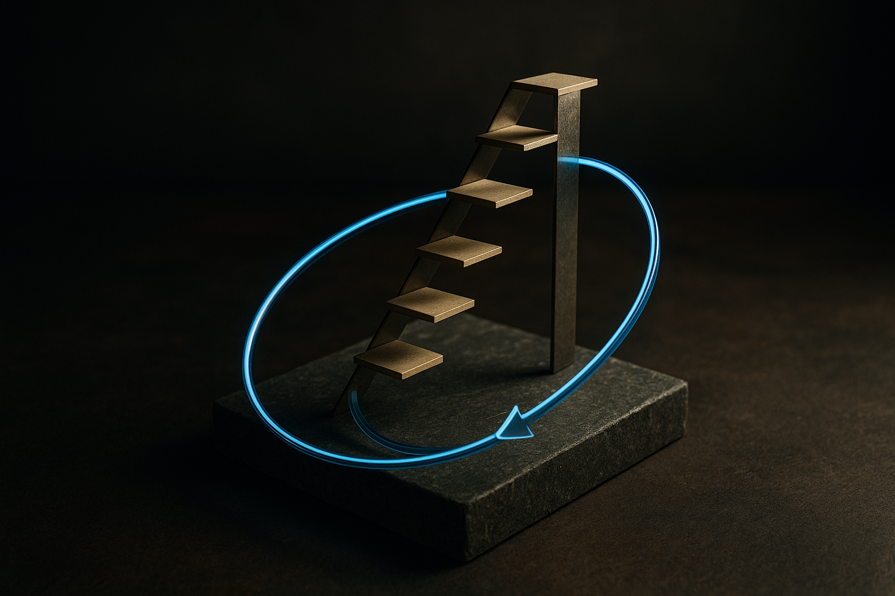

TL;DR: A paper called "The Last AI Built by Humans" breaks recursive self-improvement into four concrete autonomy levels, and today's agents sit at the very bottom rung, which is exactly why "self-improving AI" claims deserve a hard look before you believe them.

The phrase "recursive self-improvement" usually shows up in two places: safety essays that treat it as an existential switch, and pitch decks that treat it as already shipping. The paper "The Last AI Built by Humans: Toward Genuine Recursive Self-Improvement," posted across arXiv's cs.AI, cs.CL, and cs.LG listings, does something more useful than either. It defines the thing, ranks it into stages, and gives you a way to tell where a real system actually sits.

That framing matters because "self-improving" has become a marketing word. An agent that logs its failures and appends them to a prompt gets called self-improving. So does a training loop that generates its own data. These are not the same capability, and the paper's contribution is a vocabulary that keeps them apart.

## What does the paper actually mean by recursive self-improvement?

The authors define RSI as a system that turns experience and feedback into persistent changes, and here is the part people skip: those changes have to improve both the model's capabilities and the process by which it improves in the future. Not just "the model got better." The improvement machinery itself gets better. That second-order loop is what makes it recursive rather than just iterative.

They lay out a roadmap with distinct levels of autonomy. Improvement-execution autonomy is the bottom: the system can carry out a fix once someone tells it what to fix. Improvement-strategy autonomy is next: the system decides what to improve and how. Then experience-acquisition autonomy, where it goes and gathers the experience it needs rather than waiting to be fed. Then environment-adaptation autonomy, where it adjusts to conditions it wasn't set up for. At the top sits recursive meta-improvement, where the system improves the improvement process itself.

The useful move here is treating autonomy as a spectrum with named rungs instead of a binary. Most systems marketed as "self-improving" live on rung one. They execute changes a human specified. The interesting research questions live three and four rungs up, and almost nothing crosses that gap today.

## Where do today's LLMs actually fall short?

The paper introduces something called the Headroom-Closed Index, HCI, to expose the problem with current LLMs. I'll be honest about what the sources give me: the abstract names the index and says it reveals problems, but the material here doesn't spell out the formula or the exact numbers. So I'm not going to invent them. What the concept points at is clear enough. "Headroom" is the distance between what a model can do now and what it could do given more of the same. When that headroom closes, feeding the model more of the same stops helping.

This is the quiet crisis underneath the RSI conversation. A lot of the improvement we've seen came from scale and better data curation. If the headroom on that axis is closing, then the next gains have to come from a different mechanism, which is exactly where self-improvement loops get proposed as the answer. The paper is framing RSI not as science fiction but as a response to diminishing returns on the current recipe.

That's the part I find credible. Whether or not you buy the "last AI built by humans" title, the economic pressure toward systems that generate their own improvement signal is real. When you can't buy your way to the next capability with more tokens, you start wanting a model that finds its own.

## Does self-improvement look the same across every domain?

No, and this is the section builders should read twice. The authors examine RSI across scenarios: scientific discovery, embodied intelligence, software engineering. Each has different requirements and, importantly, different development speeds.

Software engineering is the fast lane, and the reason is structural. Code has a cheap, automatic verifier: you run it. Tests pass or they don't. Benchmarks give a number. That tight feedback loop is what lets an agent tell whether a change was actually an improvement, which is the whole precondition for the loop to close. This is why coding agents feel closer to self-improvement than anything else right now. The environment grades them for free.

Embodied intelligence is the slow lane. A robot can't run a thousand trials of picking up a cup in a second, and the feedback is noisy and expensive. Scientific discovery sits somewhere strange: the verification can take months and sometimes requires the physical world to cooperate. So "self-improving AI" is not one timeline. It's several, and they're pulling apart. Anyone selling you a single date for "when AI improves itself" is flattening a distinction the paper spends real effort drawing.

## How should a practitioner read a claim like this?

Skeptically, but not dismissively. This is a position paper drawing on what the abstract calls "diverse industry practices and preliminary empirical evidence." That word "preliminary" is doing work. A roadmap is not a result. The value here is the map, not a demonstration that anyone has reached the destination.

The title is deliberately provocative. "The Last AI Built by Humans" is the kind of framing that gets a paper attention, and I'd separate that rhetoric from the technical spine, which is sober and useful. You can take the four-level ladder and the domain analysis seriously without signing up for the implied singularity narrative in the name.

What I'd watch for: the paper itself flags key challenges to achieving genuine RSI. Those challenges are where the honest signal lives. Any real progress toward self-improvement will show up as a system that crosses from execution autonomy to strategy autonomy on a task with a clean verifier, most likely in software. When you see a demo, ask which rung it's on and who's picking the targets. If a human still says "fix this," it's rung one, no matter what the press release calls it.

Here's how I'd apply this on the ground. Use the ladder as a filter for vendor claims and internal roadmaps alike. When a team says their agent "improves itself," ask three questions: does the change persist across sessions, did the agent choose what to improve, and did the improvement process get better or just the output. Most systems fail the second and third. The ones that pass on the first, persistent memory of failures fed back in, are genuinely useful and worth building today. Just don't confuse that useful thing with the recursive thing. The catch most readers miss is that the cheap version, an agent that remembers its mistakes, delivers most of the practical value right now, while the recursive meta-improvement at the top of the ladder remains a research target nobody in these sources claims to have hit.
