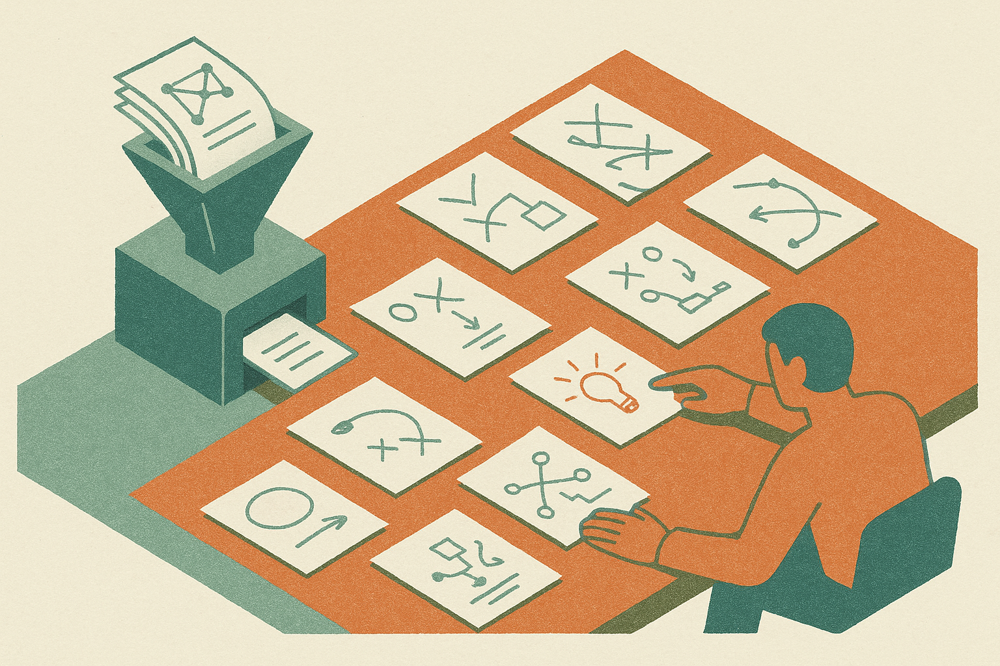

TL;DR: The useful question is not whether AI can do math, it is whether we are training and judging it on the parts of math that matter outside a benchmark.

## What is the misalignment in AI math?

Terence Tao’s post, “A misalignment of AI in mathematics,” names the issue well. The gap is not just capability. It is target selection.

Most AI math progress gets framed around visible wins: contest problems, formal proofs, benchmark scores, step-by-step reasoning traces. Those are not fake tasks. They matter. A model that can find a proof or check a proof has real value.

But mathematics is not only proof production. A lot of the work is choosing definitions, noticing the right abstraction, deciding which problem is worth formalizing, finding a counterexample, reading a field’s taste, and knowing when a path is sterile. Those parts are harder to score. They are also where a mathematician often creates the most value.

That creates the misalignment. We reward models for outputs that are easy to grade, then we act surprised when they get better at looking mathematically competent under that grading regime. This is not unique to math. Code agents have the same problem when they pass toy tests but break inside a messy repo. Research assistants have it when they summarize cleanly but miss the decisive caveat. Math just makes the failure sharper because correctness is supposed to be the safe harbor.

## Why benchmarks can make this worse

Benchmarks are not the villain. Bad benchmark worship is.

If the task is “solve this well-posed problem,” then the model learns to behave like a solver. If the task is “produce a proof-shaped answer,” it learns proof-shaped behavior. If the reward is final-answer verification, the system has little reason to represent uncertainty in a way a collaborator can use.

That matters because mathematical usefulness is often interactive. A good collaborator can say: this lemma smells false, this condition is too strong, this notation is hiding the structure, this problem belongs in a different category. Those statements may not look like a finished theorem. They can still save weeks.

The Economist’s coverage points to broader attention around AI’s role in mathematics, but the practical tension is the same one builders see everywhere: the measurable slice starts driving the product. Once teams can report a leaderboard jump, the organization bends around that number. The product gets better at the public test and not always better at the job.

For math AI, that means we should be careful about claims like “the model can reason” or “the system does research.” Maybe. But first ask what was rewarded. Was it solving known-answer problems? Formalizing an existing argument? Searching proof space? Suggesting new conjectures? Helping a human abandon bad ideas faster? Those are different products.

## What should builders measure instead?

I would split math-AI evaluation into at least three buckets.

First, correctness under verification. This is the clean one. Does the proof check? Does the answer satisfy the problem? Formal systems and controlled benchmarks belong here.

Second, collaboration quality. Can the model expose assumptions, ask for missing constraints, propose useful intermediate lemmas, and flag likely dead ends? This needs human review, not just automated grading.

Third, research taste. Hardest to measure, easiest to fake. Does the model suggest problems or abstractions that a domain expert later judges as promising? Does it compress a messy area into a usable map? Does it find analogies that survive contact with the literature?

The catch is that the third bucket will not give you a tidy daily leaderboard. That is uncomfortable for labs, funders, and product teams. But pretending it does not exist is how we get systems that are impressive in demos and brittle in actual research workflows.

Practitioner's take: if you are building with math-capable models, do not start by asking whether the model is “good at math.” Build a small eval set around your real workflow: proof checking, derivation review, notation cleanup, counterexample search, paper reading, or theorem formalization. Keep automated checks where possible, but add expert scoring for usefulness and judgment. The missed catch is that a slightly weaker model with better uncertainty, better citations, and better collaboration loops may beat a stronger benchmark model in daily work.
