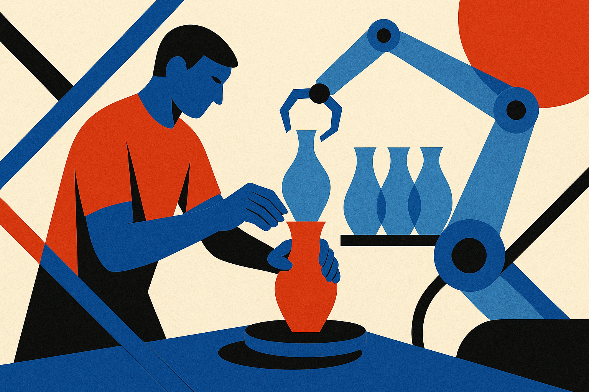

TL;DR: Treat AI sadness as product feedback: people are grieving agency, status, and meaning, not merely resisting tools, and better AI workflows need to preserve control and craft.

## What does “Feeling Sad about AI” actually tell us?

The primary receipt here is thin but real: Hacker News (AI) surfaced a thread titled “Feeling Sad about AI.” I am not going to pretend a forum title is a dataset. It does not prove a labor market trend, a mental health trend, or a universal developer mood.

But it does point at something I keep seeing in builder circles. The emotional reaction to AI is not only fear. It is loss.

Some people feel loss around craft. The thing they spent years getting good at now looks partially compressible into a prompt box. Not gone, not worthless, but cheaper to imitate. That stings.

Some feel loss around status. A junior can now produce a passable first draft of code, copy, design direction, research notes, or analysis faster than before. The senior still has judgment, but the visible gap narrows in screenshots and demos.

Some feel loss around reality. Feeds are full of synthetic images, synthetic posts, synthetic praise, synthetic outrage. Even when the output is useful, it can make the surrounding culture feel thinner. More volume. Less signal. More “content.” Less authorship.

That sadness is not irrational. It is the cost side of capability gains showing up as mood.

## Where do AI builders misread the room?

The operator mistake is answering an emotional problem with an efficiency chart.

“Now you can write 10x faster” sounds great if writing is a bottleneck. It sounds awful if writing is where someone thinks, feels competent, or earns trust. “Now your agent can complete the task” sounds great if the task is drudgery. It sounds invasive if the task is part of someone’s identity.

AI product demos often skip the handoff question: what does the human still own?

That is the missing layer. Not human-in-the-loop as a compliance checkbox. Human-in-the-loop as dignity, taste, and accountability. The user needs to know where their judgment matters, where the model is guessing, and where the machine is quietly turning their work into generic mush.

The best AI tools I use do not make me feel replaced. They make me feel faster at the parts I already wanted to accelerate. Search across notes. Draft alternatives. Find contradictions. Convert messy thoughts into structure. Run boring transformations. Catch errors.

The worst ones blur responsibility. They produce something plausible, ask for trust, and leave me with the cleanup.

## What should a better AI workflow promise?

Not “do everything for you.”

A better promise is: keep the human at the meaningful control points.

That means showing intermediate work when it matters. Letting users set taste, not just task instructions. Making revision easy. Preserving provenance. Separating “generate options” from “decide what ships.” Giving people a way to say, “this is mine,” because they shaped it, rejected parts of it, and took responsibility for the final result.

This matters inside companies too. If leadership frames AI only as headcount compression, do not be shocked when teams get quiet, defensive, or cynical. If leadership frames it as a way to remove toil while raising the standard of work, the conversation changes. Not everyone will buy it. Some jobs really will change in hard ways. But the starting point is more honest.

The useful question is not, “Are people sad about AI because they do not understand it?” Some understand it very well. The better question is, “Which parts of their work did they value, and did our AI rollout protect any of that?”

Try this before rolling out the next AI workflow: map the task into three zones, toil, craft, and accountability. Automate the toil first. Assist the craft without flattening taste. Keep accountability explicit. The catch most teams miss is that adoption is not just about model quality. It is about whether people still recognize themselves in the work after the model has touched it.
