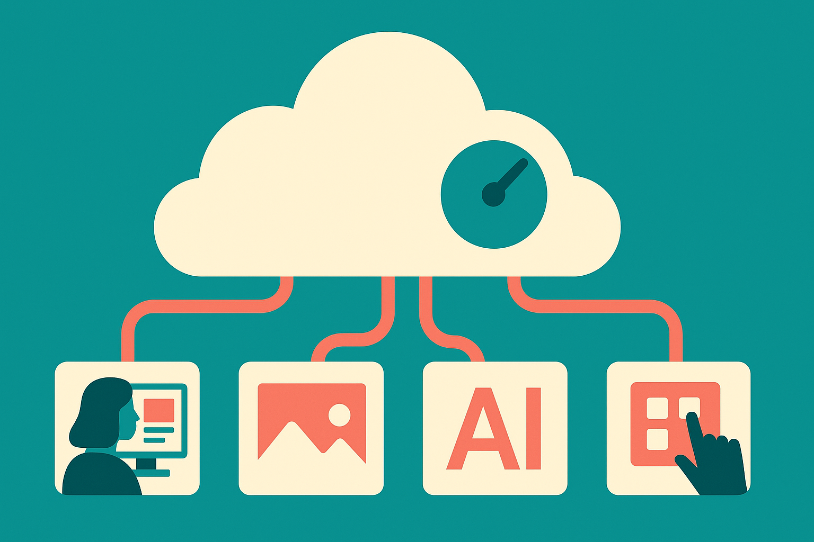

TL;DR: If your product depends on a hosted frontier model, treat the model as a moving dependency and test it like one.

## Did GPT-6 Astra actually get worse?

Decrypt’s report, “GPT-6 Astra Users Say OpenAI's Newest Model Got Dumber. It Happened Before, Too,” says users began complaining about GPT-6 Astra a week after launch, claiming OpenAI’s newest model had been “nerfed.” Decrypt also notes that OpenAI’s previous model went through a similar complaint cycle in July.

That is the story we can responsibly tell from the available sourcing. Users say it feels worse. Decrypt reports the pattern. There is no first-party OpenAI confirmation in the material here saying Astra was changed, downgraded, rate-limited, rerouted, or otherwise modified.

That distinction matters.

“Got dumber” is a real user signal, but it is not a measurement. It can mean the model is less creative. Or more cautious. Or shorter. Or worse at coding. Or worse at one weird prompt that a power user runs 40 times a day. It can also mean the launch-week comparison was skewed by novelty, cherry-picked wins, or temporary system behavior.

Still, I do not dismiss these complaints. People notice when a model stops doing the thing they built muscle memory around. Especially developers, writers, analysts, and operators who run repeat workflows. A tiny style shift can feel like a capability drop if your process depends on that style.

## Why does this keep happening?

Hosted AI products are not static software. That is the uncomfortable part.

A normal SaaS tool ships visible features. A model platform ships behavior. The provider can change model weights, system prompts, safety layers, routing, context handling, tool behavior, latency settings, or product packaging. Some of those changes may improve the system globally while making a subset of workflows worse.

That creates a trust gap. Users experience the model as one named thing, “GPT-6 Astra.” The provider may experience it as a live service with many parts. Both perspectives are valid, but they collide when performance changes without a clear changelog.

The July echo in Decrypt’s report is the more important detail than the Astra complaint itself. One blowup is noise. Repeated user suspicion after launches becomes a product problem. Not necessarily because OpenAI did something wrong in each case, but because customers do not know what changed, when, or how to verify it.

This is where AI product management is still immature. Model cards and launch demos are not enough. Benchmarks are useful, but they rarely match production workflows. And social media complaints are too messy to serve as diagnostics.

What teams need is the boring middle: version visibility, change notices, workflow-level evals, and a way to pin behavior when stability matters more than marginal capability.

## What should builders do about model drift?

If you run AI inside a real workflow, stop treating the vendor’s model name as your only unit of reliability.

Create a small eval suite for your actual use cases. Not 500 academic tasks. Ten to thirty examples that represent the work you care about: your best support tickets, your nastiest extraction cases, your brand-sensitive writing prompts, your codebase-specific refactors, your compliance edge cases. Run them on a schedule and whenever you notice a behavior shift.

Save outputs. Score them simply. Good, acceptable, fail. Add notes on why. If the model gets more verbose, more cautious, less precise, or starts missing instructions, you want examples, not vibes.

Also build graceful escape hatches. Keep prompts portable. Test at least one fallback model. Separate your product logic from model-specific quirks. If a workflow only works because one model has one lucky habit, that is not a workflow. That is a dependency trap.

For builders, the move is not to panic every time users say a model got worse. The move is to assume hosted models can change, then design around that fact. Run your own regression tests, keep a few golden prompts, compare outputs over time, and document what “good” means for your use case. The catch most readers miss: the vendor’s benchmark win does not protect your workflow. Your evals do.
