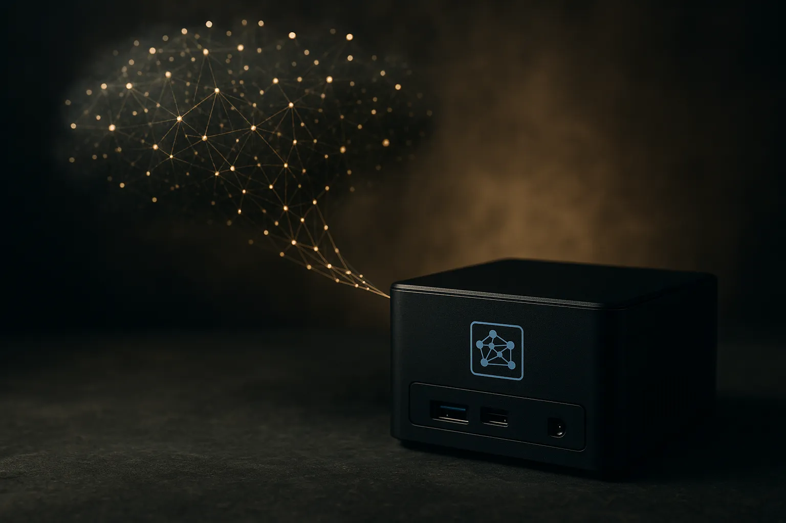

TL;DR: Treat “local AI is becoming more probable” as a watchlist signal, not a conclusion, until there are weights, evals, and working operator workflows behind it.

## What does “more probable” actually mean?

My primary source here is the r/LocalLLaMA submission by /u/pmv143 titled “This seems more probable than it was before.” That is all the provided material gives us. No linked paper details. No model card. No benchmark table. No product announcement. No first-party claim from a lab.

So the useful move is not to pretend we know the missing context. The useful move is to ask what kind of probability update matters for builders.

In the local AI world, “more probable” usually points at one of a few things: open models closing a capability gap, consumer hardware running bigger models, quantization getting less lossy, small models becoming good enough for narrow tasks, or agent workflows moving from cloud-only to local-first. Any of those would matter. But they matter in different ways.

A 70B open model that scores better on a benchmark is not the same as a 7B model that runs well on a laptop. A clever quantization trick is not the same as a dependable local coding agent. A screenshot of a demo is not the same as a reproducible repo.

That is the line I keep coming back to: local AI progress is real when it changes what you can run, not just what you can imagine running.

## What would count as receipts for local AI?

For local models, I want three kinds of proof.

First: runnable artifacts. Weights, inference code, hardware requirements, license terms, and enough setup detail that a normal technical operator can reproduce the claim. Not “it runs locally” in the abstract. What machine? How much memory? What latency? What context length? What failure modes?

Second: task-specific evals. General benchmark movement is interesting, but local AI gets adopted through boring jobs. Classify support tickets. Draft from a private knowledge base. Extract fields from PDFs. Run a coding assistant without sending a repository to a hosted provider. Summarize meeting notes on-device. If a local model wins on those jobs, I care more than if it posts a flashy score on a broad leaderboard.

Third: workflow economics. Local does not have to beat frontier hosted models at everything. It has to win somewhere specific: privacy, cost at scale, latency, offline use, customization, data residency, or independence from API changes. That is where open and local models have a clean operator story.

The trap is treating “local” as a moral category. It is not. It is a deployment choice. Sometimes the hosted model is better, cheaper, and safer to maintain. Sometimes the local model is the only sane choice because the data cannot leave the machine or the workload is repetitive enough that API costs get silly.

## How should builders use weak community signals?

A post like /u/pmv143’s title is weak evidence, but weak evidence is not useless. Communities often notice direction before formal announcements package it. r/LocalLLaMA has been especially good at surfacing practical movement around open weights, llama.cpp, quantization formats, consumer GPU constraints, and what actually runs on real machines.

But community excitement needs a filter.

I would not rebuild a product roadmap around a vague probability update. I would add a test slot. Pick one workflow where local AI would create a real advantage. Define the hosted baseline. Then rerun that test every month as models and runtimes improve.

For example: take 100 representative documents, tickets, calls, or code tasks. Test the current hosted setup against one or two local candidates. Track output quality, latency, setup pain, privacy gain, and total cost. Keep the harness boring. That way, when a real breakthrough lands, you can tell. You will not be guessing from vibes.

The catch most readers miss: local AI adoption will not arrive as one big flip from cloud to laptop. It will arrive as pockets. Private RAG. Cheap batch processing. Internal copilots. Edge devices. Regulated workflows. If you build with AI, the practical move is to maintain a small local-model bench now, even if hosted models still win today. That gives you a ready place to test the next “more probable than before” claim without betting the business on it.
