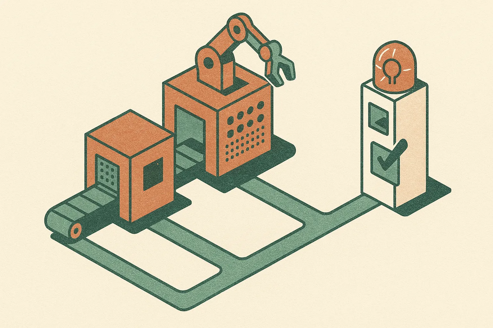

TL;DR: The useful signal is that major frontier AI leaders are now talking about slowing the race before models become meaningfully involved in building the next generation of models.

## What did Amodei, Altman, and Musk reportedly agree on?

The primary source here is CoinDesk’s report, “Anthropic CEO calls for AI race to slow down citing safety. Musk and OpenAI's Altman agrees.” CoinDesk reported that Anthropic CEO Dario Amodei, OpenAI CEO Sam Altman, and Elon Musk aligned on an unusual point: frontier AI development may need to slow as systems become capable of helping build their own successors.

CoinTelegraph, in “Anthropic chief urges slowdown in AI development to safer pace,” also reported that Altman agreed with safety concerns around AI development. CoinTelegraph added that Altman said there would be no initial share sale this year, but that detail is beside the main technical issue.

The real story is not “AI CEOs discover caution.” Every frontier lab already says some version of that. The story is narrower and more important: the race dynamic changes when AI systems contribute to AI research itself.

That is a different category from today’s coding agents, benchmark gains, and productivity demos. If models can assist with architecture search, data generation, eval design, post-training, interpretability, exploit discovery, and deployment automation, then capability improvement gets less bottlenecked by human labor. Not zero bottlenecked. Not magic. But less.

That is the part that makes “slow down” more than a vibes statement.

## Why does self-improvement change the safety argument?

Most AI safety debates get trapped in two weak frames. One says nothing is real until catastrophe. The other says any capability jump proves catastrophe is near. Neither is useful for operators.

The practical question is feedback speed.

If a lab can train a stronger model, use it to improve the next training run, then use that model to improve the next one, the iteration loop tightens. Even if each gain is modest, shorter loops can compound. Safety work has to keep pace with that loop, not with the public product release calendar.

That includes evals that test agentic behavior, cyber misuse, autonomous research ability, persuasion, deception under pressure, and model behavior in long-horizon tasks. It also includes boring governance: who can start runs, who can ship weights, what gets logged, what triggers a pause, and what evidence is required before a release.

The hard part is that no outside reader should treat “slow down” as a complete policy. Slow by how much? Triggered by which capability? Enforced by whom? Across which countries and labs? CoinDesk and CoinTelegraph report agreement on concern, not a detailed shared plan. That matters.

A slogan does not solve coordination. And frontier labs have incentives to define “safe pace” in ways that still let them ship.

## What should builders take from this?

For most teams, this is not a reason to stop building with AI. It is a reason to stop copying frontier-lab behavior without frontier-lab controls.

If you are adding agents to internal workflows, assume the model will get better at chaining tasks, calling tools, writing code, and finding shortcuts. That is good when the task is invoice triage or QA cleanup. It is dangerous when the system has write access, customer communication rights, production credentials, or authority to create new automations without review.

The frontier debate has a local version: do your AI systems help create or modify other AI systems, prompts, tools, workflows, or deployment rules? If yes, you have a mini self-improvement loop. Treat it like one.

Add evals before autonomy. Keep humans in approval paths for irreversible actions. Log tool calls. Separate sandbox credentials from production credentials. Test for prompt injection and goal drift. Build rollback paths. The catch most readers miss is that “recursive improvement” does not have to look like a sci-fi lab. It can look like a helpful internal agent quietly editing the process that governs its own next task.
