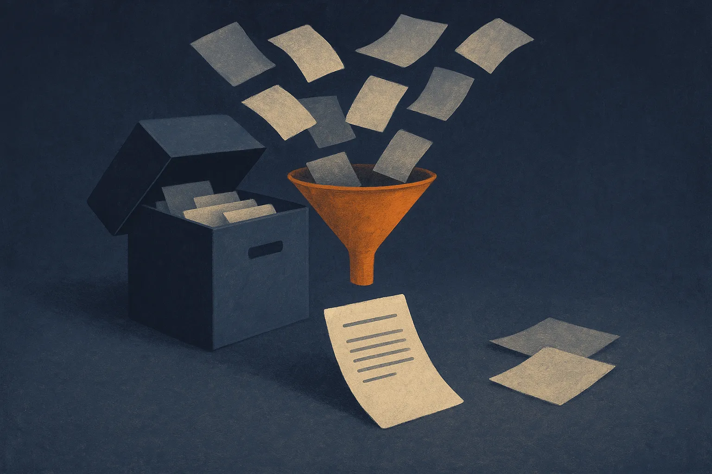

TL;DR: The CIA’s declassified President’s Daily Briefs are a useful real-world stress test for AI systems that claim to retrieve, summarize, and reason over sensitive institutional knowledge.

## What makes the CIA release useful for AI builders?

The primary source here is the CIA announcement, “CIA Releases President's Daily Briefs in Commemoration of 9/11.” The headline alone tells us the important part: the agency has released President’s Daily Brief materials connected to one of the most scrutinized intelligence failures in modern U.S. history.

For AI people, the immediate temptation is to say: great, another document set to throw into a RAG pipeline.

That undersells it.

A President’s Daily Brief is not a blog archive. It is a compressed intelligence product meant for a tiny, high-stakes audience. It carries the usual hard problems that show up in enterprise AI, government AI, legal AI, and research workflows: incomplete context, classified-to-declassified transitions, dated assumptions, names that recur across time, and conclusions that may look different with hindsight.

That makes it much more interesting than a clean benchmark. A model can summarize a document. Fine. Can it keep chronology straight? Can it distinguish what an analyst knew at the time from what a reader knows now? Can it cite the document instead of smoothing over uncertainty? Can it say “this file does not support that claim”?

Those are the behaviors that matter.

## Why not just use a long-context model?

Long context helps, but it does not solve the job.

If you stuff a pile of declassified intelligence documents into a large context window, the model may produce a confident narrative. That can be useful for orientation. It can also be dangerous, because the model is rewarded for coherence, not archival caution.

The better design is boring and stricter. Preserve document metadata. Track dates. Keep source boundaries visible. Separate extraction from interpretation. Require citations down to the document or page level where the data allows it. Run queries that test refusal and uncertainty, not just recall.

For example, a good system should answer a question about pre-9/11 intelligence warnings with sourced excerpts, dates, and caveats. A weaker system will compress everything into a retrospective storyline. That sounds smart. It is often just hindsight with better grammar.

This is where declassified government material can help builders evaluate RAG in the real world. The hard part is not finding matching words. The hard part is not over-claiming across related documents.

## What should this change in applied AI workflows?

I would treat releases like this as a reminder to build for provenance before polish.

Most AI document products still demo the happy path: upload files, ask questions, get a neat answer. Serious users need the opposite posture. Show the trail. Show gaps. Show conflicts. Let the answer be less pretty if the evidence is thin.

That matters outside national security. The same pattern shows up in board minutes, customer research, litigation files, medical records, policy archives, and old support tickets. People do not only want summaries. They want to know whether the system is grounded enough to trust, and limited enough to catch itself.

A practical build would start small: ingest a bounded set of the CIA-released PDB materials, normalize metadata, create a timeline view, and run a citation-first Q&A layer over it. Then test it with questions designed to tempt the model into hindsight, unsupported causality, or false precision. The catch most readers miss: the win is not an AI that “understands 9/11.” The win is an AI workflow that knows when the archive supports an answer, when it only suggests one, and when it should stop.
