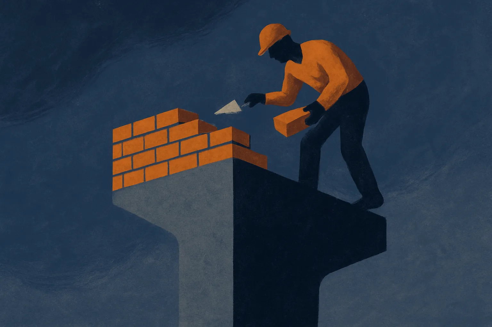

TL;DR: The "slow down AI, except me" impulse is not hypocrisy, it is the rational move in a game with no enforcement, and until the incentives change you should plan as if the pace only accelerates.

The headline that prompted this ran on Hacker News: "Everyone should slow down AI development except for me." It is a joke. It is also the most honest summary of AI governance in 2026 that I have read all year. Every serious actor in this space, the frontier labs, the open-weight crowd, the US, China, the EU, says some version of "the pace is dangerous" and then ships faster. That is not a character flaw spread across thousands of people. It is what the structure of the game rewards.

I want to take the joke seriously, because the punchline points at something operators actually have to reason about: nobody is going to slow down for you, and any plan that assumes otherwise is a bad plan.

## Why does everyone say slow down and then speed up?

Because a unilateral pause is a gift to whoever does not pause. This is the oldest problem in game theory wearing a new hat. If Lab A stops for six months on safety grounds, Lab B ships, takes the market, hires the talent, and sets the defaults everyone else has to react to. Lab A gets the moral high ground and a shrinking budget. The safety-minded actor who pauses removes themselves from the frontier and hands the wheel to whoever cared least.

So the observed behavior is completely consistent: sincere worry plus continued acceleration. People are not lying when they say they are scared. They are telling the truth about the danger and the truth about their incentives at the same time, and the incentives win because the danger is diffuse and the competition is immediate.

You see the same shape at the national level. A country that regulates hard while its rival does not is choosing to lose a capability race for a safety benefit it cannot capture alone, because the rival's models will still exist and still leak across borders. The EU AI Act is the closest thing to real constraint, and the practical result so far has been companies routing releases and timing rollouts around it, not abandoning the frontier. Constraint without matching constraint elsewhere becomes friction, not a stop.

## Is this actually hypocrisy, or something worse?

Calling it hypocrisy is comforting because hypocrisy has a cure: catch people, shame them, they stop. But this is not hypocrisy. Hypocrisy is saying one thing and privately believing another. Most of these actors believe both things fully. The slowdown they want is real, and the exception they carve for themselves is also real, and both come from the same clear-eyed read of the situation.

That is worse than hypocrisy, because you cannot shame your way out of a coordination failure. The classic pause proposals, the 2023 open letter calling for a six-month halt on training runs past GPT-4, went nowhere for exactly this reason. There was no mechanism to make defection costly, so the letter functioned as a statement of concern, not a treaty. Everyone who signed it kept working. Everyone who did not sign it kept working faster.

The uncomfortable version: "slow down except me" is not the failure mode. It is the equilibrium. A pause holds only when defection is more expensive than compliance, and right now defection is cheap and compliance is ruinous. Nothing in the current arrangement changes that math.

## What would actually make a slowdown stick?

The only slowdowns that hold in any domain are the ones with verification and consequences attached. Arms control worked when you could count silos and inspect sites. Nuclear nonproliferation has teeth because enrichment leaves signatures and sanctions bite. The analog for AI would be something like verifiable compute limits, since large training runs are still physical events that happen in data centers full of chips you can, in principle, track.

That is the one lever with real leverage: compute is countable in a way that "please be careful" is not. If you wanted a slowdown that survived contact with incentives, you would build it on hardware accounting, export controls that actually verify, and penalties that make defection cost more than the race is worth. Notice that none of that is voluntary and none of it is a pledge. It is plumbing and enforcement.

We are not close to that. There is no international body with the authority to inspect training runs, no agreed threshold, no shared enforcement. Until those exist, the rational read is that public slowdown talk is signaling and the actual pace is set by whoever is willing to move. Which means the honest planning assumption for anyone building on top of this is: not slower.

## What does this mean if you are building on top of it?

Assume acceleration. Every quarter I have watched builders plan around a coming plateau, "surely the pace lets up, surely the next model is incremental," and every quarter the assumption cost them. Not because progress is smooth, it is lumpy and often overhyped, but because betting on a slowdown that has no enforcement mechanism is betting against the structure of the game.

Concretely, this shapes three things. Model choice: do not architect around one lab's current lead, because the frontier reshuffles faster than your migration cost tolerates. Abstract your model layer so swapping providers is a config change, not a rewrite. Cost curves: price your product against next year's inference cost, not today's, because the trend is down and someone will undercut you with a cheaper model doing the same job. And regulatory exposure: watch compute-accounting and export-control rules specifically, because that is where any real constraint will land first, and it will land on infrastructure and hardware before it touches your prompts.

The catch most readers miss: "slow down" and "speed up" are not opposing camps you have to pick between. The same actors hold both, sincerely, at once. So stop reading slowdown statements as predictions of behavior. Read them as what they are, sincere fear with no enforcement behind it, and build for the world the incentives actually produce, which is the fast one. The people warning you to slow down are, right now, the same people setting the pace. Plan accordingly.
