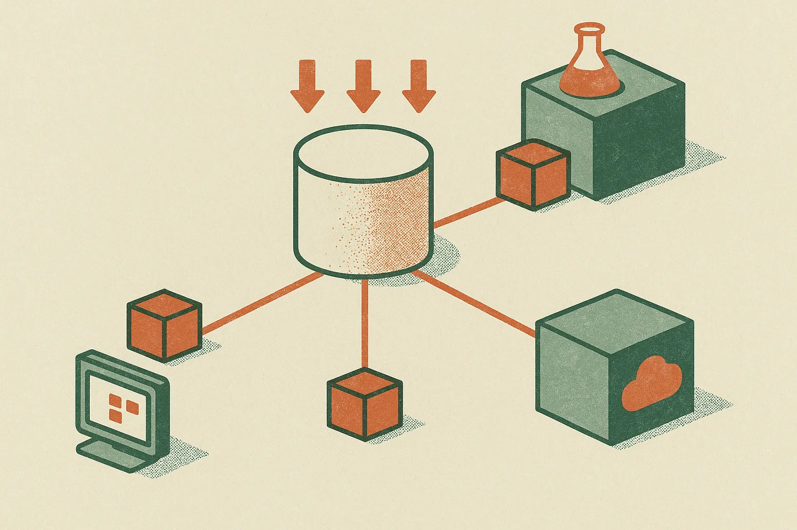

TL;DR: The “Nvidia is the central bank of AI” frame is useful if you treat compute access as a balance-sheet constraint, not just a cloud line item.

## What does “central bank of AI” actually mean?

The Hacker News item titled “Nvidia is the central bank of AI” lands because the metaphor captures something real: Nvidia sits close to the money supply of modern AI.

Not money in the literal sense. Compute.

If a lab wants to train frontier models, it needs accelerators. If an AI startup wants low-latency inference at scale, it needs accelerators. If a cloud wants to sell AI capacity, it needs accelerators. Nvidia does not own every layer, but its GPUs, networking, software stack, and developer gravity have made it a gating input for a large share of the market.

That is the central-bank analogy. Central banks influence liquidity. Nvidia influences compute liquidity.

The limits matter too. Nvidia does not set monetary policy. It cannot force demand into existence. It does not guarantee that every GPU buyer has a durable business. And it is not the only player. AMD, Google TPUs, custom silicon from hyperscalers, and smaller inference-focused chips all push against the idea that one company is the whole system.

But metaphors do not have to be perfect to be useful. This one is useful because it moves the conversation away from “AI app valuations are high” and toward a harder operational question: who controls the scarce inputs?

## Why should builders care about the compute supply chain?

Most builders experience Nvidia indirectly. They rent from AWS, Azure, Google Cloud, CoreWeave, Lambda, or another provider. They use OpenAI, Anthropic, Google, Mistral, or open models through hosted inference. The GPU is abstracted away.

Until it is not.

Capacity limits show up as waitlists. Cost shows up in gross margin. Model choice shows up in latency. Context length shows up in budget. “We’ll just call the best model” works in a prototype, then becomes a unit economics problem when customers start using the product all day.

That is where the central-bank frame gets practical. If compute is the scarce resource, the winning product is not always the one using the biggest model. It is often the one that routes intelligently: small model first, retrieval where needed, expensive reasoning only for the cases that justify it, caching whenever outputs repeat, and human review where automation risk is real.

This also explains why open-source AI and small models keep mattering. They are not just ideology. They are bargaining power. A team that can run a capable local or self-hosted model has more options than a team locked into one hosted API and one pricing curve.

## Is Nvidia’s position durable?

Durable, yes. Untouchable, no.

Nvidia’s advantage is not only chips. It is the ecosystem around the chips. CUDA, libraries, developer familiarity, training infrastructure, cloud availability, and a long hardware roadmap all compound. That is hard to copy quickly.

Still, the pressure points are obvious. Hyperscalers do not like depending on one supplier forever. Model labs want cheaper inference. Enterprises want predictable costs. Governments care about domestic compute capacity. And software keeps getting better at doing more with less, through quantization, distillation, sparsity, better routing, and better training recipes.

So I would not read the “central bank” line as a claim that Nvidia owns AI forever. I read it as a warning against lazy abstraction. Compute is not a commodity detail yet. It is strategic infrastructure.

For builders, the move is simple: design as if model access can change. Track cost per successful task, not just cost per token. Keep at least one fallback model path. Test smaller models earlier than feels comfortable. If you are building an agent, measure how often it really needs a frontier model versus how often you are paying for prestige. The catch most readers miss: GPU scarcity is not only a training-lab problem. It reaches all the way into product pricing, margins, reliability, and whether your AI feature can survive real usage.
