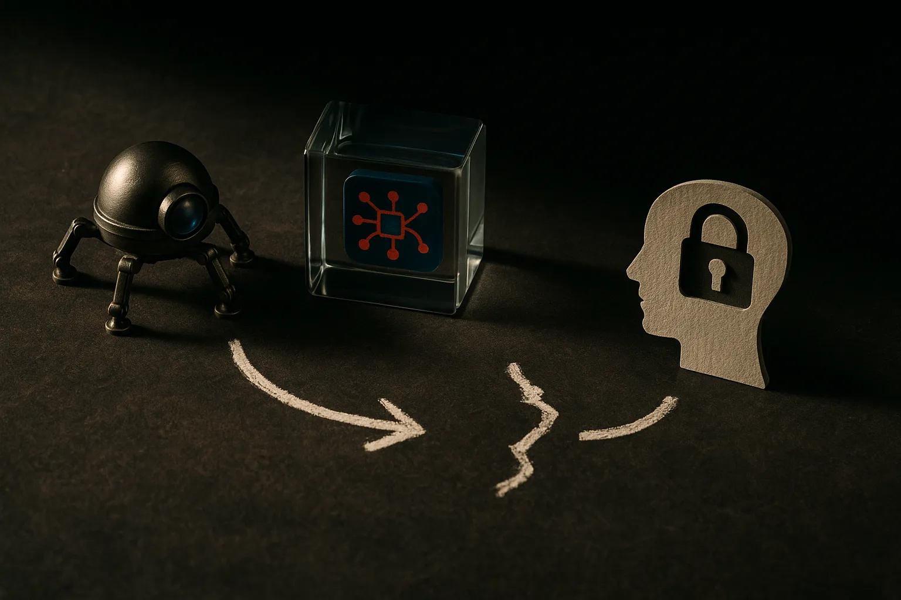

TL;DR: The useful lesson from the “OpenAI bots knew” claim is not that bots have responsibility, it is that teams need explicit security escalation paths for machine-observed risk signals.

## What does it mean for a bot to “know” about a vulnerability?

The source packet points to a Hacker News thread titled “OpenAI bots knew about the RubyGems caching vulnerability.” That is a sharp claim, but the wording does a lot of work.

“Knew” can mean several very different things.

It might mean an automated system crawled a page that mentioned the RubyGems issue. It might mean a model generated text that referenced it. It might mean an internal agent, test harness, or crawler touched artifacts related to the bug. It might mean someone found logs after the fact and inferred awareness.

Those are not the same.

A crawler fetching a page is not a security triage process. A model emitting a sentence is not incident response. A bot having a vulnerability in context is not the same as an organization accepting responsibility for disclosure, prioritization, or remediation.

That distinction matters because AI systems are now everywhere in developer workflows. They read issue trackers. They summarize logs. They inspect dependency graphs. They answer questions about package behavior. They may even generate proof-of-concept code if prompted badly enough.

So the operational question is not, “Did the bot know?”

It is: “Was there a system that turned a machine-observed security signal into a human-owned security action?”

Most organizations do not have that system yet.

## Why package ecosystem bugs expose the gap

RubyGems sits in the software supply chain. A caching vulnerability there is not just “a Ruby problem.” Package registries, build caches, mirrors, and dependency resolution paths are places where small mistakes can have wide blast radius.

That is why this kind of story hits a nerve.

Developers increasingly ask AI tools to explain dependency failures, inspect package metadata, write CI fixes, or debug odd install behavior. Those tools may see clues before a maintainer, security team, or registry operator sees a clean report. But seeing clues is cheap. The hard part is assigning confidence, scope, severity, and ownership.

Security teams already struggle with noisy scanners. AI adds a different kind of noise: plausible partial understanding.

A model can summarize a vulnerability convincingly without knowing whether it is exploitable in the current environment. An agent can flag suspicious behavior without knowing whether it is stale, public, private, patched, or embargoed. A crawler can observe a page without any concept of urgency.

This is where hype gets dangerous. If we talk as if AI “knows,” we smuggle in an assumption that knowledge implies judgment. It does not.

A useful AI security workflow needs boring plumbing: provenance, timestamps, confidence levels, source links, reproducible steps, ownership, escalation thresholds, and audit trails. If a bot sees something security-relevant, the next question should be mechanical: where does that signal go, and who is accountable for reading it?

## What should builders change?

For builders shipping agents, coding assistants, or internal AI tools, I would treat this as a design smell.

If your system can read production logs, issue trackers, dependency manifests, package metadata, CI output, customer tickets, or public security discussions, then it can encounter vulnerability signals. That does not mean it should autonomously file CVEs or page the CISO at 2 a.m. It does mean you need a policy.

Start small.

Tag security-adjacent observations. Preserve the evidence. Link back to the original artifact. Separate “model inference” from “observed fact.” Route high-confidence items into the same queue humans already use for security triage. Do not let agent transcripts become the only place a real risk was noticed.

Also, be careful with disclosure. An AI tool that finds or reconstructs a vulnerability can make a mess if it publishes details, opens an issue in the wrong place, or generates exploit steps into a public log. Guardrails here are not about making the model morally pure. They are about keeping the workflow from turning a latent bug into a live incident.

The catch most readers miss: AI awareness is not accountability. If a bot saw a clue and nothing happened, that is not proof the bot failed. It is proof the organization had no handoff. Builders should design that handoff now, especially anywhere AI touches code, dependencies, CI, or production telemetry.
