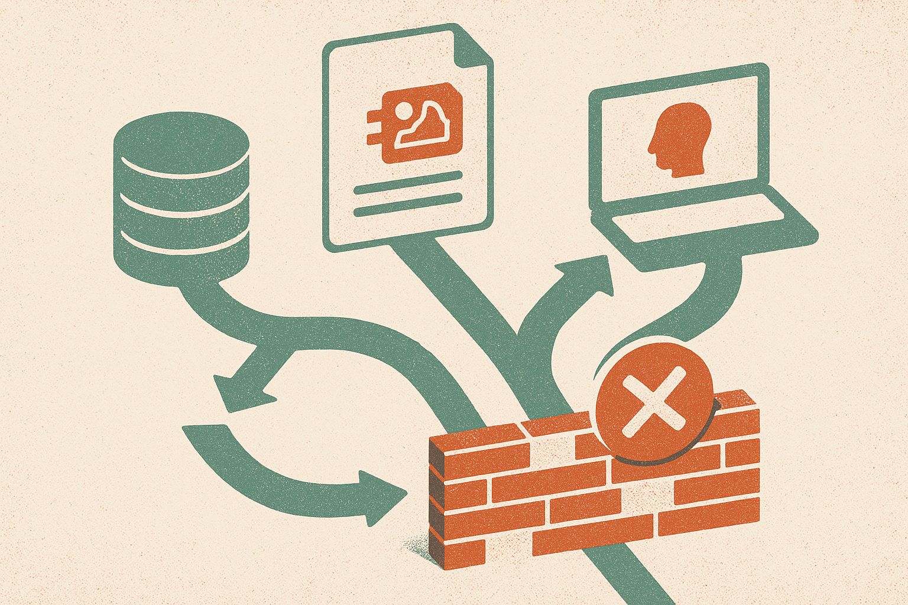

TL;DR: Treat JPEG XL decisions as pipeline decisions, not ideology about which image format is technically best.

## What is the actual decision behind “The case against JPEG XL”?

My primary source here is Hacker News (AI), “The case against JPEG XL.” That title alone is enough to locate the debate: JPEG XL is not just a compression topic, it is a deployment topic.

I am not going to pretend a headline settles the technical case. It does not. Format arguments usually get muddy because people collapse several questions into one. Is the codec efficient? Is it well specified? Do common tools read it? Does it fail safely? Can your CDN transform it? Can your annotation vendor handle it? Can your model training stack decode it at speed? Those are different questions.

For AI builders, the format question is less romantic than the web standards fight. Multimodal systems care about images as inputs, outputs, training examples, screenshots, medical scans, UI states, product photos, receipts, diagrams, memes, and generated assets. Each use case has different pressure. Archival quality is not the same as browser delivery. Human review is not the same as high-throughput training. Lossless preservation is not the same as “good enough for a classifier.”

That is why I get skeptical when format debates turn into team sports. A better codec on paper can still be the wrong default if it adds brittle conversion steps. A less elegant format can win because every library, vendor, and browser path knows how to handle it.

## Why should AI teams care about boring image plumbing?

Because image plumbing becomes model behavior.

If your pipeline converts formats inconsistently, you can introduce artifacts that nobody tracks. If one service strips metadata and another keeps it, your audit trail changes. If previews are generated differently from training images, human reviewers may approve examples the model never actually sees in the same form. If decoding is slow or unsupported in part of the stack, the “better” format quietly becomes a queue, a cloud bill, or a fallback copy in a more common format.

This is especially important for teams using synthetic images, screenshots, or generated creative at scale. The file format is not just storage. It becomes part of provenance, deduplication, caching, moderation, search indexing, and retrieval. In RAG systems with visual documents, image format choices can affect OCR, thumbnail generation, embedding jobs, and replayability. When a customer asks why a document was interpreted a certain way, “we converted it three times and lost track” is not a great answer.

So the useful question is not “Is JPEG XL good?” The useful question is “Where would JPEG XL sit in my pipeline, and what breaks if it is absent tomorrow?”

That answer may be different for a research archive, a design tool, a browser-first product, a medical workflow, a CMS, or a training data lake. The boring compatibility matrix matters more than the winner of the comment thread.

## What should builders test before changing formats?

Start with the path, not the codec. Take 500 real images from your workflow. Include ugly cases: huge files, transparent images, scans, screenshots, rotated phone photos, low-light photos, weird color profiles, AI-generated images, and files from customers who do not care about your spec.

Run them through the exact systems you use. Upload, store, transform, preview, annotate, embed, train, retrieve, export, and delete. Watch for failures that do not show up in a compression benchmark: broken thumbnails, slow workers, missing metadata, inconsistent previews, failed browser display, vendor rejection, duplicate storage, and silent conversion back to older formats.

Then decide where the format belongs. Maybe JPEG XL is useful for archival originals. Maybe it is not right for user-facing delivery. Maybe it belongs in an internal asset pipeline but not in public uploads. Maybe the cheapest answer is to keep originals, generate operational derivatives, and record every transformation.

Practitioner’s take: before adopting or rejecting JPEG XL, build a tiny image-format bakeoff inside your own stack. Do not test only file size. Test decode speed, library support, metadata handling, preview fidelity, downstream model output, and rollback. The catch most teams miss is that “format support” is not binary. It has to be supported by every service that touches the image, including the boring ones nobody remembers until they fail.
