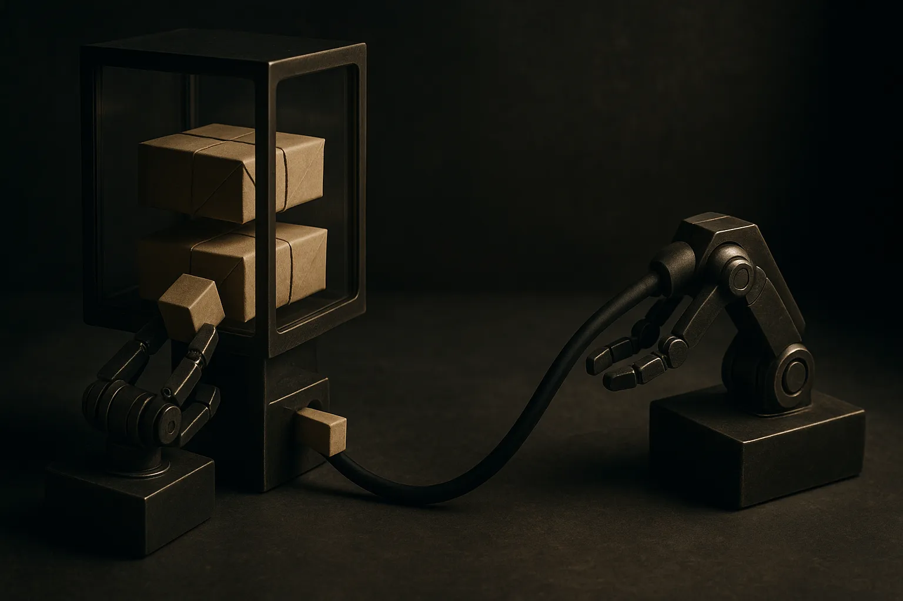
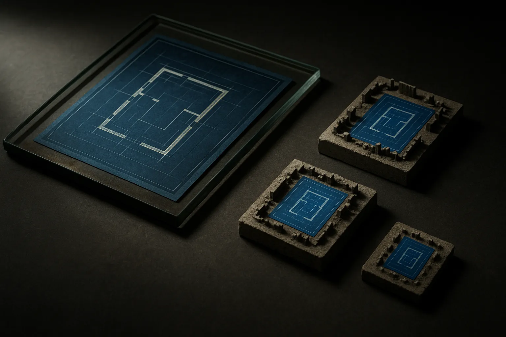

TL;DR: Hugging Face showed a way to run asynchronous GRPO training with LoRA across separate GPU jobs by using a storage bucket and an HTTP proxy for coordination instead of NCCL, which removes the hardest part of standing up distributed RL for most people.

The headline here is not a new algorithm. It is a plumbing decision. Hugging Face's post, "Async GRPO with LoRA across HF Jobs: a bucket, a proxy, and no NCCL," describes running reinforcement learning post-training without the collective communication library that usually glues multi-GPU jobs together. If you have ever tried to spin up distributed training on rented hardware, you know that NCCL is where dreams go to hang. This is an attempt to route around it.

Let me be upfront about scope. I am working from Hugging Face's blog post as the single source, so I will describe the shape of the approach and where I think it matters, and I will flag the parts that need testing before you trust them in your own setup.

## What is GRPO and why does the NCCL part matter?

GRPO is Group Relative Policy Optimization, a reinforcement learning method for post-training language models. The short version: you sample several completions for a prompt, score them, and nudge the model toward the better ones relative to the group. It became widely known as one of the training methods behind reasoning-focused models, and it has since become a standard tool for teaching models to prefer outputs that score well on some reward.

The catch is that RL post-training is two jobs pretending to be one. There is the generation side, where the model produces candidate completions, and the training side, where you compute the update and push new weights. In a naive setup those two live in the same process and talk over NCCL, the NVIDIA library that handles fast GPU-to-GPU communication. NCCL is great when it works and miserable when it does not. Version mismatches, network topology, firewall rules on rented instances, containers that cannot see each other. Anyone who has debugged a hanging all-reduce at 2am knows the feeling.

So the interesting move in Hugging Face's recipe is decoupling. Make generation and training genuinely separate jobs, let them run asynchronously, and coordinate them through infrastructure that already works everywhere: object storage and plain HTTP. No shared low-level GPU fabric required.

## How does the bucket-and-proxy setup actually work?

Two coordination pieces do the work. A bucket, meaning cloud object storage, and a proxy, meaning an HTTP layer that routes requests between the training and inference sides.

The pattern, as Hugging Face describes it, is asynchronous. The inference job generates completions and rollouts. The training job consumes those, computes the GRPO update, and produces new LoRA adapter weights. Because they are decoupled, the two do not have to march in lockstep. The trainer does not sit idle waiting for the sampler, and the sampler does not block on the trainer. The bucket is the handoff point for artifacts, and the proxy handles the live request routing so the pieces can find each other without being wired together at the CUDA level.

The LoRA choice is the other half of what makes this practical. Instead of updating and shipping full model weights between jobs, you are training low-rank adapters. Those are small. Passing a set of LoRA weights around through a bucket is cheap in a way that passing full checkpoints is not. LoRA and async coordination fit together: the thing you have to move between jobs stays tiny, so storage-based handoff stops being a bottleneck.

The whole thing is framed to run "across HF Jobs," which is Hugging Face's own hosted job runner. That is the setting they built and tested for. Whether the same bucket-and-proxy pattern drops cleanly onto your own Kubernetes cluster or a different cloud is a fair question, and it is not one the post answers for you.

## Who is this actually for?

Not everyone doing RL post-training. If you run a large lab with a tuned multi-node cluster and a team that keeps NCCL happy, this recipe is not solving a problem you have. Your fabric works, your throughput is higher for staying synchronous and local, and the async approach trades some efficiency for portability you do not need.

The people this helps are in the messier middle. Solo researchers, small teams, anyone renting GPUs across instances that were never designed to talk to each other over a fast interconnect. The async, storage-mediated design turns "get these two machines to do a coordinated all-reduce" into "have both machines read and write the same bucket." That second problem is one almost everyone already knows how to solve.

There is a real efficiency cost baked in. Async RL means the policy generating your rollouts can be slightly stale relative to the policy you are updating, because generation and training are not synchronized. That off-policy gap is a known tension in async RL, and how much it hurts depends on your reward, your update cadence, and how far the two drift apart. Hugging Face's framing is that the portability is worth it. I would want to see the reward curves next to a synchronous baseline before I called that settled for a given task, and the post as I have it is more architecture writeup than benchmark study.

## What should a builder do with this?

The clearest use is as a template. Read Hugging Face's writeup as the reference implementation for "how do I run RL post-training without owning a real cluster," then adapt the two coordination primitives to whatever infrastructure you actually have.

Start small and cheap. Pick a task where you can define a clean reward, run the async loop with LoRA adapters, and watch two things: whether the reward actually climbs, and how stale your rollouts get relative to the policy. Those two numbers tell you whether the async tradeoff is fine for your case or whether you have drifted into instability. If reward is climbing and the model is not degenerating, the portability you bought is free money. If it is thrashing, tighten the update cadence or move back toward synchronous.

The catch most people will miss: removing NCCL removes a class of failures, it does not remove the hard part of RL. The hard part is still the reward function and the off-policy gap. This recipe makes the infrastructure boring so you can spend your attention on the parts that actually decide whether the run works. That is the right trade. Just do not mistake easier plumbing for an easier problem. The plumbing was never why your RL run failed.
