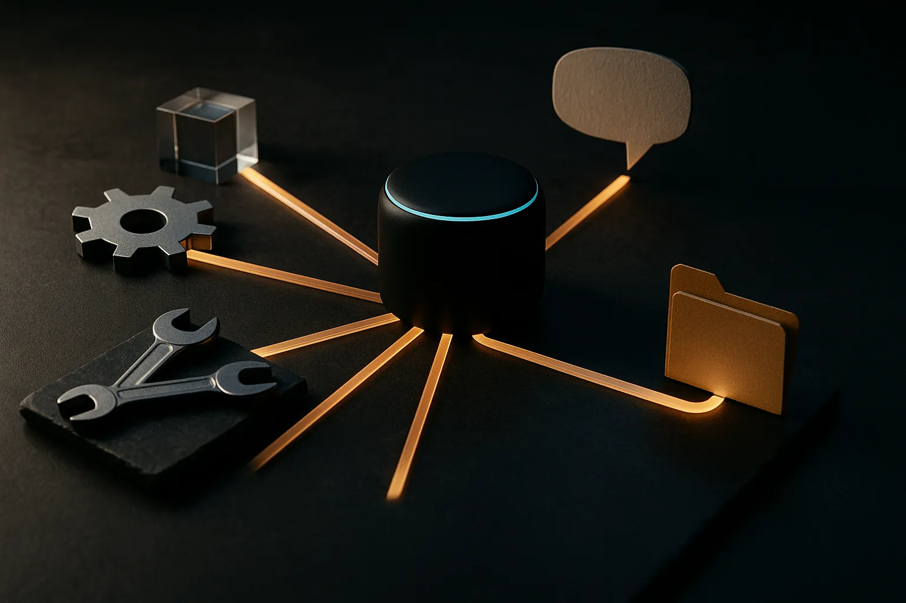

TL;DR: If Siri can route requests to Claude or ChatGPT, the real shift is not “Siri gets smarter,” it is Apple treating the assistant as a model broker, but the supplied evidence does not prove a shipped feature.

## Is Apple actually replacing Siri with Claude or ChatGPT?

The primary source here is the Hacker News AI item titled “Apple's Siri AI Can Be Swapped Out for Claude, ChatGPT, Code Shows.” That wording matters. “Code shows” is not the same as “Apple announced,” “Apple shipped,” or “users can choose Claude in Settings.”

From the material provided, there is no Apple developer document, support page, launch post, or App Store policy confirming availability, pricing, device support, geography, or user controls. So the only safe read is narrower: someone has found code paths or references that appear to allow Siri’s AI backend to be swapped for systems like Anthropic’s Claude or OpenAI’s ChatGPT.

That is still meaningful.

If true, it suggests Siri is being designed less like a single assistant brain and more like an orchestration surface. The user speaks to Siri. Siri decides what needs doing. A request may go to Apple’s own models, an external LLM, a tool call, a local app intent, or some combination.

That is the architecture most serious assistant products are drifting toward. One interface. Many models. Lots of routing. The hard part is not the chat bubble. It is deciding which system should handle which job, with what context, under which privacy and reliability constraints.

## Why would Apple want Siri to swap models?

There are boring reasons and strategic reasons.

The boring reason: testing. Large companies leave hooks in code for internal experiments, A/B tests, partner integrations, fallbacks, and unreleased features that never ship. A Claude or ChatGPT reference could be a live plan. It could also be scaffolding.

The strategic reason: no one model is best at everything. A phone assistant has to handle dictation, app actions, personal context, web-like questions, messages, reminders, images, code-adjacent queries, and weird edge cases at 7:14 a.m. while the user is walking. That mix favors routing.

Apple also has a privacy problem that is different from OpenAI’s or Anthropic’s. Siri sits close to contacts, messages, photos, calendar, location, and device state. Sending everything to a third-party model would be a nonstarter for many users and regulators. Sending some requests, with permission and filtering, is more plausible.

So the useful mental model is not “Claude replaces Siri.” It is “Siri may become the consent and routing layer.”

That model also fits the product reality. Users do not want to know which model handled “text Mom that I’m running late.” They want the assistant to do it correctly, not leak private data, and not ask five follow-up questions. Power users may want model choice. Most people want dependable outcomes.

## What should builders learn from this?

The lesson is that model choice is becoming an implementation detail, but routing quality is becoming the product.

A practical assistant stack now needs a few layers: intent detection, context filtering, model selection, tool permissioning, result verification, and a user-facing recovery path when the model gets it wrong. The model is one component. The orchestration around it is where trust is won or lost.

This is also where the hype gets ahead of the build. Swapping in Claude or ChatGPT does not automatically make Siri good. A better model can still fail if it lacks the right app hooks, fresh context, memory boundaries, or permission model. It can also create new failure modes, like inconsistent answers across providers or unclear accountability when something sensitive happens.

For operators, the question is not “which model wins?” It is “which tasks deserve which model, with what guardrails?” Customer support triage may need one setup. Calendar scheduling another. Private enterprise search another. Voice control another. The routing policy becomes as important as the prompt.

Practitioner’s take: if you are building an AI assistant, do not hard-code your product around one model unless you have to. Put a routing layer in front, log task types and failure modes, and test at least two providers on real workflows. The catch most teams miss: model swapping only helps if your permissions, evals, and fallback behavior are already clean.
