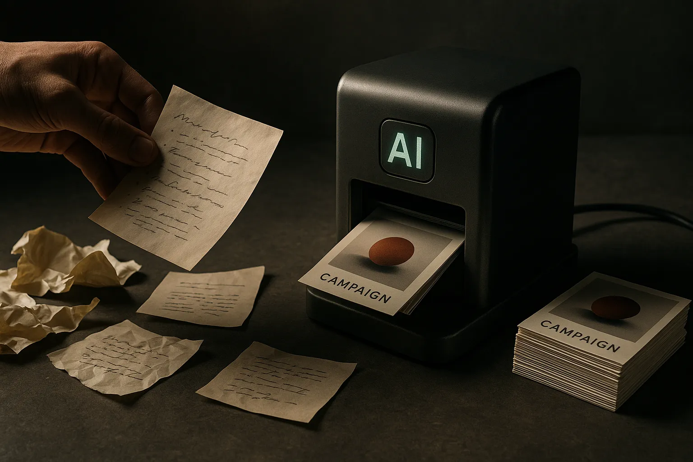

TL;DR: The practical AI shift for marketing teams is moving from “do this task faster” to “turn this repeated task into a reusable tool with judgment, inputs, and review built in.”

## What changes when the job becomes a tool?

Marketing AI Institute’s “From Marketing Job to Marketing Tool: Reframing AI Adoption” makes a useful distinction: AI is not only a way to speed up a marketer’s existing work. It can also turn pieces of that work into software-like assets the team can reuse.

That sounds small. It is not.

Most teams still use AI at the prompt level. Write a draft. Summarize a call. Generate headline options. Rewrite this in brand voice. Helpful, yes. But the value resets every time. The next person starts from scratch, with a different prompt, a different context window, and a different sense of what “good” means.

A tool is different. A tool has an input shape, a workflow, constraints, examples, review points, and an expected output. It can be improved. It can be handed to another person. It can become part of the operating system of the team.

That is the part I think marketers underweight. The durable asset is not the generated blog post or email. It is the repeatable decision path behind it.

For example, “write a webinar promo email” is a task. “Take a webinar title, audience segment, speaker notes, past performance patterns, brand rules, and CTA library, then produce three reviewed promo angles” is closer to a tool. It captures the work around the work.

## Which marketing work is actually worth turning into a tool?

Not every task deserves tooling. Some work is rare, political, or too judgment-heavy to formalize. Some prompts are fine as one-offs.

The best candidates have three traits: they happen often, they depend on known inputs, and they include repeated judgment calls that can be written down.

Campaign briefs fit. So do content refresh audits, sales-call-to-content workflows, competitive message scans, landing page QA, email variant generation, persona-specific repackaging, and first-pass SEO outlines. These are not “replace the marketer” use cases. They are “stop forcing the marketer to rebuild the same scaffold every Tuesday” use cases.

This is where the hype around AI automation usually gets sloppy. Marketing work is not just production. It is taste, timing, positioning, channel context, legal risk, customer knowledge, and brand memory. A tool that ignores those layers will create more cleanup than output.

The better pattern is narrower. Pick one recurring workflow. Capture the inputs. Write the criteria. Add examples of good and bad outputs. Decide what the model may draft, what it may recommend, and what a human must approve. Then test it against real past work, not a toy prompt.

That last part matters. If a tool cannot improve an actual workflow your team already runs, it is probably theater.

## Where should humans stay in the loop?

The human should stay closest to the places where cost of error is high and context is messy: positioning, claims, audience fit, customer sensitivity, legal promises, pricing language, and final prioritization.

The model can draft. It can compare options. It can pull patterns out of a messy brief. It can turn one approved idea into channel-specific versions. It can enforce a checklist better than a tired person on deadline.

But the marketer still owns the bet.

That is the useful reframing from Marketing AI Institute’s piece. The question is not “Can AI do my marketing job?” The better question is “Which part of my job is actually a repeatable system hiding inside a calendar invite, a doc, or a Slack thread?”

Practitioners should start with one annoying recurring workflow, not a company-wide AI transformation plan. Take the next real campaign task, document the inputs and review criteria, build a simple reusable assistant or workflow around it, and run it beside the normal process for two cycles. The catch most teams miss: the prompt is the least important artifact. The operating rules, examples, edge cases, and approval path are what make it a tool.
